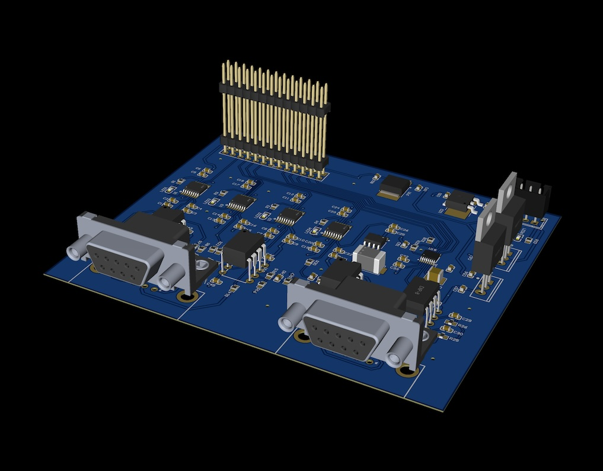
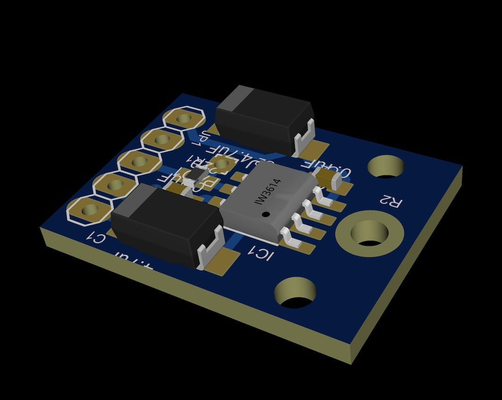

## Members
Philip Turner, Nanoscience Student (2025)
philipturner@vt.edu

## Progress (Jan 2025)

This project is officially a NANO 4994 research project for Spring 2025, worth 3 credits. After months of research, I found a potential solution to my main goal of building an STM, solving piezo creep. I discovered a new material that could make better piezoelectric actuators: <b>lithium niobate</b>. I am listing some of the calculations and scripts I have done. Currently, I am speed-running the tutorials for FreeCAD and KiCad.

## Project Overview

A device that can image with atomic resolution, and rip individual atoms off the sample with voltage pulses.

<b>Near-term goals:</b> Reproducing Mech Panda's DIY STM, a low-cost device that can image graphite. Will place a layer of tripod nano-tips under the device, verify that they can also be imaged.

<b>Long-term goals:</b> Attempt to perform atom-by-atom manufacturing. Not likely to succeed, but nonetheless ought to be attempted under ambient conditions.
- Subtractive, by etching individual atoms from the W tip.
- Additive, through thermodynamic cascade, with inverted tripod.

## Educational Value Added

PCB Design, Controls, Scanning Probe Microscopy, Computer Vision, Nanotechnology

Provides basic experience with the types of hardware necessary for manipulating individual atoms (e.g. IBM's [A Boy and His Atom](https://www.youtube.com/watch?v=oSCX78-8-q0)). This hardware typically costs an exorbitant amount of money, because it requires UHV and/or liquid helium conditions. I am testing how much functionality traditionally restricted to UHV can actually be achieved at ambient pressure.

## Timeline

| Objective                                            | Completion Date |
| ---------------------------------------------------- | --------------- |
| Start                                                | Oct 24, 2024    |
| Functioning STM imaging graphite                     | TBD             |
| Imaging a tripod monolayer on Au(111)                | TBD             |
| Inverting the tripod as a conventional mode tooltip  | TBD             |
| Attempting mechanosynthesis under ambient conditions | TBD             |

## Current Status

Working on patching up the EasyEDA files for the circuit boards. I have crude 3D models, but they need refining to match images of the actual circuit boards. Also need to specify the exact part models/manufacturers in EasyEDA. Once I do this, EasyEDA can automate a portion of the Bill of Materials generation process.

_Current status of the control board model._

_Current status of the pre-amplifier model._

## Useful Links

Dan Berard's Home Built STM: https://dberard.com/home-built-stm

Mechanical Panda's Scanning Tunneling Microscope (STM) Design: https://github.com/MechRedPanda/red-panda-stm

Systems and methods for mechanosynthesis: https://patents.google.com/patent/US11708384
