## Members
Philip Turner, Nanoscience Student (2025)
philipturner@vt.edu

## Project Overview

STM with no nonlinearities in the relationship between piezo voltage and position.

## Progress (Jan 2025)

This project is officially a NANO 4994 research project for Spring 2025, worth 3 credits. After months of research, I found a potential solution to my main goal of building an STM, solving piezo creep. I discovered a new material that could make better piezoelectric actuators: <b>lithium niobate</b>. I am listing some of the calculations and scripts I have done. Currently, I am speed-running the tutorials for FreeCAD and KiCad. I have gotten through ~50% of them.

Small-scale studies and tests performed:
- [Charge Drives (Google Sheets)](https://docs.google.com/spreadsheets/d/1x5uQ4LPubufbuQAfBjDXJuyd1Wf3S6ZZu0C0zVwssfQ/edit?usp=sharing)
- [TemperatureSensor.swift](https://gist.github.com/philipturner/81bed277f2942c87ea8825910e91a766)
- [Accelerometer.swift](https://gist.github.com/philipturner/bb1920f50a6ece8943d76146afa0af87)
- [FourierTransformAcceleration.swift](https://gist.github.com/philipturner/d7ffa2e23931173a39b9624441069f12)
- [FourierTransformVelocityPosition.swift](https://gist.github.com/philipturner/a365d72c1ba5c4eedf1c331bb21d586d)
- [FrequencyResponse.swift](https://gist.github.com/philipturner/212ae83408707147ce6cd6f57adedc7e)
- [PiezoelectricCoefficients.swift](https://gist.github.com/philipturner/9fb9d81c1d2d1427b4287541a99e6cec)
- Ordered and received 10 lithium niobate piezo plates

I also read a few hundred pages of literature on:
- Nanopositioner design and control electronics
- Vibration isolation
- Ultra-high vacuum instrumentation and compatible technologies
- Ferroelectric materials (Landau Theory)
- A substantial portion of "Art of Electronics, 3rd Edition"

<b>Lithium is a high vapor pressure metal, just like zinc.</b> See [Vacuum Compatibility (Google Sheets)](https://docs.google.com/spreadsheets/d/1ahE9a9jptKb8CLytUUoq606xVC4pLZpgXXCualte69o/edit?usp=sharing). To carry this investigation to completion, I would need to validate that lithium niobate and conductive epoxy are UHV compatible. Or whatever else is used to solder SMT/SMD components in vacuum-compatible PCBs. Shear piezo stacks have been made before, and worked under 10^-11 torr backing pressures @ 300 K. It's just, the lithium in LiNbO3 evaporates more than the lead in Pb(Ti,Zr)O3. Liquid nitrogen should annihilate the vapor pressure during STM operation, but not during bakeout (likely the issue with high vapor-pressure metals). Might require longer bakeouts at lower temperatures.

The other downside: lithium niobate has a smaller piezo constant than PZT. About one tenth. In practical applications, compensating for the fact that LiNbO3 can withstand higher electric fields (higher voltages given fixed membrane width), the range is also one tenth. Except at cryo temperatures (liquid helium, 4 K) where the range is equal. But only if you stack 10-20 plates on top of each other. I am suffering two-fold from the loss of range. I can only afford to put in, maybe 2 piezo plates for any given actuator.

## High-Level Overview

The current high-level plan is very rough. It will be split into different modules, which can be constructed once and recycled multiple times. I will conduct multiple experiments in sequence, some of which will reuse this equipment. For example, the very first capacitance measurement experiment can use the same vibration isolator as a late-stage STM iteration. It could even opt to only use the interior isolation stage.

Sequence of experiments:
- Measuring capacitance change between two parallel plates, to verify piezoelectricity of LiNbO3
  - Using glass cover slides to enforce a pre-determined distance of ~300 μm. Then, verify that capacitance behavior matches the simulations.
    - Use the FreeCAD finite element simulator to model the capacitance, which needs corrections to the parallel plate model.
  - Verify the predicted behavior, that it shears in both X and Y.
- 1DOF scanning tunneling spectroscopy machine, that can maintain tunneling current without crashing the tip
  - 30 nm range single LiNbO3 plate, with 440 V effective (+/-110 V plus polarity reversal)
  - 3 nm coarse stepping size with Dan Berard style stepper motor stage, just 1 motor?
    - Although there is severe thermal drift, the handoff between fine Z range and coarse Z step might catch up
    - Otherwise, need to stack multiple piezo plates for Z. This is a topic of major importance.
  - Verify the measurement of 100 fA currents (100x more sensitive than the Mech Panda STM)
- 3DOF scanning tunneling microscope with limited range
  - 30 nm range on each axis, verified for the X/Y axes by counting number of HOPG unit cells.
  - Prove there is an absence of hysteresis and creep distorting the images of HOPG
  - Resolve individual atoms on Au(111), which Dan Berard could not do. Or find the reason it cannot be imaged under ambient conditions.
- Complete, end-goal iteration with 100 nm range X/Y/Z and vacuum compatibility
  - Remove the stepper motor Z coarse stage
  - Z fine actuator needs disproportionately more range (more LiNbO3 plates) to match the stepping size of the coarse stage
  - Add slip-stick/stick-slip inertial drive for X and Z axes, clamped by gravity
  - X coarse stage enables "tripod assembly line", reducing a sample swapping bottleneck during atom building
  - Coarse stage uses shear piezos, but potentially out of the inferior PZT just to increase their range
  - PZT has piezo creep, but it has a similar effect to thermal drift with stepper motors. Wait until the coarse stage settles.
- Ultra-high vacuum system at room temperature (far term development stage, beyond my work at Virginia Tech)
  - Prove that evaporation of lithium atoms from LiNbO3 is not a concern
  - Prove that evaporation of atoms from the conductive epoxy is not a concern
  - Prove that the system can withstand bakeout, if STM modules are typically required to undergo bakeout
  - Verify that the previously designed system can function (take an image) while producing a vapor pressure of under 10^-10 torr
 
Mechanical loop:
- The system modules are everything besides the tip-sample mechanical loop (which will change from experiment to experiment).
- The mechanical loop should be designed to have maximum resonance frequency.
- The mechanical loop should be designed to have minimum coefficient of thermal expansion.
- The electrical shielding should have minimum possible tip-ground parasitic capacitance (the limiter to current sensitivity).

System modules:
- UHV compatible spare pre-amplifiers
  - Each time a pre-amplifier is used, it might be soldered irreversibly to the STM tip
  - A custom design that minimizes parasitic capacitance, might need to be discarded with the broken tip
  - This is similar to qPlus sensors, which have some MEMS circuitry on whatever the tuning fork is glued to
  - Minimize the magnitude of thermal drift caused by the op-amp's ~7 mW power consumption
- Reversibly bondable piezo plates
  - Use magnets to make piezos reversibly stickable to something. You can stack them up, or instead distribute them across different axes (X/Y/Z).
  - Need to understand whether you can do this, without the magnetic force crushing the crystalline material.
  - Issues with isolating nearby circuitry (such as the grounded STM tip) from very high electric fields
- Two-stage spring suspension system
  - Viton high-frequency dampers are incompatible with UHV. They're compatible with HV, but not UHV (Viton has a vapor pressure of 10^-8 or 10^-7 torr).
  - Use a single-stage, compact spring for the high-frequency part. This is small enough to fit inside a UHV chamber.
  - Use a single-stage low-frequency isolator with ~1.7 Hz vertical resonance frequency. Copying the "Open STM" design.
  - The low-frequency isolator models a pessimistic outcome, where you need an air table, and you can't utilize Minus K technology.
  - This table would hold the entire UHV chamber in the far-term prototype. Near-term, it serves to conveniently hold the electronics.
- High-voltage amplification board (piezo driver board)
  - A large number (~5–10) of high-power op amps, with bipolar -110V / +110 V output ([ADHV4702-1](https://www.analog.com/en/products/adhv4702-1.html))
    - ["The industry's first 220 Vpp op amp"](https://www.analog.com/en/resources/design-notes/adhv4702-1-24-v-to-220-v-precision-operational-amplifier.html), invented in 2018.
    - There are 350 Vpp (-175 V / +175 V) designs out there, but they have triple the cost ($10 -> $28)
    - Might be more economical to use custom, discrete components to reach even higher voltages (Art of Electronics mentioned 0 V / +1 kV piezo driver)
  - Each LiNbO3 stack needs 2 dedicated op amps, so one electrode is +110 V while the other is -110 V. LiNbO3 can withstand extremely high electric fields.
  - Unused op amps should be turned off to reduce power consumption.
  - Might multiplex op-amps to the subset of piezoactuators in use at any moment.
  - Can be recycled for late-stage prototype with coarse piezoactuators under ambient conditions. Might keep one of the electrodes at GND for PZT plates, to avoid depoling them.
- Analog to digital board
  - [AD5761](https://www.analog.com/en/products/ad5761.html]) DACs with ~133 kHz bandwidth
    - Enough DACs to supply all the piezos that must be operated simultaneously, in the late-stage prototype (3 fine and 2 coarse, 5 total). Also, a DAC for the bias voltage.
    - High voltage setting: 20 Vpp range (-10 V / +10 V or 0 V / +20 V)
    - Low voltage setting: 6 Vpp range (-3 V / +3 V or 0 V / +5 V)
    - 16 bits, enough for picometer step size (the problem is increasing the range at the voltage peak; LiNbO3 has a small piezo constant)
    - DACs used as piezo drivers will be fed into the high-voltage amplification board, jumping from +/-10 V to +/-110 V (11 V/V amplification factor).
    - Analog Devices made some [open-source code](https://github.com/analogdevicesinc/no-OS/blob/main/drivers/dac/ad5761r/ad5761r.h) to operate this chip, which is nice.
  - [AD7746](https://www.analog.com/en/products/ad7746.html) CDC with 10-100 Hz bandwidth
    - "Capacitance to digital converter", fuses high-resolution capacitance detection circuitry with a 24-bit sigma-delta ADC
    - 10 Hz = 4 aF resolution
    - 100 Hz = 40 aF resolution
    - Accepts up to 4 pF variation range during dynamic operation, with 17 pF able to be accessed by a slow capacitance offsetting mechanism
    - The capacitance measurement setup in the paper that studied piezo creep, was 3.2 pF with 10 mm x 10 mm x 300 μm parallel plate capacitor
    - Removes the need for bulky, expensive "capacitance bridges" based on a four-element bridge with inductors and mechanical DACs (unsure how they work fully)
    - Useful to early-stage prototype measuring capacitance, and could serve as a sensor to aid in tip approach later on.
- Second half of TIA board
  - Processes the output of the pre-amplifier; this board doesn't need as much shielding
  - Complex analog circuitry for the 0.1 pA–50 nA, [fast low-noise transimpedance amplifier](https://pubs.aip.org/aip/rsi/article-abstract/91/7/074701/967357/Fast-low-noise-transimpedance-amplifier-for).
  - Contains the expensive (~$20–30) 18-bit ADC.
    - Plan to buy the low-bandwidth 250 kHz one. The way ADC bandwidths work, is they have either a fixed frequency or they are on sleep.
    - The analog part of this circuit has no more than 50 kHz (anything higher would have unacceptable enC noise anyway).
    - No need to sample significantly higher than the true bandwidth.
  - Bandwidth switching circuitry and high-order filters, potentially multiplexing through a finite set of bandwidths.
    - Theoretical limit is the 50 fA bias current of the pre-amplifier.
    - Ultra low bandwidth (1-2 kHz, the circuit's natural corner frequency without correction) = 250 fA noise, mostly Johnson noise at 300 K
    - Low bandwidth (4.4 kHz) = 500 fA noise
    - High bandwidth (40 kHz) = 7 pA noise, mostly enC noise
  - Current amplifier will not be needed for early capacitance testing experiments
- Power board
  - Accepts mains power (170 V amplitude AC power)
  - Three lines: +120 V, GND, -120 V
  - Third op amp in the fast low-noise TIA (+/-50 V output capability) can use a resistive voltage divider to supply rails with +/-60 V
  - Voltage divider for +/-20 V may or may not be implemented on the analog-to-digital board. Especially if the 18-bit ADC is migrated up there.
- Teensy 4.0 CPU
  - I don't need the extra memory of the 4.1. It's slower than main memory, so it's of no use anyway.
  - I don't need the extra ports of the 4.1, at least when counting the number of DAC lines and harnessing a few built-in ADCs.

Safety mechanisms for high-voltage electronics: major importance
- -110 V and +110 V away from electrical ground, or perhaps 220 V since the circuit's ground may float away from Earth.
- Anything above 40 V can generate a great enough electric field to break down human skin.
- It's often not the voltage, per se, that is the reason for danger (40 V is already way above the band gap of the toughest insulator).
  - Rather, it's the magnitude of the electric field, given the typical thicknesses of a thin film in context.
  - Also, high voltage generates high current, and the two multiply to give a high power through the human body.
- I'll reach up a bunch more, litter the PCB silkscreens with HV safety signs, add redundant mechanisms to physically prevent exposure to HV, etc.
  - I'm not an expert on HV safety yet, so the above precautions are not good enough to protect someone.

The plans above already need some revisions. Certain chips, such as the ADHV4702, are too expensive and must be replaced with a cheaper alternative. In addition, the piezo motor coarse approach mechanism is too expensive to fabricate, if one wants high stiffness. Instead, I am currently analyzing the common design for Air-STMs/EC-STMs, which uses electromagnetic motors. This is the design Dan Berard used.

## Lithium Niobate

Images of 10 lithium niobate plates that were delivered. Dimensions: 5 mm x 5 mm x 0.5 mm.

&nbsp;
  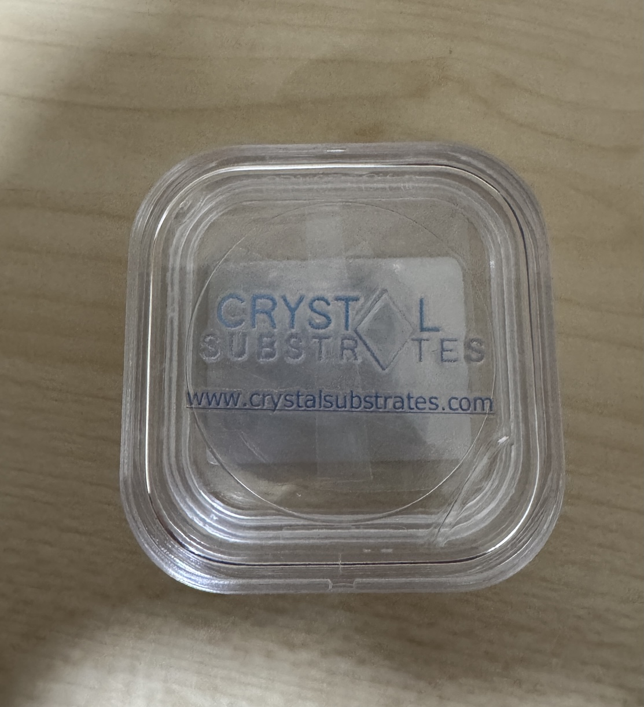
&nbsp; &nbsp;
  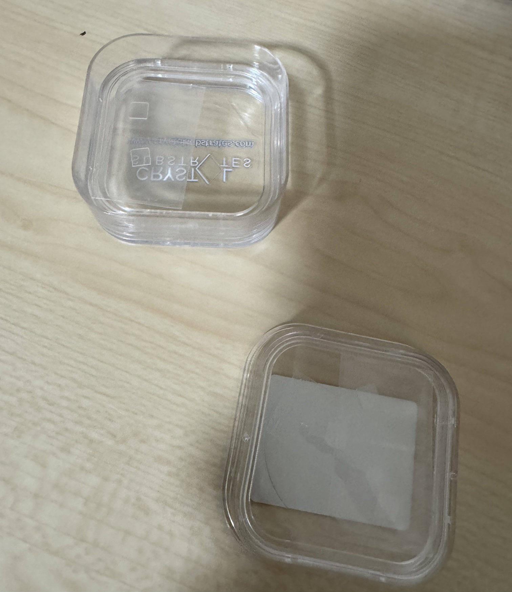
&nbsp;

Crystallographic orientation:

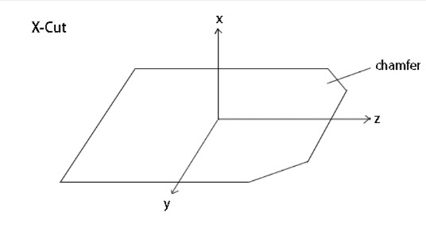

## Finite Element Modeling

Source: https://dberard.com/2015/09/13/new-spm-design-progress

Image 1: Render from Dan Berard's CAD model, of his second prototype that was never built. Image 2: Cross-section of my FreeCAD model. Image 3: Finite element mesh created from the cross-section (29,955 nodes). Node count of the full STM model, without the cross-section, is 50,907.

&nbsp;
  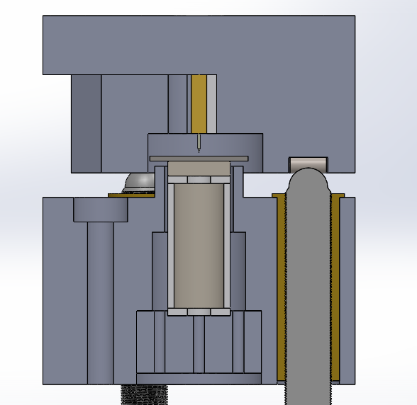
&nbsp; &nbsp;
  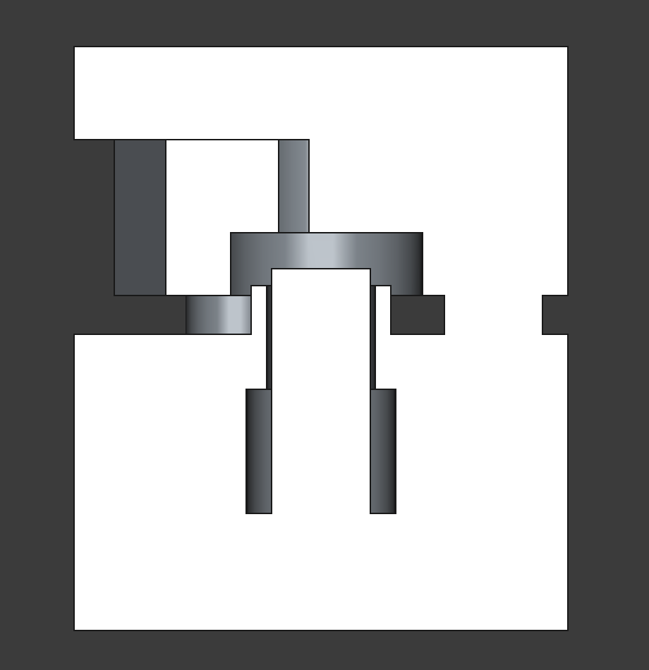
&nbsp; &nbsp;
  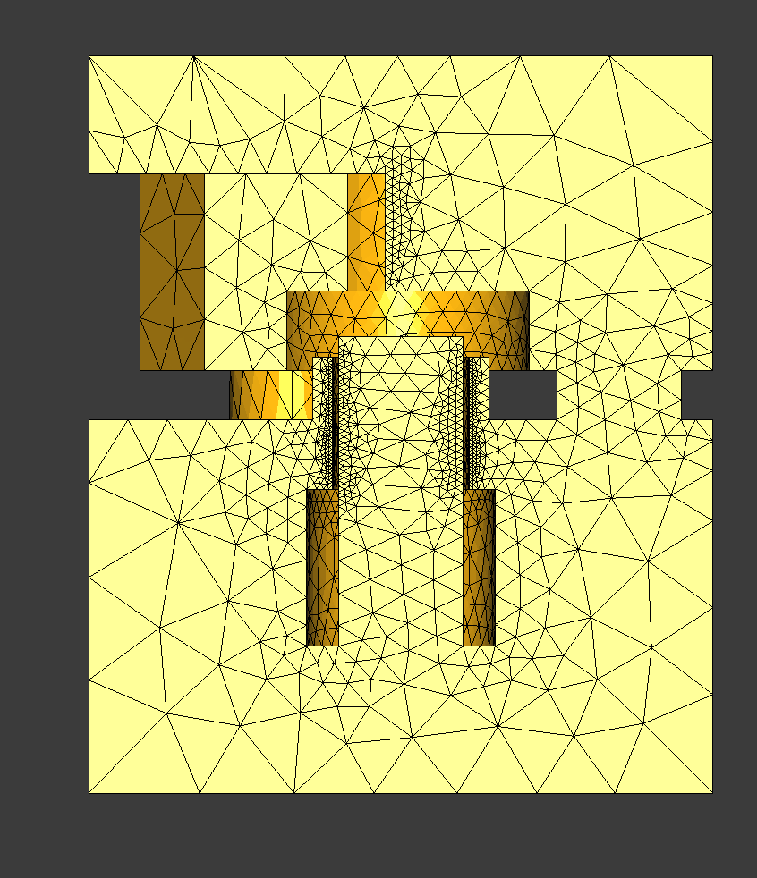
&nbsp;

## Chips

The first iteration will avoid lithium niobate and high-voltage electronics. It will avoid the fast low-noise TIA design with an LTC6090-5 (140 Vpp) and opt for a simpler design with smaller dynamic range. Instead of 100 fA to 50 nA, it will target 200 fA to 10 nA. The output will go into an ADS8699 18-bit, 100 kHz ADC. I don't yet fully understand the requirements for LPF or differential pairs. The chip seems to include a 15 kHz second-order LPF within the IC (yet it has variants running SAR at 1 MHz?). I will have at least two bandwidths hard-coded into the hardware. The lower bandwidth will be ~5 kHz and require a custom LPF, regardless of the requirements for the high-bandwidth noisy mode. I would prefer a fourth-order Bessel filter, which seems optimal based on the graphs in Art of Electronics.

This prototype serves as a near-term experience, to get experience with constructing PCBs and precision analog electronics. It is a stepping stone toward a system with high-voltage electronics. The latter would require a custom voltage regulator and (potentially, in an even later prototype) custom high-voltage amplifier/piezo driver, with discrete transistor components. High voltages are needed because lithium niobate has a very small piezo constant. For example, extending 100 nm with 68 pm/V would require 1470 V. We can get around this slightly by stacking shear plates (only for XY actuators; Z-actuating LiNbO3 has major complications). But that only works to a certain extent. The cheap, in-stock LiNbO3 plates are relatively thick (0.5 mm). Physical dimensions must be kept <<10 mm per axis. We still have to employ high voltages (e.g. 294 V with 5 piezo plates per axis). The omission of HV electronics, for the first prototype, removes the high-voltage amplification stage (the DAC outputs drive the piezos directly). This lowers the complexity and cost.

The offset voltages for ADCs and DACs are non-trivial. However, based on skimming through some online stuff, trimming should be effective. The offsets supposedly stay constant with environmental conditions (temperature is the only thing that changes them? skeptical). DACs have a much greater offset voltage than ADCs. This is especially of note for the bias voltage. Scienta Omicron's overpriced STM has a lower bound to bias voltage dynamic range, of 5 mV. How do they perform sub-millivolt STS graphs? Maybe that instrument does not.

I still haven't tabulated all the chips needed. I likely won't have a Bill of Materials until I spend more time understanding transistors and discrete transistor feedback loop circuits. This is Art of Electronics chapters 2 and 3, some of the last ones I haven't read yet. Transistors are important for over-voltage regulators in the fast low-noise TIA design, so I need to understand how they work and what implications this has.

## Update (February 22, 2025)

This project is way out of scope for a single semester. I don't even want to make a 3D scanning STM first. I just want to solve the stability issue preventing people from taking quantitatively correct current-distance curves. Can I create a stable enough STM to measure the fact that current increases 10x every 80 pm, not 10x every Å? Thermal drift and piezo nonlinearities mean this cannot happen at 300 K. It has only been done at 4 K. I hypothesize that with a lithium niobate coarse approach mechanism, as outlined in [US12174218B2](https://patents.google.com/patent/US12174218B2), such a stability test will be possible at 300 K.

Here, I have recorded a snapshot of my current priority list. It is constantly under revision, as I answer questions. The answers to these questions result in even more questions appearing. The stable 1DOF nanopositioning system would be "Prototype 5". However, v5 is out of scope for a semester. Even v4 might be out of scope, due to the need for high-voltage electronics.

For Prototype 3:
- Find the best DAC chip
- First project:
  - Before next Tuesday, come back with a plan for this
  - Making a PCB that measures the values of resistors and capacitors

For Prototype 4:
- Learning about epoxy
- AoE x-Chapters part about inductors
- Understanding tilting and bowing in the capacitance sensor
- Understanding the reason for a sensor shaped like concentric cylinders
- Learning KiCad StepUp

For Prototype 5:
- Understanding the shear stress, and whether differences in polarization will break bonds in the frictional contact
- Calculate the critical amplitude for a coarse actuator design

To explain the current roadmap, I made a table. It lists the previous design iterations (1, 2) and the ones on my priority list.

| Prototype | Purpose |
| :-------: | ------- |
| 1         | First TIA on breadboard |
| 2         | Second TIA on breadboard, with ordered parts |
| 3         | Experience using the IC chips needed for the STM |
| 4         | Test rig for properly orienting piezo stacks |
| 5         | Stable 1DOF nanopositioner with kinematic mount |

There are technically 11 weeks between now and graduation. But more realistically, the budget is 9 weeks or less. I feel that, by putting these tasks on this project document, I might feel better. About crossing off a few of them, without taking the time to finish them. I can be more motivated to work on the near-term "Prototype 3" while also not forgetting the other tasks, in the future.

## First Draft of TIA Subsystem

&nbsp;
  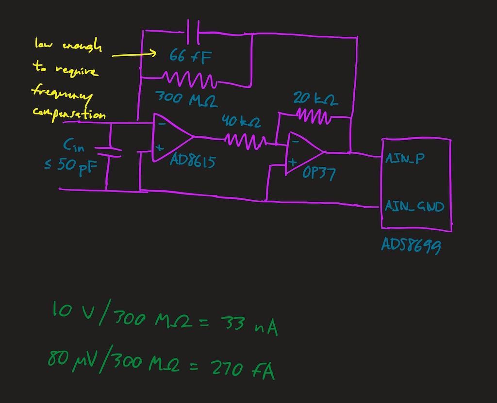
&nbsp; &nbsp;
  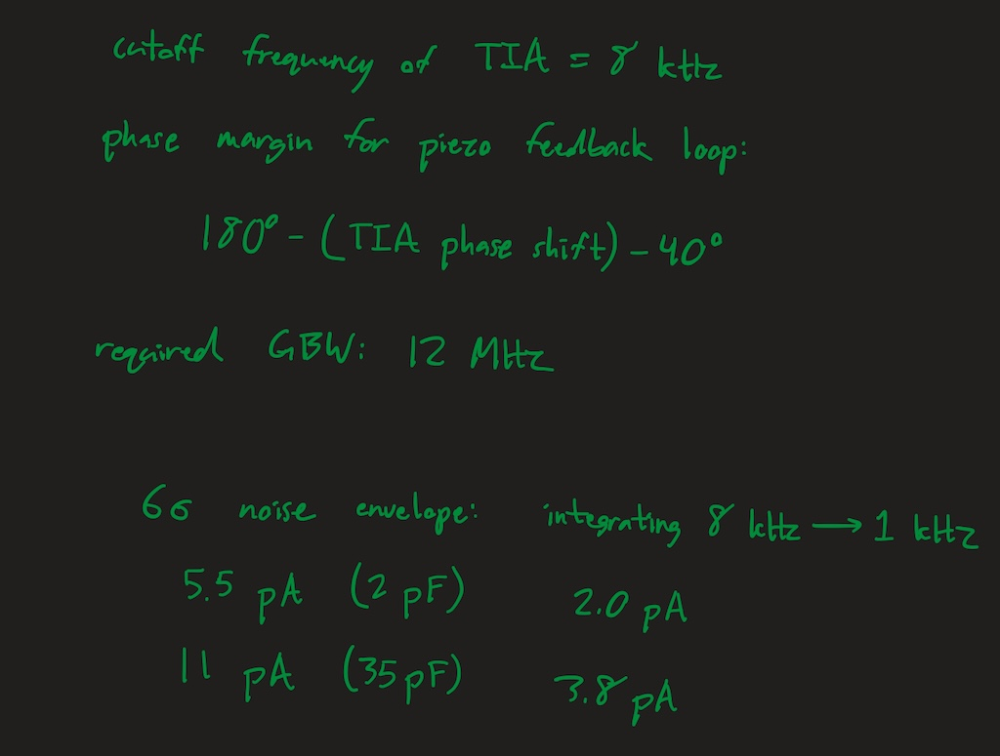
&nbsp;

## Update (February 26, 2025)

I will have to reduce the scope again. I still have the following questions:
- How does the successive approximation algorithm work?
- How does delta-sigma modulation work?
- What are the parasitics for the "capacitance bridge", and why was the 2550A supposedly better than the AD7746?

I am writing the questions on this document, hoping it will convince me to remove them from my TODO list (for now). I will remove the TIA, ADC, and CDC from the near-term initial prototype. Just the DAC remains. It will be powered by a battery (±5 V), and the output will be read with a multimeter.

I now only have the following questions left on my TODO list:
- Decide between the AD5761RBRUZ ([$14.49](https://www.mouser.com/ProductDetail/Analog-Devices/AD5761RBRUZ?qs=sGAEpiMZZMtgJDuTUz7Xu4AqHG%252BNl4bmQrNkJ2FPlwUUtx9Id5RwyQ%3D%3D)) and DAC81401 ([$13.23](https://www.mouser.com/ProductDetail/Texas-Instruments/DAC81401PWR?qs=mELouGlnn3e7ARpnyM2zAA%3D%3D)). Currently, the former appears to have better offset stability (unusually optimized around bipolar zero). The latter has better INL. Furthermore, the DAC8140x product line would readily facilitate future prototypes with multiple DAC channels.
- Understand what effects the instrumentation amplifier (bias voltage) or high-voltage amplifier (piezo driver) would have. Regarding offset, temperature drift of the offset, and temperature drift in general. These are chips that post-process the DAC's output. Their errors combine with the errors from the DAC.

## Bypassing vs. Decoupling Capacitors

I found a reference that demystifies the myriad capacitors sprouting out of ICs, and the inconsistency between example PCB layouts on datasheets. Source: https://designers-guide.org/design/bypassing.pdf

Next, I will:
- Understand the pins on the Teensy.
- Create a prototype PCB with the Teensy and the DAC.
- Perform "The Recipe" on the PCB traces.
- If I can get away with just a single 0.1 μF capacitor on each supply pin, I will do that.

## March 6, 2025

I reverted back to the original plan, of stuffing all three analog-to-digital ICs onto the near-term PCB. I am currently understanding the effects of parasitics, particularly "Header Sockets". These are parts that emulate the connections in breadboards. Header sockets allow reversible bonding of through-hole components as "devices under test". One can also reversibly connect different test points in the circuit, with jumper wires. Or interface them with a multimeter/oscilloscope. Such connections have a large amount of parasitic inductance.

I developed 8 different permutations of lumped element models, for simple "devices under test" between the DAC and the ADC. It starts with the parasitic output resistance of the DAC, 0.05 Ω. Then, it goes through a network of resistors, capacitors, and/or inductors (which may connect to GND). It ends with the parasitic input resistance of the ADC, 1 MΩ. I am using the SPICE functionality embedded in KiCad to understand the behavior of these parasitics. I previously invested well over 10 person-hours learning how to use KiCad's SPICE.
- 2 resistor geometries × 3 resistance values (1 Ω, 1 kΩ, 1 MΩ) = 6 permutations
- 2 short circuit geometries (THT with 1 cm jumper wire, SMT pads with 1 cm PCB trace)

I will put the following on this README:
- Screenshots of the KiCad schematic models
- Screenshots of the transient analysis (voltages and appropriate currents)
  - Units for time, voltage, and current in each transient analysis
- Screenshots of the AC small-signal analysis, for the DAC → ADC transfer function

Power source for transient analysis:

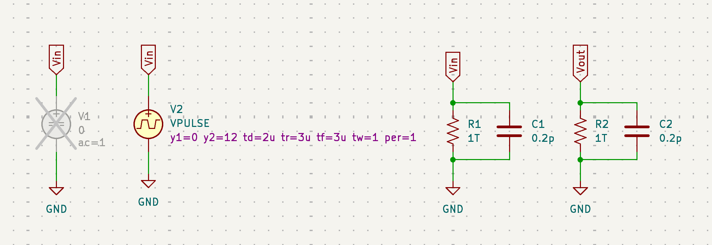

Power source for AC small-signal analysis:

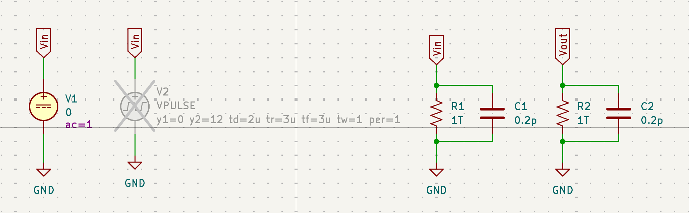

To save time, I revised the number of models to 5. The first one is a simple test to get the hang of setting up simulations.

KiCad SPICE Models

| Device Under Test | Description | Model |
| ----------------- | ----------- | ----- |
| Circuit 1 | Simplified version of SMT short circuit | 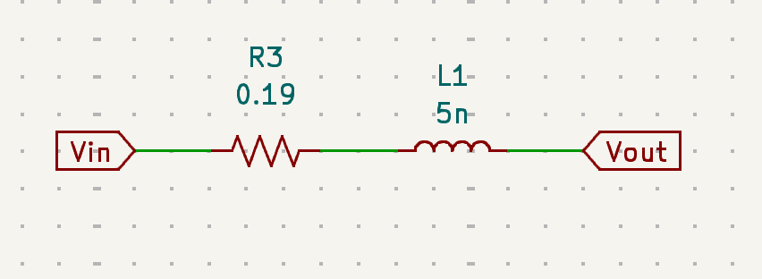 |
| Circuit 2 | SMT short circuit from 1 cm PCB trace | 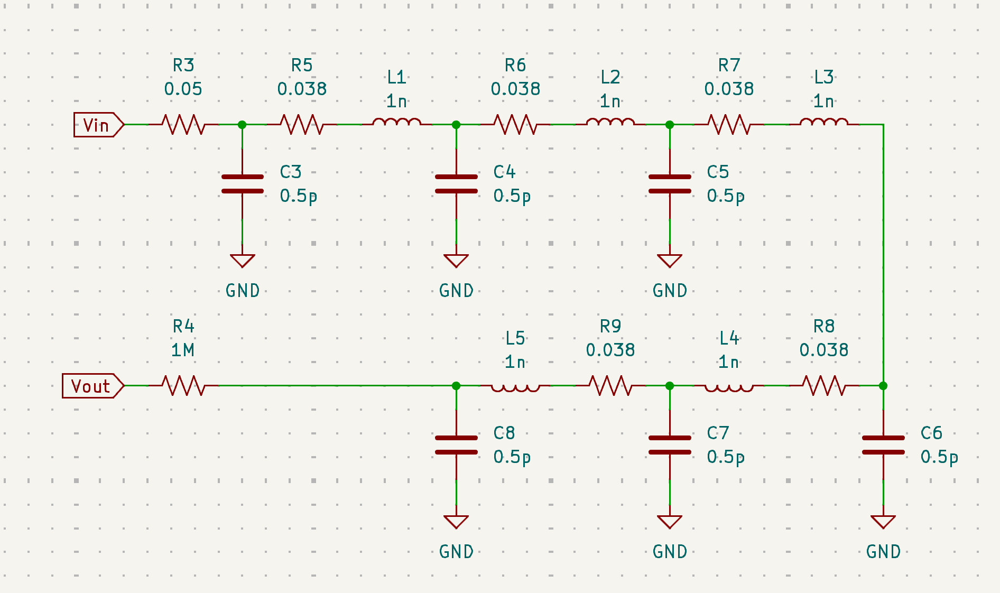 |
| Circuit 3 | THT resistor in header socket, 1 Ω | 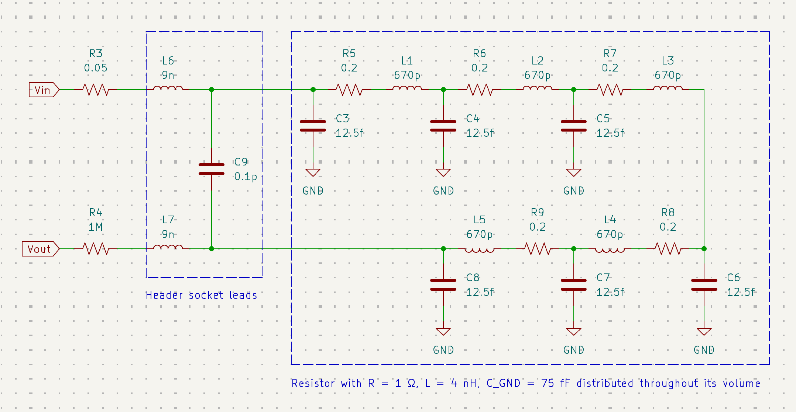 |
| Circuit 4 | THT resistor in header socket, 1 kΩ | 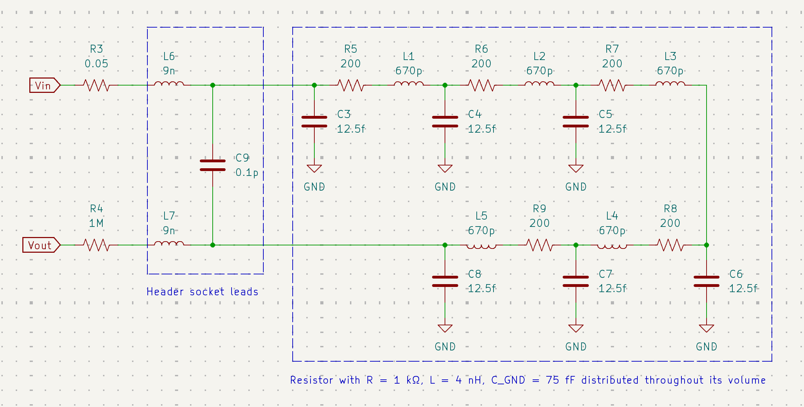 |
| Circuit 5 | THT resistor in header socket, 1 MΩ | 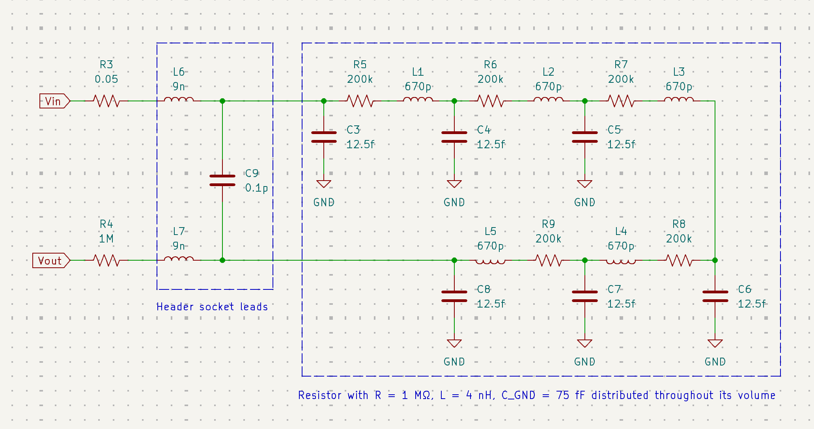 |

Transient Analysis

| Device Under Test | V(Vout) | I(V2) |
| ----------------- | ------- | ----- |
| Circuit 1 | .jpg) | .jpg) |
| Circuit 2 | .jpg) | .jpg) |
| Circuit 3 | .jpg) | .jpg) |
| Circuit 4 | .jpg) | .jpg) |
| Circuit 5 | .jpg) | .jpg) |

AC Small-Signal Analysis

| Device Under Test | V(Vout) | I(V1) |
| ----------------- | ------- | ----- |
| Circuit 1 | .jpg) | .jpg) |
| Circuit 2 | .jpg) | .jpg) |
| Circuit 3 | .jpg) | .jpg) |
| Circuit 4 | .jpg) | .jpg) |
| Circuit 5 | .jpg) | .jpg) |

## March 15, 2025

To minimize the risk of running out of time, I will cut the AD7745 out of this project for now. It might be needed in the future, in the control electronics for a capacitive displacement sensor. That sensor's purpose is primarily to aid in testing LiNbO3 piezo stacks.

Instead, I plan to use the TIA to measure capacitance, with lock-in amplification. All good capacitance sensors use both an excitation signal and capacitance cancellation. The excitation signal can be a sine wave (AH2550A, TIA) or a square wave (AD7745). The cancellation capacitance reduces the magnitude of the background (unchanging) component of the capacitance. Without the cancellation capacitance, the large signal would saturate the sensor, or its shot noise would overbear the desired (small) signal.

There are three ways to implement a cancellation capacitance.
- <b>AD7745:</b> Excitation voltage stays the same, but value of capacitance values. There are 7-bit "CAPDACs" on each input terminal, which act effectively as negative capacitances.
- <b>AH2550A:</b> Wildly complex system using transformer taps. Switches between several physical capacitors, some as large as 1 μF.
- <b>TIA:</b> Fixed-value "compensation capacitor" attached to the terminal of the pre-amplifier. It receives the bias voltage, with opposite sign and gain of 0.1&ndash;10x.

The principal issues with the TIA are:
- Ensuring the leakage capacitor has very low leakage. A high-resistance material must be used. This is hard, as PTFE (a good material) is not UHV compatible. Instead, one could create an artificial vacuum capacitor. This has concerns of bulkiness (C ∝ size) and susceptibility to vibration (dC/dt × V looking like C × dV/dt).
- Ensuring the negated bias voltage's gain can vary. A mechanical trimpot is a bad idea in the long run, because when the tip approaches the sample, the background capacitance changes. The trimpot must be recalibrated. This can incur major human labor costs, in a factory with O(1000) scanning probes. Instead, one should use a digipot and incorporate gain switching into the coarse approach controller.

In <b>scanning capacitance microscopy</b>, people have reported ~1 aF sensitivity with a 1 V sine wave at ~100 kHz. This is a concern, as the ADS8699 has a low-pass filter at 15 kHz. I see no reason one cannot use a 10 V sine wave at ~10 kHz. The 1 V bias might have been due to the AFM tip already being close to the sample, and wanting to avoid large electrostatic forces. The purpose of capacitance sensing is to extract information about the tip-sample distance, when very far from the sample. I don't need it once tunneling is established.

Electrostatic shielding can reduce the magnitude of the background capacitance. This means the compensation capacitor can be smaller (it must be similar to the background capacitance in magnitude). It is also needed to reduce currents from radiofrequency interference. It may contribute to the parasitic capacitance (Cin) that harms performance of the TIA.

In addition to capacitance measurement, a good TIA must have low leakage and interference currents. Here are some non-obvious notes regarding that.
- Leakage through a PCB (FR-4 material) might be non-negligible. In-vacuum transimpedance amplifiers are made of SMT components bonded to Macor. PCBs are not UHV compatible.
- Often, a PTFE standoff is used at the junction where tunneling current enters the op-amp. The IC pin may be pried off the PCB, and soldered to a wire going directly to the tip.
- In the case of qPlus AFM, the op amp is literally suspended in the air, held in place by wires reaching into its pins.
- The pre-amplifier stage should have a separate power supply, with very large capacitors. It is critical to suppress power supply noise, which can be a limiting factor to current sensitivity.

I'll have to judge what measures are feasible with the time remaining in this semester. I want a sensor with very high performance, that can be easily tested. The contacts for a "device under test" must be reversibly bondable. The testing system must be shielded.

Perhaps a model STM, with just two parallel plates moved together with a micrometer screw. It does not require vibration isolation, or automation of the coarse approach.

No, all of that is out of scope. Just have a PCB with a DAC and ADC. Include the TIA, but don't include shielding or leakage protection that would require a lot of effort.
- All test points are through-hole header sockets.
- I can cover the entire PCB with a construct of aluminum foil, for first-order shielding.
- The power supply is six 9V batteries, fed into a network of linear regulator ICs.
- The Teensy will bond directly to the PCB, via a carefully placed array of header sockets. No need for ribbon cables and intermediate boards between the Teensy and PCB.
- Separate ground plane for the Teensy (digital) and ADC/DAC SPI pins (analog). Each of the two chips has a quad-channel digital isolator (not an opto-isolator, but similar).

From the time budget in the February 22 update, I have effectively 6 weeks left. But Spring Break (the most productive week) is mostly over. The workload will get harder. I am participating in a group project, to plan and execute an organic synthesis. I will be very engaged, as it's invaluable to my future aspirations to synthesize tripods. Although that motivation has faded away; the even greater barrier might be time to construct a minimal-cost UHV SPM. Regardless, I have little time to waste.

## March 18, 2025

Correct control-loop model of the fast low-noise transimpedance amplifier:

&nbsp;
  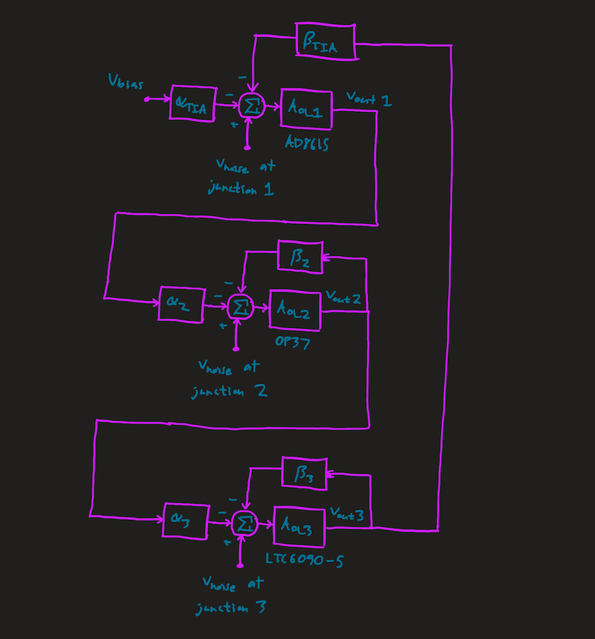
&nbsp; &nbsp;
  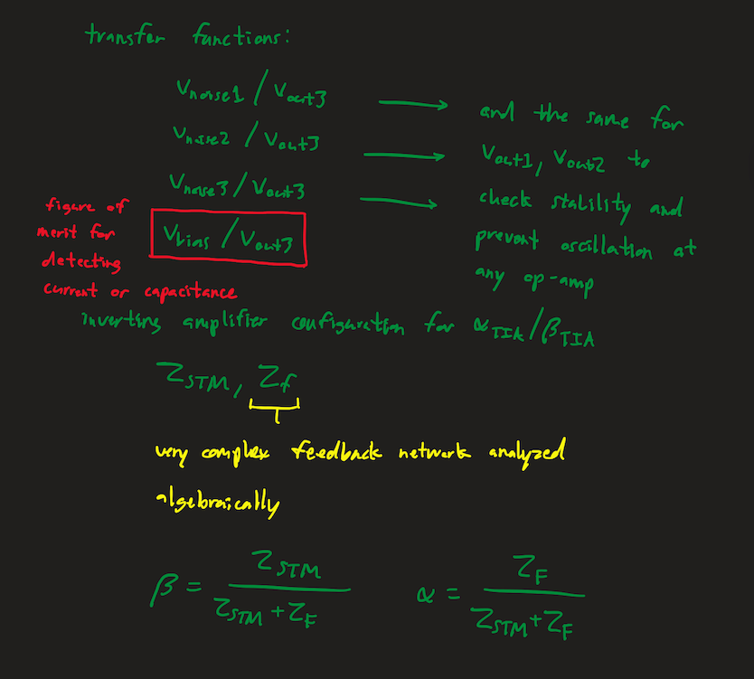
&nbsp;

Analysis, in progress at the time of writing:

[TransimpedanceAmplifierStability.swift](https://gist.github.com/philipturner/321f9a1ccf64319d583776371fe78bf2)

I could not use SPICE because the model for LTC6090-5 was closed-source. I could not trust the parameters for it. The other two amplifiers have open-source text files for SPICE, which are compatible with KiCad SPICE. The easiest way to understand "mid-f compensation" is actually to just script the transfer functions with Swift, and graph with Matplotlib. It is the second option after Wolfram Alpha stops working because I hit the character limit (the transfer function has too many variables).

Interestingly, I learned something about "LTspice" used in college electronics classes. It stands for "Linear Technologies SPICE". If you look at the app icon, it has the logo for Linear Technologies. The software IP transferred over to Analog Devices when they bought out LT. The buyout happened in 2016&ndash;2017. I realized the thing about LTspice after looking through old Internet Archive records, of the original company's website. The LTC6090/LTC6090-5 was released in 2013&ndash;2015.

<b>Update:</b> I think I figured this out. I can use KiCad SPICE to simulate the circuit. I just need to use the Swift script to verify the transfer functions for the single-pole approximations to each op-amp. Then, I'll reproduce each transfer function with a voltage-dependent voltage source + RC filter in SPICE. Verify that no feedback loop ever enters the region where the single-pole approximation is incorrect. This is >500 kHz for the OP37, >50 kHz for the LTC6090-5.

I don't have to worry about the incorrectness for LTC6090-5, as I won't use that chip in the real device. The inner feedback loops will likely be >500 kHz. But I'm not concerned about the moderately inaccurate phase shift for inner loops. Just that they are stable (which is pretty easy to guarantee). I care more about the detailed frequency response of the outer loop, which is far below 500 kHz. Therefore, I should be justified in parameterizing only a single-pole model. This saves time.

## March 19, 2025

I keep going back and forth about which tool I want to use. Generally, if I was not pressured for time, I would do everything custom. I only learned FreeCAD because there was an immense overhead to set up the geometry for finite element simulations. For electrical circuit simulations, the equations and algorithms are much simpler. In addition, scripting opens up the flexibility to explore more details, which are inaccessible from a UI-based program. Solving this problem with scripting would be a valuable experience, and prepare me to tackle future problems that existing tools can't address.

Finally!

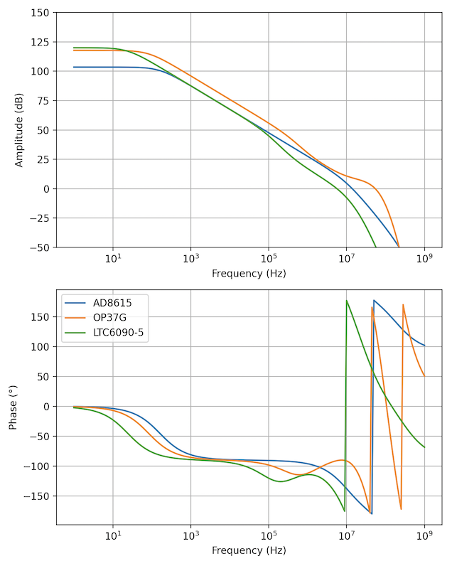

## March 20, 2025

I have successfully created lumped-element models of the op-amps in KiCad SPICE, by referring to the code from the script. They reproduce the transfer functions shown above. I used voltage-controlled voltage sources to create unity-gain buffers, which prevent different filter sections from "loading" each other.

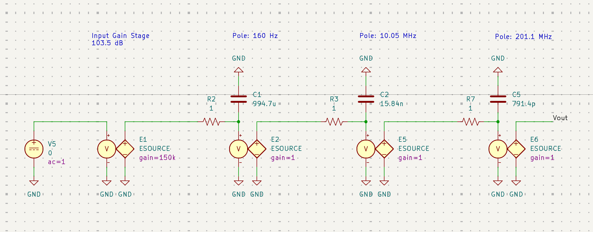

<i>Lumped-element model of the AD8615, configured for an AC small-signal analysis.</i>

I organized the KiCad project by creating multiple pages. One of the pages holds the models for the op-amps. There is text denoting which circuit is which op-amp model. This page is excluded from simulation. To set up a simulation, I can copy and paste the elements from this reference page, into the main page. This is similar to how I host reference code for MD simulations in a repository [(1)](https://github.com/philipturner/rod-logic) [(2)](https://github.com/philipturner/bootstrapping-code-archive), they copy it into an [Xcode project](https://github.com/philipturner/molecular-renderer) for customization.

The OP37G model has been translated <i>correctly</i>.

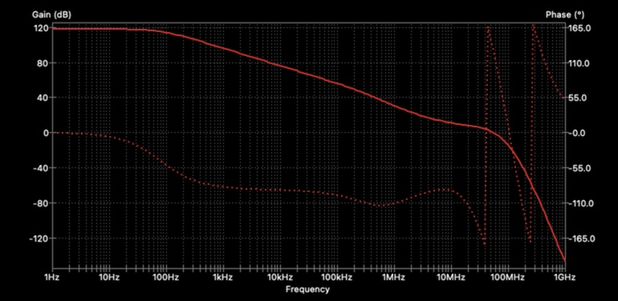

Another scope reduction: omit the ADC, DAC, Teensy, and optocouplers. We'll be using entirely analog input and analog/oscilloscope output methods. It is true, that going entirely analog makes the circuitry simpler. This a hard conclusion to reach, from someone who spent their entire previous career in the digital realm.

<b>Why is this true?</b> There are less questions about what is "ground", less need to isolate noisier grounds from quieter grounds. Another bonus, is you're not able to measure signals with 16-bit precision, so you don't have to optimize for low noise/drift. The total number of chips on the near-term prototype PCB is less. And the total number of decoupling and/or bypassing capacitors is less. Which means less time to set up the schematic, less time to place the components before soldering. Less traces on the PCB; op-amps and comparators have ~1/4 as many leads as ADC/DAC chips.

It's also easier to model, because the entire circuit (except the power supply and overvoltage protection) can be represented in the SPICE simulation. Everything is linearly dependent, given a fixed frequency. All the non-power pins and devices under test (impedances) can be described with linear algebra.

## March 21, 2025

I got the general structure of the custom design figured out. Instead of three inverting stages, there is one inverting stage (AD8615) followed by a noninverting stage (OP37G). This configuration is different from the problematic combination of a noninverting preamplifier with an inverting second stage. The frequency response should theoretically be identical to the amplifier from the fast low-noise TIA paper.

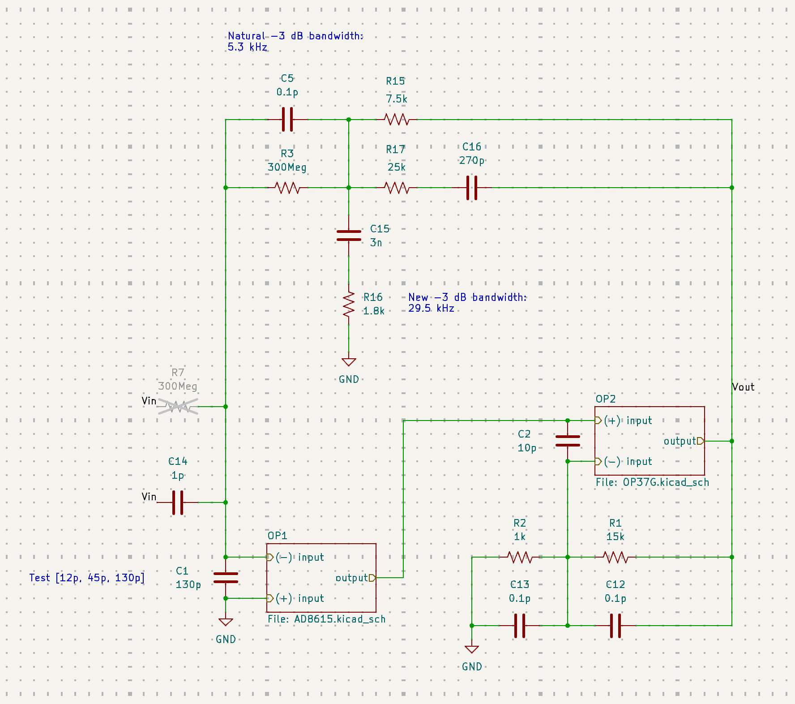

Response to a triangle wave + 1.0 pF device under test, after calibration. Note that the "mid-f compensation" appears to not affect the response when the current is a triangle wave. Only when the current is an infinitely sharp step. It eliminates the peaking that appears when input capacitance exceeds 90 pF and goes toward 95 pF, 130 pF.

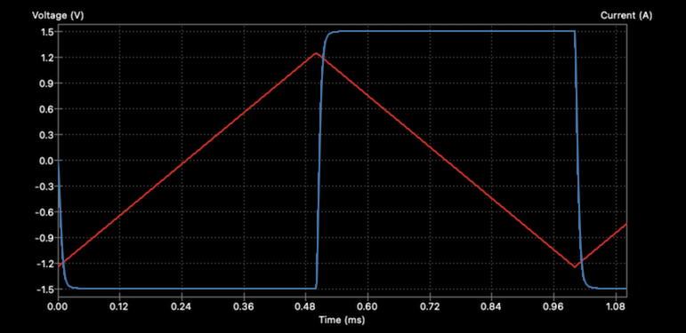

Note that for this design, the second stage can be very sensitive to the parasitic capacitance between the terminals of OP2. If Cin for OP1 is 130 pF, the circuit oscillates when Cin for OP2 reaches ~350 pF. If Cin for OP1 is 12 pF, the circuit oscillates when Cin for OP2 reaches ~120 pF. This can be remedied by using tactics traditionally used for transmitting preamplifier input wires. Put the actual preamplifier in vacuum, and use what "once was" its 35 pF parasitic as the input capacitor for OP2. This ensures that (10 + 35 =) 45 pF < 120 pF.

## March 22, 2025

Capacitances that make the amplifier unstable. The tests are conducted when the "mid-f compensation" trimpot is at 25 kΩ, and the "main compensation" trimpot is tuned for a flat frequency response.

Custom design:

| OP1 Cin | OP2 Cin |
| -----------------: | -----------------: |
|   2 pF |  ≥ 26 pF |
|  12 pF | ≥ 121 pF |
|  45 pF | ≥ 264 pF |
| 130 pF | ≥ 370 pF |

Fast low-noise TIA:

| OP1 Cin | OP2 Cin | OP3 Cin |
| -----------------: | -----------------: | -----------------: |
|   2 pF | unstable | unstable |
|   2 pF | unstable | unstable |
|   2 pF | unstable | unstable |
|  12 pF |  ≥ 50 pF |    10 pF |
|  12 pF |    10 pF |  ≥ 12 pF |
|  12 pF |  ≥ 12 pF |  ≥ 12 pF |
|  45 pF | ≥ 705 pF |    10 pF |
|  45 pF |    10 pF | ≥ 122 pF |
|  45 pF | ≥ 121 pF | ≥ 121 pF |
| 130 pF | ≥ 725 pF |    10 pF |
| 130 pF |    10 pF | ≥ 242 pF |
| 130 pF | ≥ 238 pF | ≥ 238 pF |

Tolerance for capacitance between terminals of post-amplifier stages:

| OP1 Cin | OP2 Cin (2-stage) | OP2 Cin (3-stage) | OP3 Cin (3-stage) |
| -----------------: | ------: | ------: | ------: |
|   2 pF |  ≤ 26 pF | unstable | unstable |
|  12 pF | ≤ 121 pF |  ≤ 50 pF |  ≤ 12 pF |
|  45 pF | ≤ 264 pF | ≤ 705 pF | ≤ 121 pF |
| 130 pF | ≤ 370 pF | ≤ 725 pF | ≤ 238 pF |

Interesting behavior with the three-stage design:
- When OP1 Cin = 12 pF, reducing the "mid-f compensation" trimpot to 15 kΩ causes instability.
- When OP1 Cin = 2 pF, the amplifier is always unstable. Even when the "mid-f compensation" trimpot is at 100 kΩ, and the resistance in series to Cc is 1470 Ω.
- When OP1 Cin = 45 pF, reducing the "mid-f compensation" trimpot to 15 kΩ does not cause instability.

Next, I must design an analog 2-stage lowpass filter that mimics the ADS8699's lowpass. It's important to include this test in the semester's project, as I likely won't actually test the ADS8699. The filter will not take much effort to include.

## March 23, 2025

Second-order lowpass filters to emulate the ADS8699 are out of scope. I need to figure out which voltage regulators to use. Also, I wonder how to/whether one should switch off the triangle wave generator.

Voltages required:
- AD8615
  - rail-to-rail input and output
  - no GND pin
  - positive supply: 2.5 V
  - negative supply: -1.5 V
  - If an input pin voltage exceeds the supplies, place resistor in series with the input, so that the current doesn't exceed 5 mA.
- OP37G
  - no GND pin
  - positive supply: 12 V to 18 V
  - negative supply: -12 V to -18 V
  - If differential input voltage exceeds 0.7 V, the input current should not exceed 25 mA.
- LM4040-10
  - 10 V reverse breakdown voltage between cathode and anode
  - tolerance in reverse breakdown voltage: 
    - ±10 mV (A grade)
    - ±20 mV (B grade)
    - ±50 mV (C grade)
    - ±100 mV (D grade)
  - 1 mA current change:
    - up to 1.5 mV voltage change (A, B, C grade)
    - up to 2.0 mV voltage change (D grade)
  - 15 mA current change:
    - up to 14 mV voltage change (A, B, C grade)
    - up to 18 mV voltage change (D grade)
- AD8676
  - rail-to-rail output
  - no GND pin
  - positive supply: 5 V to 18 V
  - negative supply: -5 V to -18 V
  - up to ±0.7 V input differential voltage tolerated
  - If power supplies are established awkwardly with respect to input signals, input current should not exceed 10 mA.
- TS861
  - rail-to-rail input
  - no GND pin
  - supply operation from 2.7 to 10 V
  - tolerates differential input voltages up to ±12 V (absolute maximum rating)

Currents required:
- AD8615
  - up to 2 mA quiescent supply current
  - output current:
    - up to 50 mA (2.7 V supply)
    - up to 150 mA (5 V supply)
- OP37G
  - total supply current:
    - 2.8 mA (24 V)
    - 3.1 mA (30 V)
    - 3.3 mA (36 V)
    - 5.7 mA (from 170 mW maximum at 30 V)
  - output current via maximum output voltage:
    - 1.5 mA (10 kΩ)
    - 4.8 mA (3 kΩ)
    - 14 mA (1 kΩ)
    - 37 mA (300 Ω)
    - 45 mA (200 Ω)
    - 50 mA (100 Ω)
  - For best linearity, the output current should not exceed ±10 mA.
- LM4040-10
  - recommended operating conditions: 0 to 15 mA
  - minimum cathode current:
    - up to 120 μA (A, B, C grade)
    - up to 130 μA (D grade)
  - example application: 4.7&ndash;10 kΩ resistance separating Zener from supplies
    - 4.7 kΩ, ±15 V: 1.1 mA
    - 4.7 kΩ, ±18 V: 1.7 mA
    - 10 kΩ, ±15 V: 0.5 mA
    - 10 kΩ, ±18 V: 0.8 mA
  - short-circuit "current": -39 mA to +45 mA
- AD8676
  - short-circuit "limit": +40 mA
  - output current: ±20 mA typical
  - supply current per amplifier:
    - up to 3.2 mA (±5 V supply)
    - up to 3.4 mA (±15 V supply)
  - ±50 μA output current used in the application
- TS861
  - supply current per comparator, output low:
    - up to 12 μA (2.7 V supply)
    - up to 12 μA (5 V supply)
    - up to 14 μA (10 V supply)
  - supply current per comparator, output high:
    - up to 14 μA (2.7 V supply)
    - up to 14 μA (5 V supply)
    - up to 16 μA (10 V supply)
  - Front page quotes 6 μA per comparator at 2.7 V supply.
  - Can source/sink up to 40 mA at 5 V supply. Likely higher at 10 V supply.

Summarize the information above:

| Chip | Voltage from (-) Supply to GND | Voltage from (+) Supply to GND | Quiescent Current from (+) to (-) Supply | Maximum Output Current |
| --------- | -----: | ----: | -------------------: | ------------: |
| AD8615    | -1.5 V | 2.5 V | 1.6&ndash;1.9 mA | 3 μA    |
| OP37G     |  -12 V |  12 V | 2.8&ndash;5.4 mA | 1.95 mA |
| OP37G     |  -15 V |  15 V | 3.1&ndash;5.7 mA | 1.95 mA |
| OP37G     |  -18 V |  18 V | 3.3&ndash;5.9 mA | 1.95 mA |
| LM4040D10 |    0 V |  10 V | 0.8&ndash;1.1 mA | n/a     |
| AD8676    |   -5 V |   5 V | 4.6&ndash;6.4 mA | 0.32 mA |
| AD8676    |  -10 V |  10 V | 5.0&ndash;6.6 mA | 0.32 mA |
| AD8676    |  -15 V |  15 V | 5.4&ndash;6.8 mA | 0.32 mA |
| TS861     |   -5 V |   5 V | 7&ndash;16 μA    | 0.32 mA |

Tradeoffs between supply voltages for OP37G. The difference in voltage noise is negligible.

| Supply Voltages | Open-Loop Gain | Common-Mode Range | Slew Rate, Falling | Slew Rate, Rising |
| --------------: | -------------: | ----------------: | -----------------: | ----------------: |
| ±12 V           | 1.6 million    | -9.5 V to 9.5 V   | -16.0 V/μs         | 17.0 V/μs         |
| ±15 V           | 1.8 million    |  -13 V to  13 V   | -17.0 V/μs         | 18.0 V/μs         |
| ±18 V           | 2.0 million    |  -16 V to  16 V   | -18.0 V/μs         | 18.5 V/μs         |

## March 25, 2025

The fight marches on. Only 4 weeks left. I will not fail to produce results this semester.

I spent a few days prying apart the voltage regulators. Created a 16-page Google Sheet.

[Voltage Regulators (Google Sheets)](https://docs.google.com/spreadsheets/d/1mhAkuCKq5BPGl8A8w-LUtCfJhjZLB09bPVywwgDxSec/edit?usp=sharing)

[VoltageDividerDesign.swift](https://gist.github.com/philipturner/36213b186f521f3313a14810f68e0b57)

I ended on investigating the voltage divider that creates +2.5 V and -1.5 V for the AD8615. If my computations are correct, one should use a pair of +5 V and -5 V voltage regulators. Not a pair of +15 V and -15 V regulators. And definitely not an LM317/LM337 pair.

I settled on a divider with three resistors, that touches the ground nowhere. Capacitors for AC stability/noise suppression were out of scope. I started investigating footprints for the SMT resistors, but realized that is an entire ordeal.

All of these capacitors, ground planes, ICs is out of scope. Capacitors grow out of the ICs like apples on a tree, placed haphazardly and sometimes not actually needed. One, two, or three ground planes make a cheap 2-layer PCB into an expensive 4-layer one. One of the 4 different regulated voltages gets to be king of its dedicated plane, the other 3 voltages don't.

I have a simple goal. A PCB with the 3 SMT resistors (357 Ω, 499 Ω, 806 Ω, 1% tolerance, 0603, Vishay) and 4 (isolated?) THT header sockets. No ground plane. But the solder paste footprints have the correct dimensions, as specified on Vishay's part datasheet. What specific width should the PCB traces have? That should be doable in 4 weeks of part-time work.

## March 28, 2025

The semester did not go as expected (there was no plan, really). I tried my hardest to build something related to the STM. I just lacked critical prerequisites in precision analog electronics and precision mechanical engineering. Stuff people might gloss over, and then build a device with inferior performance. I refuse to make anything other than the best possible hardware for a given set of constraints.

I will wrap the extensive computational and theoretical research on the transimpedance amplifier, into this semester's "deliverable." Likely not publishing a video about it (to save time, and there's not much to say) but instead a short PPTX to count for credit. Return to it in the far future, when I can work on it full-time.

| Event | Date | Time Until |
| ----- | ---- | ---------- |
| Today | 3-28-2025 | 0 days |
| Classes End | 5-7-2025 | 40 days |
| Graduation | 5-16-2025 | 49 days |
| Brief Return to Campus | 6-16-2025 | ~1 month after graduation |

I'm using the remaining weeks to gain valuable experience, on lab hardware I'll lose access to after graduation. The AMP lab has a reflow oven, decent hand soldering stations, oscilloscopes, CNC machining, etc. I'll get a very simple PCB designed, ordered, and soldered. Learn how to place the SMT components and operate the reflow oven myself. Then, learn how to operate the "high-end" CNC machine with G-code generated in FreeCAD.

| Accessible Now | Alternative at Home Lab |
| -------------- | ----------------------- |
| Reflow oven | Sand bath in a frying pan |
| Oscilloscope | Custom mixed-signal DAQ boards |
| CNC machine | Online CNC services |
| - | Two-component epoxy systems |
| Sputtering | Electrochemical deposition |

Simultaneously, I'm trying very hard to get gold sputtered onto a silicon wafer. Not the $1,000 gold samples you can order, but being in the same room when the sputtering is taking place. I do not foresee having access to UHV equipment until the very far future. I'll try to build it myself, and avoid sample preparation processes that require explosive gases. There's a half-possible chance I can build diamond-like spaghetti carbon (only C and H atoms) in a garage lab, without moving out to a dedicated lab building. Or at least hydrogen depassivation lithography. Depends on whether I can do without an argon ion gun (literal particle accelerator) and XPS sensor. And the timing/logistics of germa-adamantane tripods.

[Demonstration of mechanosynthesis with only carbon dimers on pre-charged germanium tooltips](https://www.youtube.com/watch?v=whvXCeEwlmI)

I need the flexibility to do graduate school full-time, without the bureaucracy and restrictions associated with a graduate degree. Being able to work full-time in a personal lab like [NileRed](https://www.youtube.com/@NileRed/videos). Until that happens, even a "simple" piezo stack with lithium niobate is out of scope.

No time to waste! There is work to do.

## March 29, 2025

Why is it so hard and complicated to specify a printed circuit board for manufacturing? There are at least 20 different parameters relevant to the process. And OSH Park, what I thought was the best service, doesn't ship steel stencils. You have to defer that to OSH Stencils. Other manufacturers (PCBWay, JLCPCB) might bundle stencils with your order. You need steel stencils to apply solder paste in a way other than randomly "dabbing" a "bit" on each precison pad.

OSH Park won't accept `.kicad_pcb` files from KiCad 9; they need files from KiCad 8. I find these practical implementation issues amusing.

## March 30, 2025

A few random notes (don't know where to put them):
- The issue with lithium and vacuum compatibility is still a concern. Its vapor pressure falls between zinc and lead. Perhaps baking out at a lower temperature (400 K instead of 500&ndash;800 K), for a longer time, will be needed.
- I don't want to have to wash parts in a bath of boiling trichloroethylene. This step might be an unscientific method for cleaning UHV parts.
- Wear a face mask while handling UHV parts, so you don't sneeze and add a layer of filmic contaminant.

## March 31, 2025

Helpful note. In the KiCad PCB editor, change all silkscreen items to be 0.635 mm x 0.127 mm. It allows the text to match the manufacturing tolerance of OSH Park. In the board setup constraints, set:
- Minimum item clearance: 0.127 mm
- Minimum text height: 0 mm
- Minimum text thickness: 0.127 mm

## April 1, 2025

Rule: Keep the symbols as close as possible to a generic chip,
no special op amp symbols or special linear regulator symbols.
Prefer the Snapeda symbols.
- Link datasheet and price to library symbol.

Rule: Use a standard set of footprints derived from the
KiCad library. Link them to the symbols, which are unique
for each part model.
- Delete the unique footprints and 3D models to reduce file size.

Avoid open-frame potentiometers.

Valid series (single-turn):
- 3313/3314/PVG3 ($1.23)
- 3329/3345/PV32
- 3361 ($1.10)
- 3362/3386 ($0.56)

Valid series (multi-turn):
- 3005/3006/3009/3057/3059/3082 ($1.79)
- 3214/3224/PVG5 ($2.44)
- 3223
- 3250/3252/3260/3262/3266/PV37 ($2.23)
- 3269
- 3290/3292/3296/3299/PV36 ($1.53)
- 3339/PV12

## April 2, 2025

I found myself having an unexpected few days with a few hours of free time. I used it to make another attempt at the transimpedance amplifier. I went through another design iteration of fixing problems with setting up the KiCad project. Made custom symbols and footprints for the ~12 different ICs.

I was preparing to set up the last dozen distinct circuit components. I got stuck on the enormous combinatorial space for trimming potentiometer types, and read a few dozen pages in a potentiometer handbook. I only got halfway through a Google Sheet characterizing the entire product catalog for Bourns trimpots.

Since final exams are coming up, I will likely not have another large block of free time like this. Or if I do, it's too risky to invest it into finishing the TIA. I can put the TIA to the side, and have it be the first thing I return to after graduation.

I must spend as much of this remaining time as possible:
- Getting experience with assembling mixed-technology PCBs
- Getting experience with CNC machining
- Attempting to get experience with a vacuum system capable of 10^-8 torr (10^-9 torr on a very good day)

## April 6, 2025

So I finally broke ground with real hardware. I did reflow soldering. Next, I am working on setting up an appointment to learn advanced hand soldering. I added 36 JPG images to the repository, with no effort to reduce data footprint. So the amount of data jumped 43 MB, dwarfing previous efforts to minimize disk consumption. Oh well, caught up in the moment.

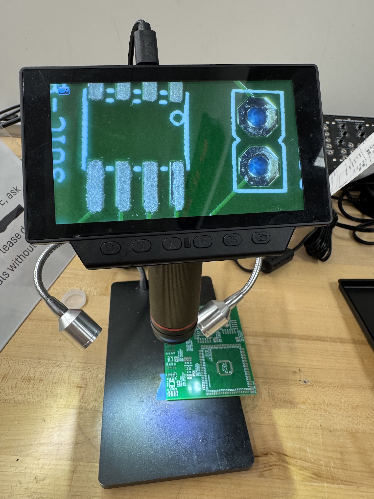

I followed some online Environmental Health and Safety modules and applied for swipe access to the AMP Lab. If granted, it would let me work on the CNC machine on my own schedule, just like my style for fixing the AFM last semester. Go into the lab every day, spending hours, without waiting on other people's schedule conflicts to restrict how much time I can spend. Schedule conflicts are the reason I have to wait until at least next week to make further progress on soldering.

The lab has a Denford 2600 / 2600 Pro CNC router. There are two main categories of 3-axis CNC machines for general-purpose 3D shaping. Routers and mills. Routers are less mechanically stable, and for machining softer materials like wood. Luckily, routers can machine the softest metals (6061 aluminum and brass) with the right tools and techniques. I can across an interesting realization about Dan Berard's aluminum blocks. He didn't use a CNC machine, but instead hand tools from a machine shop. That poses questions about what geometry can be CNC machined, such as the V-grooves. V-grooves might be important for kinematic mounts in my future STM design iterations. Worth looking into.

I found another unexpected bout of free time. Internal conflict: continue work on the spreadsheet about potentiometers, or read the Denford 2600 manual. What to do while waiting for the ability to access the machine, and download the manual on the lab's PC. Looks like some new homework came in, so I'll work on that instead. Question answered.

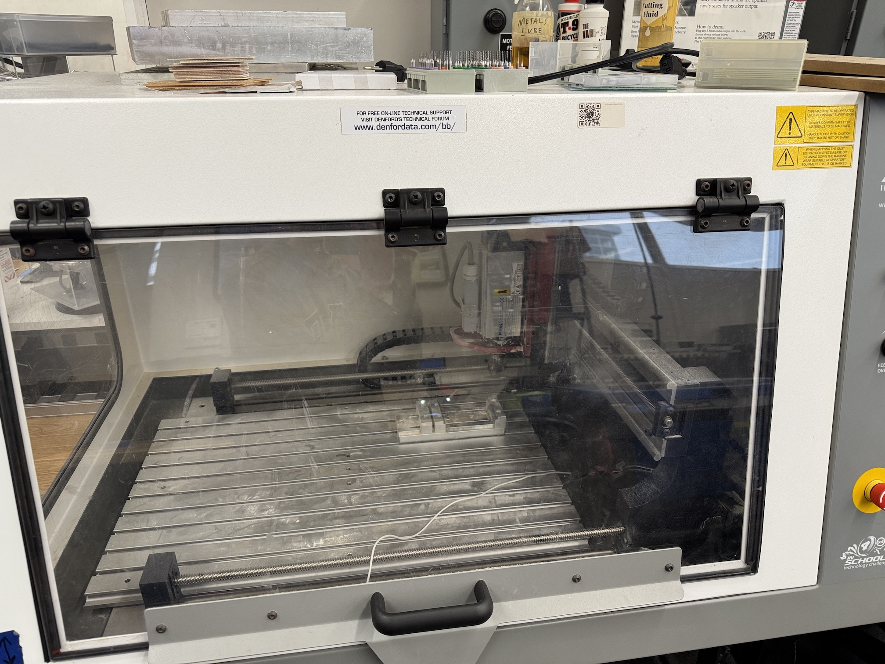

Some explanation of something else that was going on behind the scenes recently. Someone who was too easily discouraged by the pains of real-world hardware work. Claimed that my entire effort should not receive funding, because it's doomed to fail. That, even if lithium niobate improves the speed of SPMs, they're still not fast enough to build a replicator. I harshly ended that argument by declaring that I'll start a company, build a semiconductor fab with O(1000) scanning probes, and start the next industrial revolution. _You're taking the argument too far. Didn't mean it that serious. Chill out._ I can use words and video editing as a weapon too, and I have more experience with both. From here on out, I'm not diluting the fact that I'm going for APM (atomically precise _mass_-manufacturing). Even if it makes me sound crazy, it's a matter of survival and securing funding. Nothing shall stand in my way, now that I've torn down CBN's idea that they hold leverage over the intellectual property for inverted mode mechanosynthesis.

That motivated me to spend ~20 person-hours solving the "Drake Equation" for how much it costs to bootstrap a replicator. The end result, so soundly crushed the argument that SPMs are too slow, I started obsessing about the next fundamental theoretical problem (where do we go from here; what's next?). About getting an atomically detailed design of a self-replicator, so we can reduce the atom count estimate to something under 200 million atoms. There's not much intellectually rigorous theory out there about replicator atom count, besides [Kinematic Self-Replicating Machines (2004)](https://www.molecularassembler.com/KSRM.htm). It has been renamed "exponential assembly" and "factory pixels", and some well-deserving low-level technical ideas. But there was no indication of how many DOFs the compact atom builder would have, and its complete atom count. Even if it's made of spiroligomers, there's a fundamental minimum bound to the number of building blocks required to make a mechanical system complex enough to do 3DOF actuation. Atoms or spiroligomers, all indications are that we cannot place building blocks faster than a few 100 Hz per macroscale atom builder working in parallel. At this point, the only difference between carbon dimers vs. spiroligomers/amino acids/DNA base pairs/other polymer units, is one requires high vacuum and the other doesn't. Which changes the cost maybe a factor of 3, not a factor of 1 trillion.

[CostEstimates.md](https://gist.github.com/philipturner/8d1d6680932b01fae4700b6f20da5198)

Enough theory. It's distracting. _Really_ distracting. It resurrected my desire to make a CAD program capable of handling ~64 million atoms in real-time. I had quit the computational and theoretical side because I felt there was competition from MSEP. No purpose working in an already saturated field. Now, I see that there's not actually competition there. I also switched sides because I got insider information about CBN's experimental progress. Was super unhappy that they weren't telling anybody about it. Now, I've destroyed their veil of secrecy over Twitter (in the heat of the moment due to frustration one day). And I'm confident they cannot fabricate LiNbO3 piezo stacks to fix their bottleneck. So I don't see a threat from competition on the experimental side. <ins><b>_Very dangerous train of thought._</b></ins> The competition still exists, they're still building atoms and not telling anybody. But at least I'm writing about that on this document, instead of Twitter (which I'm making an effort to quit).

How one question about theoretical SPM atom placement speed, can nearly derail my experimental effort. I'm still reeling, trying to suppress the heart-wrenching feeling of sacrificing my desire to render millions of atoms. Giving up on a hobby I've had for years, optimizing GPU code. Feels like playing Minecraft, which I had to give up once. I've worked so hard to build an experimental toolset, learn KiCad and FreeCAD. To put myself in the best position to make progress on experiment. That breakthrough, doing real-world reflow soldering on real-world hardware. It was the first step, and now I'm finishing up getting back the motivation to be 100% experimental. Piezo creep doesn't care what my desires are. It continues to plague SPM as we speak. It's the reason we're 30 years in and nanobots still don't exist.

Real-world hardware is so much more difficult than theory, or commentating on experimental efforts you're not participating in yourself. More difficult than holding meetings and attempting to convince investors with fancy PPTX's. Nobody's going to give you money. DARPA won't, frankly because you don't have a deliverable that can be implemented in an engineering blueprint. Where is the FreeCAD model of the facility with 1000 scanning probes? I'll quit today's lab journal entry while I'm at it...

## April 7, 2025

Swipe access granted.

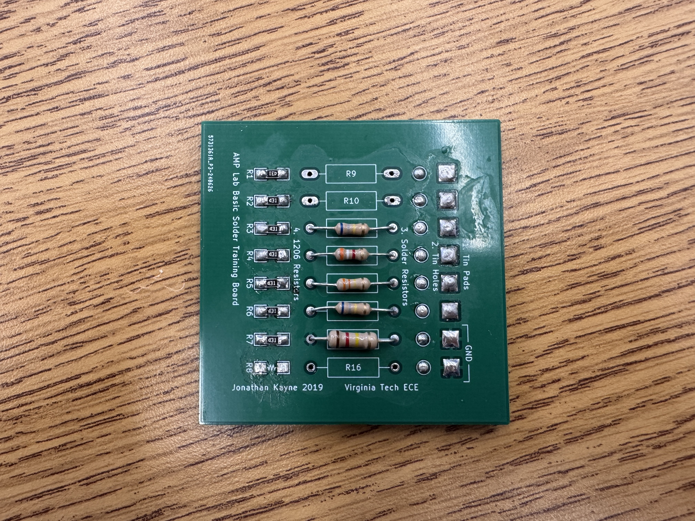

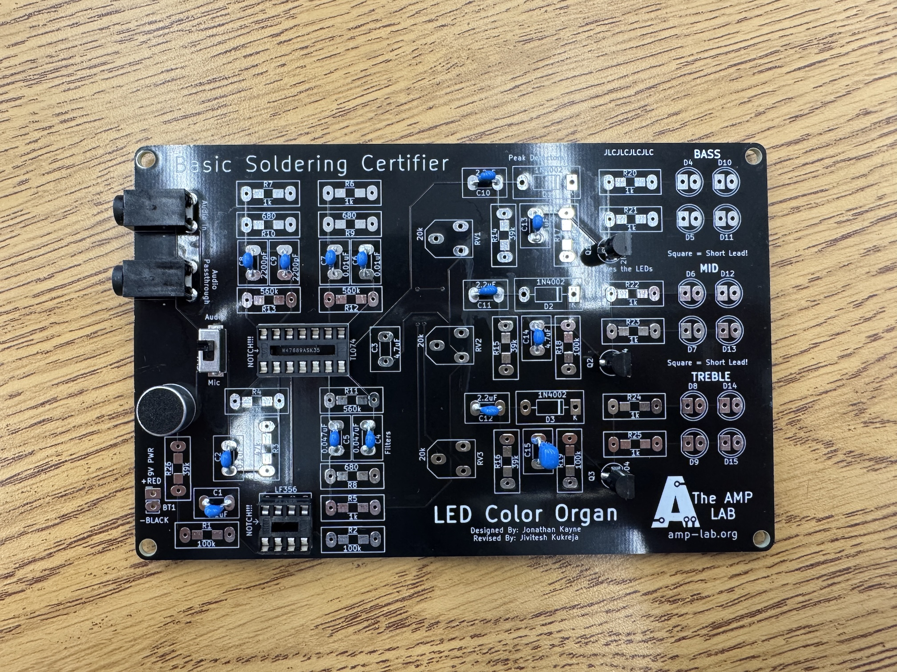

Today, I answered some more fundamental questions about the control electronics. We need 2 DAC channels for the bias voltage. One for the primary bias, and another for the negative-polarity bias to cancel the capacitive current. The cancellation capacitor can have a nonzero conductance. We can detect and subtract this unwanted resistive current in software, because it's 90° out of phase from the capacitive current. In addition, the magnitude of the resistive current stays constant, even as the frequency of the sinewave changes. Having 2 different DAC channels solves the issue of dynamically altering the magnitude of the negative-polarity bias sinewave. It also solves the issue of the two polarities being out of phase/having a large time offset, because now they will go through the same analog low-pass filter, with ideally the same phase shift/time delay.

<ins><b>_I will build 1 singular atom in a repeatable programmable way, 1 atom in isolation._</b></ins> That was my whole goal since Oct. 2024 and it has not changed. The main goal is not to hire employees, give other aspiring people the ability to physically access my lab, build a self-replicator, or liquefy hydrogen. I just want to substantiate my [mechanosynthesis simulations](https://github.com/philipturner/mechanosynthetic-build-sequences) with a real-world experiment. That has always been my goal. Nobody can take away my funding. I went _too far_ perhaps in an effort to ensure the funding goes to direct-path SPMs, and not to incremental-path floppy proteins. Suppressed the notion that incremental path is the way to molecular nanotechnology. Side note, should tone down the rhetoric about CBN from now on, it's not going to help me build a vacuum system.

I might be close to figuring out the most accessible chemistry. Energetically, it goes downhill from Ge-C to Si-C. But it also goes downhill from Ge-C to W-C. Possibly moreso than silicon. This makes it more convenient to do mechanosynthesis (given a situation where you've already folded on HV and accepted the undesired fate of fabricating a UHV system). More convenient because you can just use a W wire instead of a degenerately doped Si cantilever (the latter conducts poor STM current). Also, perhaps you can MBE thiol tripods onto an Au surface, instead of depositing them in solution? To get better control over ensuring they're spaced out 100 nm between each molecule. Either that, or maybe conventional-mode mechanosynthesis (dense monolayers with 1 nm spacing between molecules) could be more accessible at 10^-6 torr? 10^-6 to 10^-9 torr is exponentially more accessible than 10^-10 torr to 10^-12 torr.

It will take more time than I have this semester, perhaps this year, but my goal has always been the most accessible method to build atoms. Or groups of atoms (such as the carbon dimer or the spiroligomer). Any atoms at all, of any type or chemistry, just not randomly machined semiconductor nanoparticles. If I can do it by myself in a garage, great. If I have to make a startup and raise funding for external labs to assemble PCBs / CNC objects / synthesize tripods with NMR analysis, second best option. If I have to move to a different city and renovate a lab building, all just to (1) build a vibration-isolated heavy chunk of stainless steel producing UHV or (2) work with explosive or pyrophoric gases, third best option. If I have to work with any cryogens, liquid nitrogen is not good enough and what is good enough, is the 4th best option. Picking an option prematurely and attempting it right now, will waste more time than waiting a little bit longer, to have more solid plans and learn the technical skills to assemble the vacuum SPM system.

The first step before any of this is an Air-STM using PZT, which is plagued by creep. But it doesn't require high-voltage electronics or the complexities of fabricating piezo stacks. The second step is making just the fine actuator (not the coarse actuator) utilize lithium niobate. I calculated that if the coarse actuator is plagued by piezo creep, there's still a substantial improvement over CBN's atom placement speed. At least maybe 6 reactions/8 hours & 18 reactions/24 hours -> 1700 reactions/24 hours or better. This calculation was done with the 600 operations/reaction parameter from 
[CostEstimates.md](https://gist.github.com/philipturner/8d1d6680932b01fae4700b6f20da5198). And some undocumented quantitative models for the drift rate from piezo creep + actuation amplitudes in nanometers + acceptable creep drift rates in pm/ms.

Another epiphany today, was that a certain type of piezo actuation can have creep drift scale $1 / t^2$ instead of $1 / t$. Take two hyperbolas, one is $1 / t$ and another is $1 / (t - 5)$. Subtract them. The result has a $1 / t^2$ scaling, which decays faster. Or rather, in Desmos, time offset of 5 looks like $1 / t$. But time offset of 0.1 looks more like $1 / t^2$. Or it's just a concidence of the hyperbolas being nearby and cancelling out near perfectly. The lesson is, this is the phenomenon of why piezo creep doesn't show up in typical scanlines. They're triangle waves with almost-sudden jumps in piezo voltage from left, to right, back to left. A piezo creep triggered in the positive direction, then a creep triggered in the negative direction with a time delay. After the controlling voltage comes to rest, there _is_ a creep drift. And it might decay faster than $1 / t$. This needs more rigorous analysis. It is relevant to coarse stick-slip actuation motions, which are like triangle waves and ideally return back to 0 V at the end of the waveform. So that any DC piezoelectric extension can come from the LiNbO3 fine actuators which have a range too small to overcome frictional contact forces in stick-slip.

Now, this README is technically about a project sponsored by the university. I will make it very clear, they only ever agreed about the part of reproducing Mech Panda's 3D printed STM with a piezo buzzer. Virginia Tech has no association or knowledge of building individual atoms under UHV. Building atoms is my personal goal, independent of anybody else on Earth, which inspired me to learn skills in electrical engineering. The code in this repository is about electrical engineering. It will continue to be only EE and perhaps also CNC machining.

## April 8, 2025

It might be helpful to remember back to _Engines of Creation_ and _Radical Abundance_. The real reason we're here, is to seize control of chemistry and create artificial life. To build our own molecules, our own building blocks, one carbon dimer at a time. Not to rely on slow macroscale organic chemistry techniques, like extracting proteins from bacteriums, that slow stuff down. Atomic precision in UHV unlocks the ability to synthesize new molecules, much more easily. Even if they're not a perfect diamond lattice.

I feel, in full honesty, that I am the person described in the epilogue to _Engines of Creation_. Someone who can learn all the fields, or at least where to look for further information. A generalist, mastering electronics, chemistry, mechanical engineering, computer science, business, leadership, teaching. Most importantly, problem solving, troubleshooting, and optimization. I am young, not tainted by years of doing theory and the desire to continue doing theory for eternity. I have no commitments; I will switch sides based on which idea is most supported by evidence, which action is in my best interest. My worldview flipped 180° before I entered the nanotechnology field (it's part of why I entered), I'm more resilient as a result, not gullible to nonsense/misleading stuff.

I do not see the way to artificial life, being to use the framework of existing life. We must create a new alternative to primordial ribonucleic bases, that can be modified faster. Expand the design space for chemistry by allowing free radicals/metals to not be oxidized instantly. The replicator likely won't have a 14-bit rod logic decoder, turning digital electrical signals into linear mechanical motions. Life doesn't work that way, yet it manages to suppress contaminants (gas molecules in vacuum). We have so little rigorous literature on self-replication, beyond KSRM. All we can say, is the first step into the dark, is making atom manipulation faster/cheaper/more accessible. I have no idea where this will end up.

One thing is for certain. I will not make the same mistakes as my predecessors. I am already breaking all rules and norms. Intellectual property from CBN, fried. Obligation to travel to California for Foresight workshops, I'd rather troubleshoot an AFM in Virginia. I can outperform everybody on both hardware/software, both theory/experiment. There's a lot of work left on the theory, but it's not in molecular dynamics simulations. It's figuring out what life actually is, what it does at the lowest level. How to build a replicator in spite of imperfect vacuum or error rates much greater than 10-15. The way forward, is to go 100% experimental, get experience building SPMs and redefining what's "accessible." We all want to build individual atoms, that's what we've always secretly wanted to do. I finally have the means to actually do it myself.

Wow, I've mastered the art of changing my state of mind. The way the brain works, if you think it's true, it actually is true. Feel excited about the long, difficult journey ahead. Revived my interest in building atoms.

The printed circuit board functions correctly. I've completed the "basic" level of soldering training. Didn't have time to clean up the back with isopropyl alcohol.

| Event | Date | Time Until |
| ----- | ---- | ---------- |
| Today | 4-8-2025 | 0 days |
| Classes End | 5-7-2025 | 29 days |
| Graduation | 5-16-2025 | 38 days |
| Brief Return to Campus | 6-16-2025 | ~1 month after graduation |

I have confirmation that the person I contacted about gold sputtering, is actively trying to schedule a time. I trust him. If the stars don't align in my favor, DIY gold sputtering doesn't require UHV. Anything creating a particle beam, where particles must fly somewhere in O(1 second), has relatively light demands on vacuum. High vacuum is good enough. Example: mass spectrometers, e-beams like scanning electron microscopes, tin plasma EUV lasers. The challenge is making particles uninterrupted for O(10,000 seconds) or longer, which is ultra-high vacuum. Specifically, the half-life for a free radical to be oxidized, must be longer than sample preparation time (either minutes or hours, needs more research). Trying to make both the atomically sharp tripod tip and the tungsten wire/silicon cantilever flat ~10 nm diameter build surface/workpiece immune to oxidation, e.g. hydrogen passivation via HF etching, adds complexity to the process.

I imagine an experimental effort to really stretch how fast you can prepare a sample. Flash anneal an NaOH-etched tungsten wire, open the door to another chamber in 10 seconds, close the door in another 10 seconds while simultaneously putting the W tip into the holder. Coarse approach in 30 seconds with optical assist and reproducible capacitive sensing. Locate the first tripod in inverted mode in 60 seconds. Rip apart the C-Br bond with a 1 ms voltage pulse. Place a carbon dimer on the unpassivated W tip. Takes 110 seconds, you can make do with 10^-8 torr O2/H2O partial pressure. Unsure whether this is plausible, or just wishful thinking. Optical tip approach doesn't work when the chamber must be cryo-cooled, because the light reflecting from the chamber back to your eyes/CCD brings thermal energy with it.

Instead of speaking in torr and distinct HV vs. UHV regimes, we should talk in acceptable half-lives of surfaces where carbon dimers will stick. Or of exposure time for the surface the tripods will stick to, if they have alcohol linkers (which necessitates a surface susceptible to oxidation). Half-life of 100 seconds, 10 hours, 1 day? Radioactive nucleus.

## April 9, 2025

The computer connected to the 3D printing station had an Intel CPU from 2023 and an RTX 4060 GPU. I couldn't install the Denford CNC software on it (required admin password and CD/DVD reader). I connected the monitor, keyboard, mouse, and CNC machine USB cable to an old Windows 7 machine on the floor. It had the proper CNC software installed. The software has built-in documentation about things like aligning the axes.

&nbsp;
  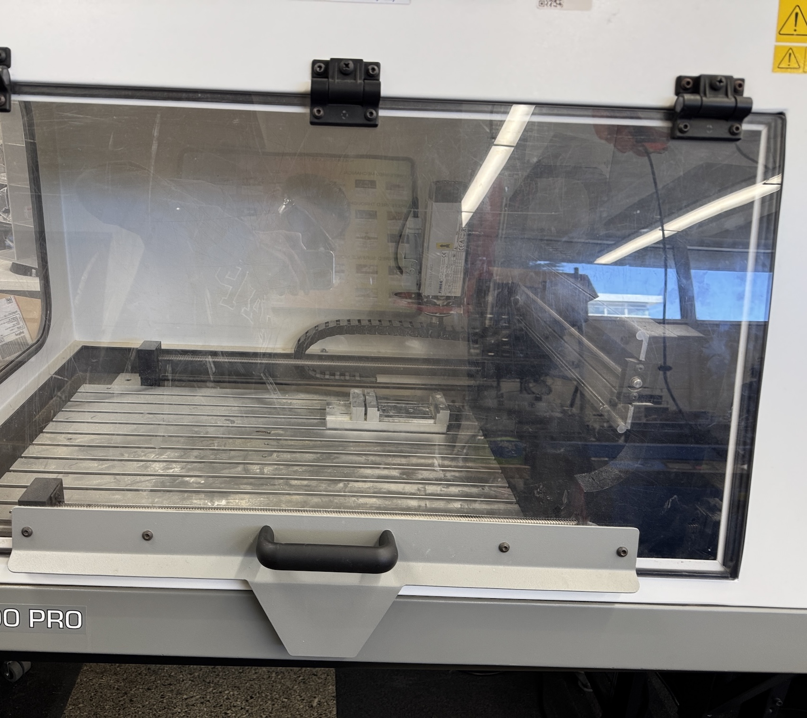
&nbsp; &nbsp;
  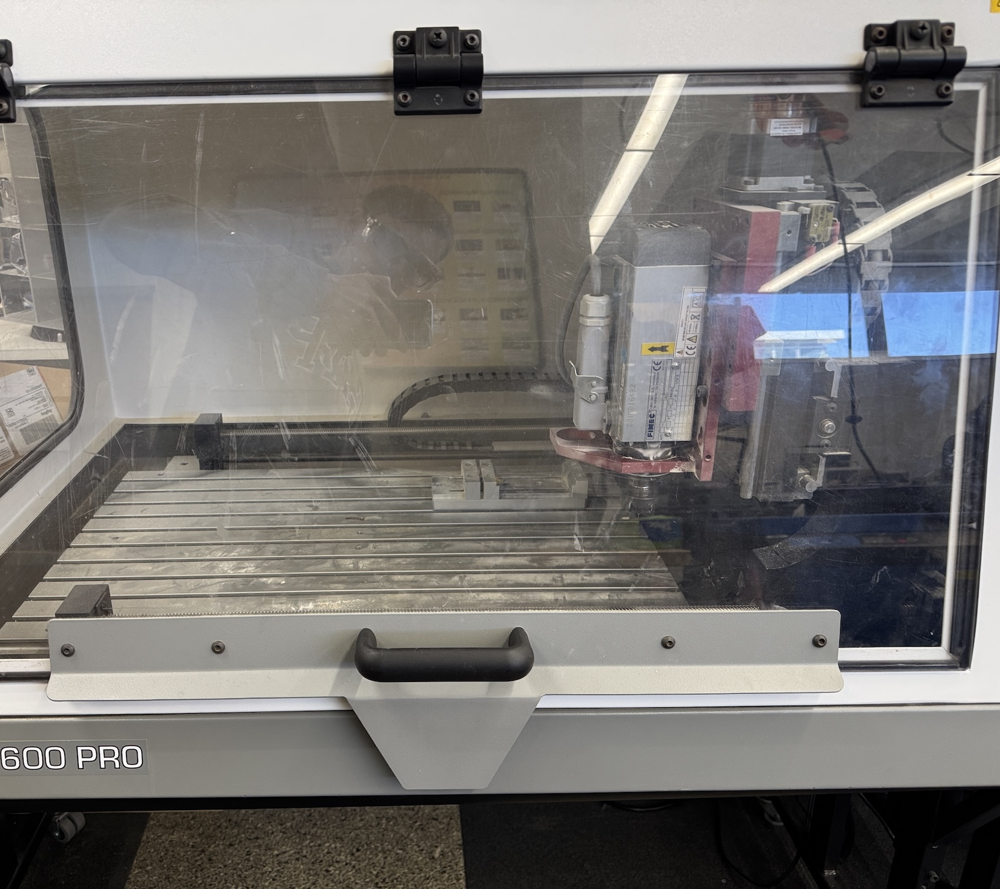
&nbsp;

&nbsp;
  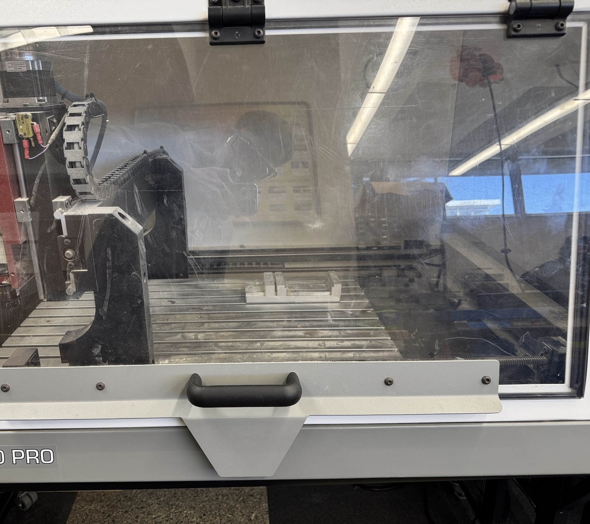
&nbsp; &nbsp;
  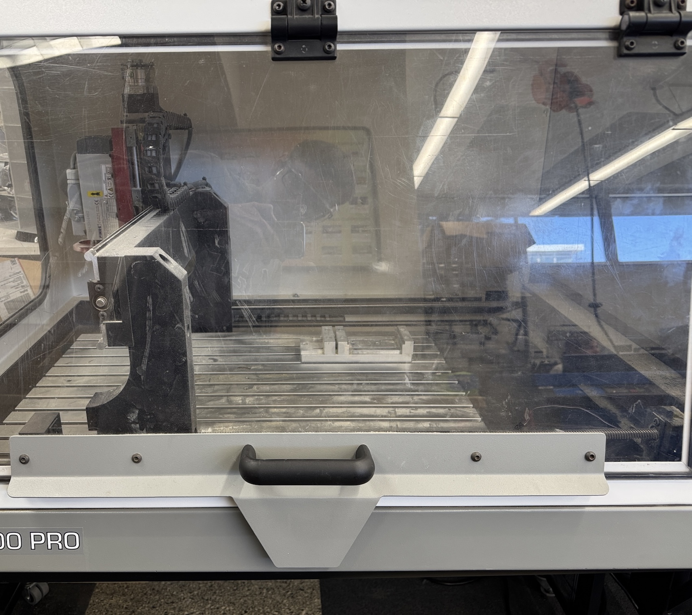
&nbsp;

_Manually jogging the machine to the 4 corners of the work volume._

[Image]

_Aligning a tool with a corner of the vice/jig._

Now the machine works. Apparently, someone had fixed it up 2 years ago, and is preparing to have the machine removed. It doesn't like aluminum, at least the tooltips already in the lab. They "explode" when machining aluminum. The Z axis control has some issues. The machine is "easy to damage". This corroborates my experience, as jogging the X axis all the way to the left, it collides with a glass window.

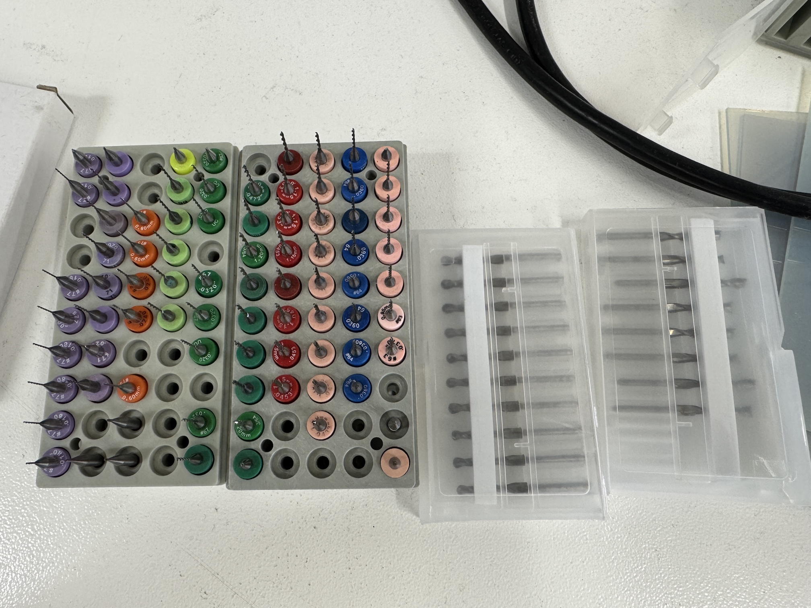

_CNC tooltips currently available at the lab work site._

The colorful tools are only good for PCB engraving. The currently loaded tool is a PCB-grade tool.

Start out with wood. Use the thicker tools in the plastic casing (which appear to all have the same dimensions) are generic tools suitable for wood.  The wood tools are an unspecified part model. We don't know the datasheet. Likely have to be measured with calipers.

For aluminum or brass, order dedicated tool bits not yet in the lab. Tools made specifically for CNC machining aluminum. They should have as few flutes as possible. In addition, spares should be ordered. My primary goal is to CNC machine as many parts from previous STM designs as possible.

Don't machine fiberglass, the dust is toxic. Requires a wierd lubricant. The system doesn't have a vacuum exhaust installed to collect dust. The port for the vacuum insert is taped over. The inside is covered in wood dust. Actuating the axes for the first time, I saw them push the dust off a sliding surface.