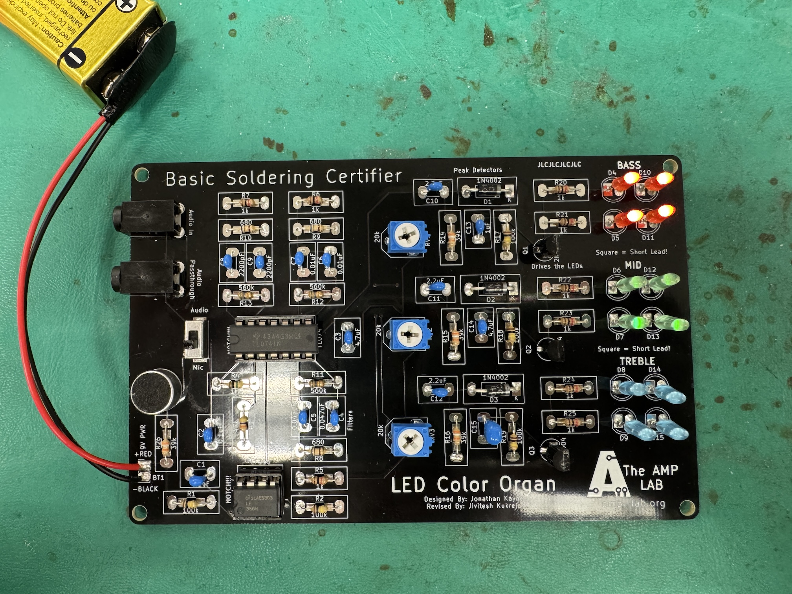
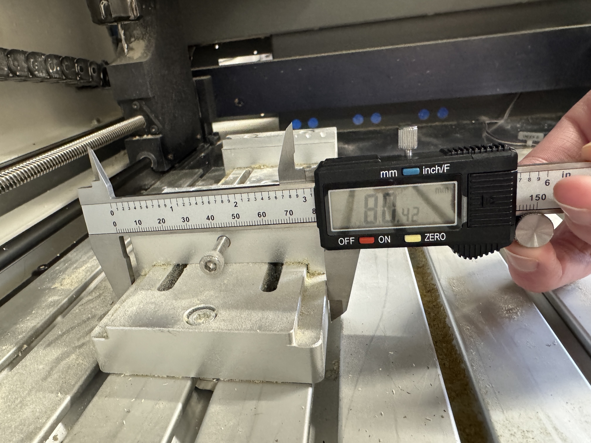
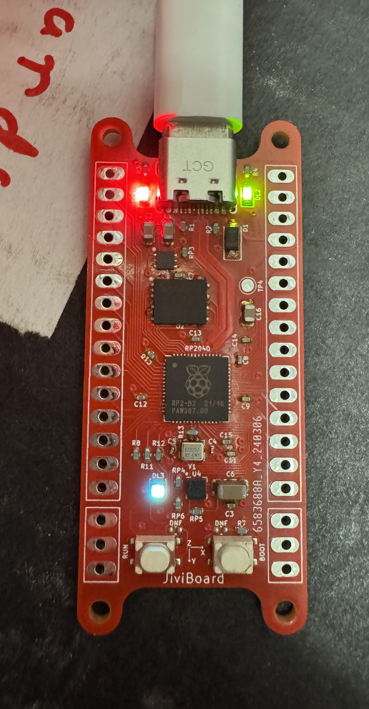
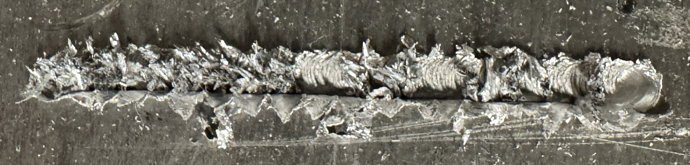
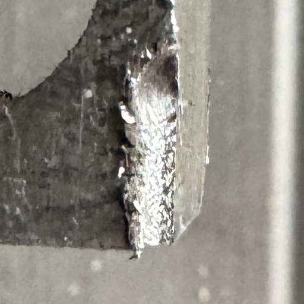

## Members
Philip Turner, Nanoscience Student (2025)
philipturner@vt.edu

## Project Overview

> _Complexity is the nemesis of progress._

STM with no nonlinearities in the relationship between piezo voltage and position.

Presentation:
- [Video (YouTube)](https://www.youtube.com/watch?v=1APURT2G7bo)
- [Slides (PDF)](./Documentation/Presentation/Final%20Presentation.pdf)

Table of Contents:
- Journal Entries (Planning Stage)
  - [Progress (Jan 2025)](#progress-jan-2025)
  - [High-Level Overview](#high-level-overview)
  - [Lithium Niobate](#lithium-niobate)
  - [Finite Element Modeling](#finite-element-modeling)
  - [Chips](#chips)
  - [Update (February 22, 2025)](#update-february-22-2025)
  - [First Draft of TIA Subsystem](#first-draft-of-tia-subsystem)
  - [Bypassing vs. Decoupling Capacitors](#bypassing-vs-decoupling-capacitors)
- Journal Entries (Theoretical Stage)
  - [March 6, 2025](#march-6-2025)
  - [March 15, 2025](#march-15-2025)
  - [March 18, 2025](#march-18-2025)
  - [March 19, 2025](#march-19-2025)
  - [March 20, 2025](#march-20-2025)
  - [March 21, 2025](#march-21-2025)
  - [March 22, 2025](#march-22-2025)
  - [March 23, 2025](#march-23-2025)
  - [March 25, 2025](#march-25-2025)
  - [March 28, 2025](#march-28-2025)
  - [March 29, 2025](#march-29-2025)
  - [March 30, 2025](#march-30-2025)
  - [March 31, 2025](#march-31-2025)
  - [April 1, 2025](#april-1-2025)
  - [April 2, 2025](#april-2-2025)
- Journal Entries (Experimental Stage)
  - [April 6, 2025](#april-6-2025)
  - [April 7, 2025](#april-7-2025)
  - [April 8, 2025](#april-8-2025)
  - [April 9, 2025](#april-9-2025)
  - [April 10, 2025](#april-10-2025)
  - [April 11, 2025](#april-11-2025)
  - [April 12, 2025](#april-12-2025)
  - [April 13, 2025](#april-13-2025)
  - [April 14, 2025](#april-14-2025)
  - [April 15, 2025](#april-15-2025)
  - [April 16, 2025](#april-16-2025)
  - [April 17, 2025](#april-17-2025)
- Journal Entries (Conclusion Stage)
  - [April 18, 2025](#april-18-2025)
  - [April 22, 2025](#april-22-2025)
  - [April 25, 2025](#april-25-2025)
  - [May 5, 2025](#may-5-2025)
- Journal Entries (Experimental Stage, Revived)
  - [May 6, 2025](#may-6-2025)
  - [May 7, 2025](#may-7-2025)
  - [May 8, 2025](#may-8-2025)
  - [May 9, 2025](#may-9-2025)
  - [May 10, 2025](#may-10-2025)
  - [May 12, 2025](#may-12-2025)
  - [May 13, 2025](#may-13-2025)
  - [May 14, 2025](#may-14-2025)

## Progress (Jan 2025)

This project is officially a NANO 4994 research project for Spring 2025, worth 3 credits. After months of research, I found a potential solution to my main goal of building an STM, solving piezo creep. I discovered a new material that could make better piezoelectric actuators: <b>lithium niobate</b>. I am listing some of the calculations and scripts I have done. Currently, I am speed-running the tutorials for FreeCAD and KiCad. I have gotten through ~50% of them.

Small-scale studies and tests performed:
- [Charge Drives (Google Sheets)](https://docs.google.com/spreadsheets/d/1x5uQ4LPubufbuQAfBjDXJuyd1Wf3S6ZZu0C0zVwssfQ/edit?usp=sharing)
- [TemperatureSensor.swift](https://gist.github.com/philipturner/81bed277f2942c87ea8825910e91a766)
- [Accelerometer.swift](https://gist.github.com/philipturner/bb1920f50a6ece8943d76146afa0af87)
- [FourierTransformAcceleration.swift](https://gist.github.com/philipturner/d7ffa2e23931173a39b9624441069f12)
- [FourierTransformVelocityPosition.swift](https://gist.github.com/philipturner/a365d72c1ba5c4eedf1c331bb21d586d)
- [FrequencyResponse.swift](https://gist.github.com/philipturner/212ae83408707147ce6cd6f57adedc7e)
- [PiezoelectricCoefficients.swift](https://gist.github.com/philipturner/9fb9d81c1d2d1427b4287541a99e6cec)
- Ordered and received 10 lithium niobate piezo plates

I also read a few hundred pages of literature on:
- Nanopositioner design and control electronics
- Vibration isolation
- Ultra-high vacuum instrumentation and compatible technologies
- Ferroelectric materials (Landau Theory)
- A substantial portion of "Art of Electronics, 3rd Edition"

<b>Lithium is a high vapor pressure metal, just like zinc.</b> See [Vacuum Compatibility (Google Sheets)](https://docs.google.com/spreadsheets/d/1ahE9a9jptKb8CLytUUoq606xVC4pLZpgXXCualte69o/edit?usp=sharing). To carry this investigation to completion, I would need to validate that lithium niobate and conductive epoxy are UHV compatible. Or whatever else is used to solder SMT/SMD components in vacuum-compatible PCBs. Shear piezo stacks have been made before, and worked under 10^-11 torr backing pressures @ 300 K. It's just, the lithium in LiNbO3 evaporates more than the lead in Pb(Ti,Zr)O3. Liquid nitrogen should annihilate the vapor pressure during STM operation, but not during bakeout (likely the issue with high vapor-pressure metals). Might require longer bakeouts at lower temperatures.

The other downside: lithium niobate has a smaller piezo constant than PZT. About one tenth. In practical applications, compensating for the fact that LiNbO3 can withstand higher electric fields (higher voltages given fixed membrane width), the range is also one tenth. Except at cryo temperatures (liquid helium, 4 K) where the range is equal. But only if you stack 10-20 plates on top of each other. I am suffering two-fold from the loss of range. I can only afford to put in, maybe 2 piezo plates for any given actuator.

## High-Level Overview

The current high-level plan is very rough. It will be split into different modules, which can be constructed once and recycled multiple times. I will conduct multiple experiments in sequence, some of which will reuse this equipment. For example, the very first capacitance measurement experiment can use the same vibration isolator as a late-stage STM iteration. It could even opt to only use the interior isolation stage.

Sequence of experiments:
- Measuring capacitance change between two parallel plates, to verify piezoelectricity of LiNbO3
  - Using glass cover slides to enforce a pre-determined distance of ~300 μm. Then, verify that capacitance behavior matches the simulations.
    - Use the FreeCAD finite element simulator to model the capacitance, which needs corrections to the parallel plate model.
  - Verify the predicted behavior, that it shears in both X and Y.
- 1DOF scanning tunneling spectroscopy machine, that can maintain tunneling current without crashing the tip
  - 30 nm range single LiNbO3 plate, with 440 V effective (+/-110 V plus polarity reversal)
  - 3 nm coarse stepping size with Dan Berard style stepper motor stage, just 1 motor?
    - Although there is severe thermal drift, the handoff between fine Z range and coarse Z step might catch up
    - Otherwise, need to stack multiple piezo plates for Z. This is a topic of major importance.
  - Verify the measurement of 100 fA currents (100x more sensitive than the Mech Panda STM)
- 3DOF scanning tunneling microscope with limited range
  - 30 nm range on each axis, verified for the X/Y axes by counting number of HOPG unit cells.
  - Prove there is an absence of hysteresis and creep distorting the images of HOPG
  - Resolve individual atoms on Au(111), which Dan Berard could not do. Or find the reason it cannot be imaged under ambient conditions.
- Complete, end-goal iteration with 100 nm range X/Y/Z and vacuum compatibility
  - Remove the stepper motor Z coarse stage
  - Z fine actuator needs disproportionately more range (more LiNbO3 plates) to match the stepping size of the coarse stage
  - Add slip-stick/stick-slip inertial drive for X and Z axes, clamped by gravity
  - X coarse stage enables "tripod assembly line", reducing a sample swapping bottleneck during atom building
  - Coarse stage uses shear piezos, but potentially out of the inferior PZT just to increase their range
  - PZT has piezo creep, but it has a similar effect to thermal drift with stepper motors. Wait until the coarse stage settles.
- Ultra-high vacuum system at room temperature (far term development stage, beyond my work at Virginia Tech)
  - Prove that evaporation of lithium atoms from LiNbO3 is not a concern
  - Prove that evaporation of atoms from the conductive epoxy is not a concern
  - Prove that the system can withstand bakeout, if STM modules are typically required to undergo bakeout
  - Verify that the previously designed system can function (take an image) while producing a vapor pressure of under 10^-10 torr
 
Mechanical loop:
- The system modules are everything besides the tip-sample mechanical loop (which will change from experiment to experiment).
- The mechanical loop should be designed to have maximum resonance frequency.
- The mechanical loop should be designed to have minimum coefficient of thermal expansion.
- The electrical shielding should have minimum possible tip-ground parasitic capacitance (the limiter to current sensitivity).

System modules:
- UHV compatible spare pre-amplifiers
  - Each time a pre-amplifier is used, it might be soldered irreversibly to the STM tip
  - A custom design that minimizes parasitic capacitance, might need to be discarded with the broken tip
  - This is similar to qPlus sensors, which have some MEMS circuitry on whatever the tuning fork is glued to
  - Minimize the magnitude of thermal drift caused by the op-amp's ~7 mW power consumption
- Reversibly bondable piezo plates
  - Use magnets to make piezos reversibly stickable to something. You can stack them up, or instead distribute them across different axes (X/Y/Z).
  - Need to understand whether you can do this, without the magnetic force crushing the crystalline material.
  - Issues with isolating nearby circuitry (such as the grounded STM tip) from very high electric fields
- Two-stage spring suspension system
  - Viton high-frequency dampers are incompatible with UHV. They're compatible with HV, but not UHV (Viton has a vapor pressure of 10^-8 or 10^-7 torr).
  - Use a single-stage, compact spring for the high-frequency part. This is small enough to fit inside a UHV chamber.
  - Use a single-stage low-frequency isolator with ~1.7 Hz vertical resonance frequency. Copying the "Open STM" design.
  - The low-frequency isolator models a pessimistic outcome, where you need an air table, and you can't utilize Minus K technology.
  - This table would hold the entire UHV chamber in the far-term prototype. Near-term, it serves to conveniently hold the electronics.
- High-voltage amplification board (piezo driver board)
  - A large number (~5–10) of high-power op amps, with bipolar -110V / +110 V output ([ADHV4702-1](https://www.analog.com/en/products/adhv4702-1.html))
    - ["The industry's first 220 Vpp op amp"](https://www.analog.com/en/resources/design-notes/adhv4702-1-24-v-to-220-v-precision-operational-amplifier.html), invented in 2018.
    - There are 350 Vpp (-175 V / +175 V) designs out there, but they have triple the cost ($10 -> $28)
    - Might be more economical to use custom, discrete components to reach even higher voltages (Art of Electronics mentioned 0 V / +1 kV piezo driver)
  - Each LiNbO3 stack needs 2 dedicated op amps, so one electrode is +110 V while the other is -110 V. LiNbO3 can withstand extremely high electric fields.
  - Unused op amps should be turned off to reduce power consumption.
  - Might multiplex op-amps to the subset of piezoactuators in use at any moment.
  - Can be recycled for late-stage prototype with coarse piezoactuators under ambient conditions. Might keep one of the electrodes at GND for PZT plates, to avoid depoling them.
- Analog to digital board
  - [AD5761](https://www.analog.com/en/products/ad5761.html]) DACs with ~133 kHz bandwidth
    - Enough DACs to supply all the piezos that must be operated simultaneously, in the late-stage prototype (3 fine and 2 coarse, 5 total). Also, a DAC for the bias voltage.
    - High voltage setting: 20 Vpp range (-10 V / +10 V or 0 V / +20 V)
    - Low voltage setting: 6 Vpp range (-3 V / +3 V or 0 V / +5 V)
    - 16 bits, enough for picometer step size (the problem is increasing the range at the voltage peak; LiNbO3 has a small piezo constant)
    - DACs used as piezo drivers will be fed into the high-voltage amplification board, jumping from +/-10 V to +/-110 V (11 V/V amplification factor).
    - Analog Devices made some [open-source code](https://github.com/analogdevicesinc/no-OS/blob/main/drivers/dac/ad5761r/ad5761r.h) to operate this chip, which is nice.
  - [AD7746](https://www.analog.com/en/products/ad7746.html) CDC with 10-100 Hz bandwidth
    - "Capacitance to digital converter", fuses high-resolution capacitance detection circuitry with a 24-bit sigma-delta ADC
    - 10 Hz = 4 aF resolution
    - 100 Hz = 40 aF resolution
    - Accepts up to 4 pF variation range during dynamic operation, with 17 pF able to be accessed by a slow capacitance offsetting mechanism
    - The capacitance measurement setup in the paper that studied piezo creep, was 3.2 pF with 10 mm x 10 mm x 300 μm parallel plate capacitor
    - Removes the need for bulky, expensive "capacitance bridges" based on a four-element bridge with inductors and mechanical DACs (unsure how they work fully)
    - Useful to early-stage prototype measuring capacitance, and could serve as a sensor to aid in tip approach later on.
- Second half of TIA board
  - Processes the output of the pre-amplifier; this board doesn't need as much shielding
  - Complex analog circuitry for the 0.1 pA–50 nA, [fast low-noise transimpedance amplifier](https://pubs.aip.org/aip/rsi/article-abstract/91/7/074701/967357/Fast-low-noise-transimpedance-amplifier-for).
  - Contains the expensive (~$20–30) 18-bit ADC.
    - Plan to buy the low-bandwidth 250 kHz one. The way ADC bandwidths work, is they have either a fixed frequency or they are on sleep.
    - The analog part of this circuit has no more than 50 kHz (anything higher would have unacceptable e<sub>n</sub>C noise anyway).
    - No need to sample significantly higher than the true bandwidth.
  - Bandwidth switching circuitry and high-order filters, potentially multiplexing through a finite set of bandwidths.
    - Theoretical limit is the 50 fA bias current of the pre-amplifier.
    - Ultra low bandwidth (1-2 kHz, the circuit's natural corner frequency without correction) = 250 fA noise, mostly Johnson noise at 300 K
    - Low bandwidth (4.4 kHz) = 500 fA noise
    - High bandwidth (40 kHz) = 7 pA noise, mostly e<sub>n</sub>C noise
  - Current amplifier will not be needed for early capacitance testing experiments
- Power board
  - Accepts mains power (170 V amplitude AC power)
  - Three lines: +120 V, GND, -120 V
  - Third op amp in the fast low-noise TIA (+/-50 V output capability) can use a resistive voltage divider to supply rails with +/-60 V
  - Voltage divider for +/-20 V may or may not be implemented on the analog-to-digital board. Especially if the 18-bit ADC is migrated up there.
- Teensy 4.0 CPU
  - I don't need the extra memory of the 4.1. It's slower than main memory, so it's of no use anyway.
  - I don't need the extra ports of the 4.1, at least when counting the number of DAC lines and harnessing a few built-in ADCs.

Safety mechanisms for high-voltage electronics: major importance
- -110 V and +110 V away from electrical ground, or perhaps 220 V since the circuit's ground may float away from Earth.
- Anything above 40 V can generate a great enough electric field to break down human skin.
- It's often not the voltage, per se, that is the reason for danger (40 V is already way above the band gap of the toughest insulator).
  - Rather, it's the magnitude of the electric field, given the typical thicknesses of a thin film in context.
  - Also, high voltage generates high current, and the two multiply to give a high power through the human body.
- I'll reach up a bunch more, litter the PCB silkscreens with HV safety signs, add redundant mechanisms to physically prevent exposure to HV, etc.
  - I'm not an expert on HV safety yet, so the above precautions are not good enough to protect someone.

The plans above already need some revisions. Certain chips, such as the ADHV4702, are too expensive and must be replaced with a cheaper alternative. In addition, the piezo motor coarse approach mechanism is too expensive to fabricate, if one wants high stiffness. Instead, I am currently analyzing the common design for Air-STMs/EC-STMs, which uses electromagnetic motors. This is the design Dan Berard used.

## Lithium Niobate

Images of 10 lithium niobate plates that were delivered. Dimensions: 5 mm x 5 mm x 0.5 mm.

<p align="center">
&nbsp;
  
&nbsp; &nbsp;
  
&nbsp;
</p>

Crystallographic orientation:


## Finite Element Modeling

Source: https://dberard.com/2015/09/13/new-spm-design-progress

Image 1: Render from Dan Berard's CAD model, of his second prototype that was never built. Image 2: Cross-section of my FreeCAD model. Image 3: Finite element mesh created from the cross-section (29,955 nodes). Node count of the full STM model, without the cross-section, is 50,907.

<p align="center">
&nbsp;
  
&nbsp; &nbsp;
  
&nbsp; &nbsp;
  
&nbsp;
</p>

## Chips

The first iteration will avoid lithium niobate and high-voltage electronics. It will avoid the fast low-noise TIA design with an LTC6090-5 (140 Vpp) and opt for a simpler design with smaller dynamic range. Instead of 100 fA to 50 nA, it will target 200 fA to 10 nA. The output will go into an ADS8699 18-bit, 100 kHz ADC. I don't yet fully understand the requirements for LPF or differential pairs. The chip seems to include a 15 kHz second-order LPF within the IC (yet it has variants running SAR at 1 MHz?). I will have at least two bandwidths hard-coded into the hardware. The lower bandwidth will be ~5 kHz and require a custom LPF, regardless of the requirements for the high-bandwidth noisy mode. I would prefer a fourth-order Bessel filter, which seems optimal based on the graphs in Art of Electronics.

This prototype serves as a near-term experience, to get experience with constructing PCBs and precision analog electronics. It is a stepping stone toward a system with high-voltage electronics. The latter would require a custom voltage regulator and (potentially, in an even later prototype) custom high-voltage amplifier/piezo driver, with discrete transistor components. High voltages are needed because lithium niobate has a very small piezo constant. For example, extending 100 nm with 68 pm/V would require 1470 V. We can get around this slightly by stacking shear plates (only for XY actuators; Z-actuating LiNbO3 has major complications). But that only works to a certain extent. The cheap, in-stock LiNbO3 plates are relatively thick (0.5 mm). Physical dimensions must be kept <<10 mm per axis. We still have to employ high voltages (e.g. 294 V with 5 piezo plates per axis). The omission of HV electronics, for the first prototype, removes the high-voltage amplification stage (the DAC outputs drive the piezos directly). This lowers the complexity and cost.

The offset voltages for ADCs and DACs are non-trivial. However, based on skimming through some online stuff, trimming should be effective. The offsets supposedly stay constant with environmental conditions (temperature is the only thing that changes them? skeptical). DACs have a much greater offset voltage than ADCs. This is especially of note for the bias voltage. Scienta Omicron's overpriced STM has a lower bound to bias voltage dynamic range, of 5 mV. How do they perform sub-millivolt STS graphs? Maybe that instrument does not.

I still haven't tabulated all the chips needed. I likely won't have a Bill of Materials until I spend more time understanding transistors and discrete transistor feedback loop circuits. This is Art of Electronics chapters 2 and 3, some of the last ones I haven't read yet. Transistors are important for over-voltage regulators in the fast low-noise TIA design, so I need to understand how they work and what implications this has.

## Update (February 22, 2025)

This project is way out of scope for a single semester. I don't even want to make a 3D scanning STM first. I just want to solve the stability issue preventing people from taking quantitatively correct current-distance curves. Can I create a stable enough STM to measure the fact that current increases 10x every 80 pm, not 10x every Å? Thermal drift and piezo nonlinearities mean this cannot happen at 300 K. It has only been done at 4 K. I hypothesize that with a lithium niobate coarse approach mechanism, as outlined in [US12174218B2](https://patents.google.com/patent/US12174218B2), such a stability test will be possible at 300 K.

Here, I have recorded a snapshot of my current priority list. It is constantly under revision, as I answer questions. The answers to these questions result in even more questions appearing. The stable 1DOF nanopositioning system would be "Prototype 5". However, v5 is out of scope for a semester. Even v4 might be out of scope, due to the need for high-voltage electronics.

For Prototype 3:
- Find the best DAC chip
- First project:
  - Before next Tuesday, come back with a plan for this
  - Making a PCB that measures the values of resistors and capacitors

For Prototype 4:
- Learning about epoxy
- AoE x-Chapters part about inductors
- Understanding tilting and bowing in the capacitance sensor
- Understanding the reason for a sensor shaped like concentric cylinders
- Learning KiCad StepUp

For Prototype 5:
- Understanding the shear stress, and whether differences in polarization will break bonds in the frictional contact
- Calculate the critical amplitude for a coarse actuator design

To explain the current roadmap, I made a table. It lists the previous design iterations (1, 2) and the ones on my priority list.

| Prototype | Purpose |
| :-------: | ------- |
| 1         | First TIA on breadboard |
| 2         | Second TIA on breadboard, with ordered parts |
| 3         | Experience using the IC chips needed for the STM |
| 4         | Test rig for properly orienting piezo stacks |
| 5         | Stable 1DOF nanopositioner with kinematic mount |

There are technically 11 weeks between now and graduation. But more realistically, the budget is 9 weeks or less. I feel that, by putting these tasks on this project document, I might feel better. About crossing off a few of them, without taking the time to finish them. I can be more motivated to work on the near-term "Prototype 3" while also not forgetting the other tasks, in the future.

## First Draft of TIA Subsystem

<p align="center">
&nbsp;
  
&nbsp; &nbsp;
  
&nbsp;
</p>

## Update (February 26, 2025)

I will have to reduce the scope again. I still have the following questions:
- How does the successive approximation algorithm work?
- How does delta-sigma modulation work?
- What are the parasitics for the "capacitance bridge", and why was the 2550A supposedly better than the AD7746?

I am writing the questions on this document, hoping it will convince me to remove them from my TODO list (for now). I will remove the TIA, ADC, and CDC from the near-term initial prototype. Just the DAC remains. It will be powered by a battery (±5 V), and the output will be read with a multimeter.

I now only have the following questions left on my TODO list:
- Decide between the AD5761RBRUZ ([$14.49](https://www.mouser.com/ProductDetail/Analog-Devices/AD5761RBRUZ?qs=sGAEpiMZZMtgJDuTUz7Xu4AqHG%252BNl4bmQrNkJ2FPlwUUtx9Id5RwyQ%3D%3D)) and DAC81401 ([$13.23](https://www.mouser.com/ProductDetail/Texas-Instruments/DAC81401PWR?qs=mELouGlnn3e7ARpnyM2zAA%3D%3D)). Currently, the former appears to have better offset stability (unusually optimized around bipolar zero). The latter has better INL. Furthermore, the DAC8140x product line would readily facilitate future prototypes with multiple DAC channels.
- Understand what effects the instrumentation amplifier (bias voltage) or high-voltage amplifier (piezo driver) would have. Regarding offset, temperature drift of the offset, and temperature drift in general. These are chips that post-process the DAC's output. Their errors combine with the errors from the DAC.

## Bypassing vs. Decoupling Capacitors

I found a reference that demystifies the myriad capacitors sprouting out of ICs, and the inconsistency between example PCB layouts on datasheets. Source: https://designers-guide.org/design/bypassing.pdf

Next, I will:
- Understand the pins on the Teensy.
- Create a prototype PCB with the Teensy and the DAC.
- Perform "The Recipe" on the PCB traces.
- If I can get away with just a single 0.1 μF capacitor on each supply pin, I will do that.

## March 6, 2025

I reverted back to the original plan, of stuffing all three analog-to-digital ICs onto the near-term PCB. I am currently understanding the effects of parasitics, particularly "Header Sockets". These are parts that emulate the connections in breadboards. Header sockets allow reversible bonding of through-hole components as "devices under test". One can also reversibly connect different test points in the circuit, with jumper wires. Or interface them with a multimeter/oscilloscope. Such connections have a large amount of parasitic inductance.

I developed 8 different permutations of lumped element models, for simple "devices under test" between the DAC and the ADC. It starts with the parasitic output resistance of the DAC, 0.05 Ω. Then, it goes through a network of resistors, capacitors, and/or inductors (which may connect to GND). It ends with the parasitic input resistance of the ADC, 1 MΩ. I am using the SPICE functionality embedded in KiCad to understand the behavior of these parasitics. I previously invested well over 10 person-hours learning how to use KiCad's SPICE.
- 2 resistor geometries × 3 resistance values (1 Ω, 1 kΩ, 1 MΩ) = 6 permutations
- 2 short circuit geometries (THT with 1 cm jumper wire, SMT pads with 1 cm PCB trace)

I will put the following on this README:
- Screenshots of the KiCad schematic models
- Screenshots of the transient analysis (voltages and appropriate currents)
  - Units for time, voltage, and current in each transient analysis
- Screenshots of the AC small-signal analysis, for the DAC → ADC transfer function

Power source for transient analysis:


Power source for AC small-signal analysis:


To save time, I revised the number of models to 5. The first one is a simple test to get the hang of setting up simulations.

<details>
<summary>KiCad SPICE Models</summary>

| Device Under Test | Description | Model |
| ----------------- | ----------- | ----- |
| Circuit 1 | Simplified version of SMT short circuit |  |
| Circuit 2 | SMT short circuit from 1 cm PCB trace |  |
| Circuit 3 | THT resistor in header socket, 1 Ω |  |
| Circuit 4 | THT resistor in header socket, 1 kΩ |  |
| Circuit 5 | THT resistor in header socket, 1 MΩ |  |

</details>

<details>
<summary>Transient Analysis</summary>

| Device Under Test | V(Vout) | I(V2) |
| ----------------- | ------- | ----- |
| Circuit 1 | .jpg) | .jpg) |
| Circuit 2 | .jpg) | .jpg) |
| Circuit 3 | .jpg) | .jpg) |
| Circuit 4 | .jpg) | .jpg) |
| Circuit 5 | .jpg) | .jpg) |

</details>

<details>
<summary>AC Small-Signal Analysis</summary>

| Device Under Test | V(Vout) | I(V1) |
| ----------------- | ------- | ----- |
| Circuit 1 | .jpg) | .jpg) |
| Circuit 2 | .jpg) | .jpg) |
| Circuit 3 | .jpg) | .jpg) |
| Circuit 4 | .jpg) | .jpg) |
| Circuit 5 | .jpg) | .jpg) |

</details>

## March 15, 2025

To minimize the risk of running out of time, I will cut the AD7745 out of this project for now. It might be needed in the future, in the control electronics for a capacitive displacement sensor. That sensor's purpose is primarily to aid in testing LiNbO3 piezo stacks.

Instead, I plan to use the TIA to measure capacitance, with lock-in amplification. All good capacitance sensors use both an excitation signal and capacitance cancellation. The excitation signal can be a sine wave (AH2550A, TIA) or a square wave (AD7745). The cancellation capacitance reduces the magnitude of the background (unchanging) component of the capacitance. Without the cancellation capacitance, the large signal would saturate the sensor, or its shot noise would overbear the desired (small) signal.

There are three ways to implement a cancellation capacitance.
- <b>AD7745:</b> Excitation voltage stays the same, but value of capacitance values. There are 7-bit "CAPDACs" on each input terminal, which act effectively as negative capacitances.
- <b>AH2550A:</b> Wildly complex system using transformer taps. Switches between several physical capacitors, some as large as 1 μF.
- <b>TIA:</b> Fixed-value "compensation capacitor" attached to the terminal of the pre-amplifier. It receives the bias voltage, with opposite sign and gain of 0.1&ndash;10x.

The principal issues with the TIA are:
- Ensuring the leakage capacitor has very low leakage. A high-resistance material must be used. This is hard, as PTFE (a good material) is not UHV compatible. Instead, one could create an artificial vacuum capacitor. This has concerns of bulkiness (C ∝ size) and susceptibility to vibration (dC/dt × V looking like C × dV/dt).
- Ensuring the negated bias voltage's gain can vary. A mechanical trimpot is a bad idea in the long run, because when the tip approaches the sample, the background capacitance changes. The trimpot must be recalibrated. This can incur major human labor costs, in a factory with O(1000) scanning probes. Instead, one should use a digipot and incorporate gain switching into the coarse approach controller.

In <b>scanning capacitance microscopy</b>, people have reported ~1 aF sensitivity with a 1 V sine wave at ~100 kHz. This is a concern, as the ADS8699 has a low-pass filter at 15 kHz. I see no reason one cannot use a 10 V sine wave at ~10 kHz. The 1 V bias might have been due to the AFM tip already being close to the sample, and wanting to avoid large electrostatic forces. The purpose of capacitance sensing is to extract information about the tip-sample distance, when very far from the sample. I don't need it once tunneling is established.

Electrostatic shielding can reduce the magnitude of the background capacitance. This means the compensation capacitor can be smaller (it must be similar to the background capacitance in magnitude). It is also needed to reduce currents from radiofrequency interference. It may contribute to the parasitic capacitance (C<sub>in</sub>) that harms performance of the TIA.

In addition to capacitance measurement, a good TIA must have low leakage and interference currents. Here are some non-obvious notes regarding that.
- Leakage through a PCB (FR-4 material) might be non-negligible. In-vacuum transimpedance amplifiers are made of SMT components bonded to Macor. PCBs are not UHV compatible.
- Often, a PTFE standoff is used at the junction where tunneling current enters the op-amp. The IC pin may be pried off the PCB, and soldered to a wire going directly to the tip.
- In the case of qPlus AFM, the op amp is literally suspended in the air, held in place by wires reaching into its pins.
- The pre-amplifier stage should have a separate power supply, with very large capacitors. It is critical to suppress power supply noise, which can be a limiting factor to current sensitivity.

I'll have to judge what measures are feasible with the time remaining in this semester. I want a sensor with very high performance, that can be easily tested. The contacts for a "device under test" must be reversibly bondable. The testing system must be shielded.

Perhaps a model STM, with just two parallel plates moved together with a micrometer screw. It does not require vibration isolation, or automation of the coarse approach.

No, all of that is out of scope. Just have a PCB with a DAC and ADC. Include the TIA, but don't include shielding or leakage protection that would require a lot of effort.
- All test points are through-hole header sockets.
- I can cover the entire PCB with a construct of aluminum foil, for first-order shielding.
- The power supply is six 9V batteries, fed into a network of linear regulator ICs.
- The Teensy will bond directly to the PCB, via a carefully placed array of header sockets. No need for ribbon cables and intermediate boards between the Teensy and PCB.
- Separate ground plane for the Teensy (digital) and ADC/DAC SPI pins (analog). Each of the two chips has a quad-channel digital isolator (not an opto-isolator, but similar).

From the time budget in the February 22 update, I have effectively 6 weeks left. But Spring Break (the most productive week) is mostly over. The workload will get harder. I am participating in a group project, to plan and execute an organic synthesis. I will be very engaged, as it's invaluable to my future aspirations to synthesize tripods. Although that motivation has faded away; the even greater barrier might be time to construct a minimal-cost UHV SPM. Regardless, I have little time to waste.

## March 18, 2025

Correct control-loop model of the fast low-noise transimpedance amplifier:

<p align="center">
&nbsp;
  
&nbsp; &nbsp;
  
&nbsp;
</p>

Analysis, in progress at the time of writing:

[TransimpedanceAmplifierStability.swift](https://gist.github.com/philipturner/321f9a1ccf64319d583776371fe78bf2)

I could not use SPICE because the model for LTC6090-5 was closed-source. I could not trust the parameters for it. The other two amplifiers have open-source text files for SPICE, which are compatible with KiCad SPICE. The easiest way to understand "mid-f compensation" is actually to just script the transfer functions with Swift, and graph with Matplotlib. It is the second option after Wolfram Alpha stops working because I hit the character limit (the transfer function has too many variables).

Interestingly, I learned something about "LTspice" used in college electronics classes. It stands for "Linear Technologies SPICE". If you look at the app icon, it has the logo for Linear Technologies. The software IP transferred over to Analog Devices when they bought out LT. The buyout happened in 2016&ndash;2017. I realized the thing about LTspice after looking through old Internet Archive records, of the original company's website. The LTC6090/LTC6090-5 was released in 2013&ndash;2015.

<b>Update:</b> I think I figured this out. I can use KiCad SPICE to simulate the circuit. I just need to use the Swift script to verify the transfer functions for the single-pole approximations to each op-amp. Then, I'll reproduce each transfer function with a voltage-dependent voltage source + RC filter in SPICE. Verify that no feedback loop ever enters the region where the single-pole approximation is incorrect. This is >500 kHz for the OP37, >50 kHz for the LTC6090-5.

I don't have to worry about the incorrectness for LTC6090-5, as I won't use that chip in the real device. The inner feedback loops will likely be >500 kHz. But I'm not concerned about the moderately inaccurate phase shift for inner loops. Just that they are stable (which is pretty easy to guarantee). I care more about the detailed frequency response of the outer loop, which is far below 500 kHz. Therefore, I should be justified in parameterizing only a single-pole model. This saves time.

## March 19, 2025

I keep going back and forth about which tool I want to use. Generally, if I was not pressured for time, I would do everything custom. I only learned FreeCAD because there was an immense overhead to set up the geometry for finite element simulations. For electrical circuit simulations, the equations and algorithms are much simpler. In addition, scripting opens up the flexibility to explore more details, which are inaccessible from a UI-based program. Solving this problem with scripting would be a valuable experience, and prepare me to tackle future problems that existing tools can't address.

Finally!


## March 20, 2025

I have successfully created lumped-element models of the op-amps in KiCad SPICE, by referring to the code from the script. They reproduce the transfer functions shown above. I used voltage-controlled voltage sources to create unity-gain buffers, which prevent different filter sections from "loading" each other.


<i>Lumped-element model of the AD8615, configured for an AC small-signal analysis.</i>

I organized the KiCad project by creating multiple pages. One of the pages holds the models for the op-amps. There is text denoting which circuit is which op-amp model. This page is excluded from simulation. To set up a simulation, I can copy and paste the elements from this reference page, into the main page. This is similar to how I host reference code for MD simulations in a repository [(1)](https://github.com/philipturner/rod-logic) [(2)](https://github.com/philipturner/bootstrapping-code-archive), they copy it into an [Xcode project](https://github.com/philipturner/molecular-renderer) for customization.

The OP37G model has been translated <i>correctly</i>.


Another scope reduction: omit the ADC, DAC, Teensy, and optocouplers. We'll be using entirely analog input and analog/oscilloscope output methods. It is true, that going entirely analog makes the circuitry simpler. This a hard conclusion to reach, from someone who spent their entire previous career in the digital realm.

<b>Why is this true?</b> There are less questions about what is "ground", less need to isolate noisier grounds from quieter grounds. Another bonus, is you're not able to measure signals with 16-bit precision, so you don't have to optimize for low noise/drift. The total number of chips on the near-term prototype PCB is less. And the total number of decoupling and/or bypassing capacitors is less. Which means less time to set up the schematic, less time to place the components before soldering. Less traces on the PCB; op-amps and comparators have ~1/4 as many leads as ADC/DAC chips.

It's also easier to model, because the entire circuit (except the power supply and overvoltage protection) can be represented in the SPICE simulation. Everything is linearly dependent, given a fixed frequency. All the non-power pins and devices under test (impedances) can be described with linear algebra.

## March 21, 2025

I got the general structure of the custom design figured out. Instead of three inverting stages, there is one inverting stage (AD8615) followed by a noninverting stage (OP37G). This configuration is different from the problematic combination of a noninverting preamplifier with an inverting second stage. The frequency response should theoretically be identical to the amplifier from the fast low-noise TIA paper.


Response to a triangle wave + 1.0 pF device under test, after calibration. Note that the "mid-f compensation" appears to not affect the response when the current is a triangle wave. Only when the current is an infinitely sharp step. It eliminates the peaking that appears when input capacitance exceeds 90 pF and goes toward 95 pF, 130 pF.


Note that for this design, the second stage can be very sensitive to the parasitic capacitance between the terminals of OP2. If C<sub>in</sub> for OP1 is 130 pF, the circuit oscillates when C<sub>in</sub> for OP2 reaches ~350 pF. If C<sub>in</sub> for OP1 is 12 pF, the circuit oscillates when C<sub>in</sub> for OP2 reaches ~120 pF. This can be remedied by using tactics traditionally used for transmitting preamplifier input wires. Put the actual preamplifier in vacuum, and use what "once was" its 35 pF parasitic as the input capacitor for OP2. This ensures that (10 + 35 =) 45 pF < 120 pF.

## March 22, 2025

Capacitances that make the amplifier unstable. The tests are conducted when the "mid-f compensation" trimpot is at 25 kΩ, and the "main compensation" trimpot is tuned for a flat frequency response.

Custom design:

| OP1 C<sub>in</sub> | OP2 C<sub>in</sub> |
| -----------------: | -----------------: |
|   2 pF |  ≥ 26 pF |
|  12 pF | ≥ 121 pF |
|  45 pF | ≥ 264 pF |
| 130 pF | ≥ 370 pF |

Fast low-noise TIA:

| OP1 C<sub>in</sub> | OP2 C<sub>in</sub> | OP3 C<sub>in</sub> |
| -----------------: | -----------------: | -----------------: |
|   2 pF | unstable | unstable |
|   2 pF | unstable | unstable |
|   2 pF | unstable | unstable |
|  12 pF |  ≥ 50 pF |    10 pF |
|  12 pF |    10 pF |  ≥ 12 pF |
|  12 pF |  ≥ 12 pF |  ≥ 12 pF |
|  45 pF | ≥ 705 pF |    10 pF |
|  45 pF |    10 pF | ≥ 122 pF |
|  45 pF | ≥ 121 pF | ≥ 121 pF |
| 130 pF | ≥ 725 pF |    10 pF |
| 130 pF |    10 pF | ≥ 242 pF |
| 130 pF | ≥ 238 pF | ≥ 238 pF |

Tolerance for capacitance between terminals of post-amplifier stages:

| OP1 C<sub>in</sub> | OP2 C<sub>in</sub> (2-stage) | OP2 C<sub>in</sub> (3-stage) | OP3 C<sub>in</sub> (3-stage) |
| -----------------: | ------: | ------: | ------: |
|   2 pF |  ≤ 26 pF | unstable | unstable |
|  12 pF | ≤ 121 pF |  ≤ 50 pF |  ≤ 12 pF |
|  45 pF | ≤ 264 pF | ≤ 705 pF | ≤ 121 pF |
| 130 pF | ≤ 370 pF | ≤ 725 pF | ≤ 238 pF |

Interesting behavior with the three-stage design:
- When OP1 C<sub>in</sub> = 12 pF, reducing the "mid-f compensation" trimpot to 15 kΩ causes instability.
- When OP1 C<sub>in</sub> = 2 pF, the amplifier is always unstable. Even when the "mid-f compensation" trimpot is at 100 kΩ, and the resistance in series to C<sub>c</sub> is 1470 Ω.
- When OP1 C<sub>in</sub> = 45 pF, reducing the "mid-f compensation" trimpot to 15 kΩ does not cause instability.

Next, I must design an analog 2-stage lowpass filter that mimics the ADS8699's lowpass. It's important to include this test in the semester's project, as I likely won't actually test the ADS8699. The filter will not take much effort to include.

## March 23, 2025

Second-order lowpass filters to emulate the ADS8699 are out of scope. I need to figure out which voltage regulators to use. Also, I wonder how to/whether one should switch off the triangle wave generator.

Voltages required:
- AD8615
  - rail-to-rail input and output
  - no GND pin
  - positive supply: 2.5 V
  - negative supply: -1.5 V
  - If an input pin voltage exceeds the supplies, place resistor in series with the input, so that the current doesn't exceed 5 mA.
- OP37G
  - no GND pin
  - positive supply: 12 V to 18 V
  - negative supply: -12 V to -18 V
  - If differential input voltage exceeds 0.7 V, the input current should not exceed 25 mA.
- LM4040-10
  - 10 V reverse breakdown voltage between cathode and anode
  - tolerance in reverse breakdown voltage: 
    - ±10 mV (A grade)
    - ±20 mV (B grade)
    - ±50 mV (C grade)
    - ±100 mV (D grade)
  - 1 mA current change:
    - up to 1.5 mV voltage change (A, B, C grade)
    - up to 2.0 mV voltage change (D grade)
  - 15 mA current change:
    - up to 14 mV voltage change (A, B, C grade)
    - up to 18 mV voltage change (D grade)
- AD8676
  - rail-to-rail output
  - no GND pin
  - positive supply: 5 V to 18 V
  - negative supply: -5 V to -18 V
  - up to ±0.7 V input differential voltage tolerated
  - If power supplies are established awkwardly with respect to input signals, input current should not exceed 10 mA.
- TS861
  - rail-to-rail input
  - no GND pin
  - supply operation from 2.7 to 10 V
  - tolerates differential input voltages up to ±12 V (absolute maximum rating)

Currents required:
- AD8615
  - up to 2 mA quiescent supply current
  - output current:
    - up to 50 mA (2.7 V supply)
    - up to 150 mA (5 V supply)
- OP37G
  - total supply current:
    - 2.8 mA (24 V)
    - 3.1 mA (30 V)
    - 3.3 mA (36 V)
    - 5.7 mA (from 170 mW maximum at 30 V)
  - output current via maximum output voltage:
    - 1.5 mA (10 kΩ)
    - 4.8 mA (3 kΩ)
    - 14 mA (1 kΩ)
    - 37 mA (300 Ω)
    - 45 mA (200 Ω)
    - 50 mA (100 Ω)
  - For best linearity, the output current should not exceed ±10 mA.
- LM4040-10
  - recommended operating conditions: 0 to 15 mA
  - minimum cathode current:
    - up to 120 μA (A, B, C grade)
    - up to 130 μA (D grade)
  - example application: 4.7&ndash;10 kΩ resistance separating Zener from supplies
    - 4.7 kΩ, ±15 V: 1.1 mA
    - 4.7 kΩ, ±18 V: 1.7 mA
    - 10 kΩ, ±15 V: 0.5 mA
    - 10 kΩ, ±18 V: 0.8 mA
  - short-circuit "current": -39 mA to +45 mA
- AD8676
  - short-circuit "limit": +40 mA
  - output current: ±20 mA typical
  - supply current per amplifier:
    - up to 3.2 mA (±5 V supply)
    - up to 3.4 mA (±15 V supply)
  - ±50 μA output current used in the application
- TS861
  - supply current per comparator, output low:
    - up to 12 μA (2.7 V supply)
    - up to 12 μA (5 V supply)
    - up to 14 μA (10 V supply)
  - supply current per comparator, output high:
    - up to 14 μA (2.7 V supply)
    - up to 14 μA (5 V supply)
    - up to 16 μA (10 V supply)
  - Front page quotes 6 μA per comparator at 2.7 V supply.
  - Can source/sink up to 40 mA at 5 V supply. Likely higher at 10 V supply.

Summarize the information above:

| Chip | Voltage from (-) Supply to GND | Voltage from (+) Supply to GND | Quiescent Current from (+) to (-) Supply | Maximum Output Current |
| --------- | -----: | ----: | -------------------: | ------------: |
| AD8615    | -1.5 V | 2.5 V | 1.6&ndash;1.9 mA | 3 μA    |
| OP37G     |  -12 V |  12 V | 2.8&ndash;5.4 mA | 1.95 mA |
| OP37G     |  -15 V |  15 V | 3.1&ndash;5.7 mA | 1.95 mA |
| OP37G     |  -18 V |  18 V | 3.3&ndash;5.9 mA | 1.95 mA |
| LM4040D10 |    0 V |  10 V | 0.8&ndash;1.1 mA | n/a     |
| AD8676    |   -5 V |   5 V | 4.6&ndash;6.4 mA | 0.32 mA |
| AD8676    |  -10 V |  10 V | 5.0&ndash;6.6 mA | 0.32 mA |
| AD8676    |  -15 V |  15 V | 5.4&ndash;6.8 mA | 0.32 mA |
| TS861     |   -5 V |   5 V | 7&ndash;16 μA    | 0.32 mA |

Tradeoffs between supply voltages for OP37G. The difference in voltage noise is negligible.

| Supply Voltages | Open-Loop Gain | Common-Mode Range | Slew Rate, Falling | Slew Rate, Rising |
| --------------: | -------------: | ----------------: | -----------------: | ----------------: |
| ±12 V           | 1.6 million    | -9.5 V to 9.5 V   | -16.0 V/μs         | 17.0 V/μs         |
| ±15 V           | 1.8 million    |  -13 V to  13 V   | -17.0 V/μs         | 18.0 V/μs         |
| ±18 V           | 2.0 million    |  -16 V to  16 V   | -18.0 V/μs         | 18.5 V/μs         |

## March 25, 2025

The fight marches on. Only 4 weeks left. I will not fail to produce results this semester.

I spent a few days prying apart the voltage regulators. Created a 16-page Google Sheet.

[Voltage Regulators (Google Sheets)](https://docs.google.com/spreadsheets/d/1mhAkuCKq5BPGl8A8w-LUtCfJhjZLB09bPVywwgDxSec/edit?usp=sharing)

[VoltageDividerDesign.swift](https://gist.github.com/philipturner/36213b186f521f3313a14810f68e0b57)

I ended on investigating the voltage divider that creates +2.5 V and -1.5 V for the AD8615. If my computations are correct, one should use a pair of +5 V and -5 V voltage regulators. Not a pair of +15 V and -15 V regulators. And definitely not an LM317/LM337 pair.

I settled on a divider with three resistors, that touches the ground nowhere. Capacitors for AC stability/noise suppression were out of scope. I started investigating footprints for the SMT resistors, but realized that is an entire ordeal.

All of these capacitors, ground planes, ICs is out of scope. Capacitors grow out of the ICs like apples on a tree, placed haphazardly and sometimes not actually needed. One, two, or three ground planes make a cheap 2-layer PCB into an expensive 4-layer one. One of the 4 different regulated voltages gets to be king of its dedicated plane, the other 3 voltages don't.

I have a simple goal. A PCB with the 3 SMT resistors (357 Ω, 499 Ω, 806 Ω, 1% tolerance, 0603, Vishay) and 4 (isolated?) THT header sockets. No ground plane. But the solder paste footprints have the correct dimensions, as specified on Vishay's part datasheet. What specific width should the PCB traces have? That should be doable in 4 weeks of part-time work.

## March 28, 2025

The semester did not go as expected (there was no plan, really). I tried my hardest to build something related to the STM. I just lacked critical prerequisites in precision analog electronics and precision mechanical engineering. Stuff people might gloss over, and then build a device with inferior performance. I refuse to make anything other than the best possible hardware for a given set of constraints.

I will wrap the extensive computational and theoretical research on the transimpedance amplifier, into this semester's "deliverable." Likely not publishing a video about it (to save time, and there's not much to say) but instead a short PPTX to count for credit. Return to it in the far future, when I can work on it full-time.

| Event | Date | Time Until |
| ----- | ---- | ---------- |
| Today | 3-28-2025 | 0 days |
| Classes End | 5-7-2025 | 40 days |
| Graduation | 5-16-2025 | 49 days |
| Brief Return to Campus | 6-16-2025 | ~1 month after graduation |

I'm using the remaining weeks to gain valuable experience, on lab hardware I'll lose access to after graduation. The AMP lab has a reflow oven, decent hand soldering stations, oscilloscopes, CNC machining, etc. I'll get a very simple PCB designed, ordered, and soldered. Learn how to place the SMT components and operate the reflow oven myself. Then, learn how to operate the "high-end" CNC machine with G-code generated in FreeCAD.

| Accessible Now | Alternative at Home Lab |
| -------------- | ----------------------- |
| Reflow oven | Sand bath in a frying pan |
| Oscilloscope | Custom mixed-signal DAQ boards |
| CNC machine | Online CNC services |
| - | Two-component epoxy systems |
| Sputtering | Electrochemical deposition |

Simultaneously, I'm trying very hard to get gold sputtered onto a silicon wafer. Not the $1,000 gold samples you can order, but being in the same room when the sputtering is taking place. I do not foresee having access to UHV equipment until the very far future. I'll try to build it myself, and avoid sample preparation processes that require explosive gases. There's a half-possible chance I can build diamond-like spaghetti carbon (only C and H atoms) in a garage lab, without moving out to a dedicated lab building. Or at least hydrogen depassivation lithography. Depends on whether I can do without an argon ion gun (literal particle accelerator) and XPS sensor. And the timing/logistics of germa-adamantane tripods.

[Demonstration of mechanosynthesis with only carbon dimers on pre-charged germanium tooltips](https://www.youtube.com/watch?v=whvXCeEwlmI)

I need the flexibility to do graduate school full-time, without the bureaucracy and restrictions associated with a graduate degree. Being able to work full-time in a personal lab like [NileRed](https://www.youtube.com/@NileRed/videos). Until that happens, even a "simple" piezo stack with lithium niobate is out of scope.

No time to waste! There is work to do.

## March 29, 2025

Why is it so hard and complicated to specify a printed circuit board for manufacturing? There are at least 20 different parameters relevant to the process. And OSH Park, what I thought was the best service, doesn't ship steel stencils. You have to defer that to OSH Stencils. Other manufacturers (PCBWay, JLCPCB) might bundle stencils with your order. You need steel stencils to apply solder paste in a way other than randomly "dabbing" a "bit" on each precison pad.

OSH Park won't accept `.kicad_pcb` files from KiCad 9; they need files from KiCad 8. I find these practical implementation issues amusing.

## March 30, 2025

A few random notes (don't know where to put them):
- The issue with lithium and vacuum compatibility is still a concern. Its vapor pressure falls between zinc and lead. Perhaps baking out at a lower temperature (400 K instead of 500&ndash;800 K), for a longer time, will be needed.
- I don't want to have to wash parts in a bath of boiling trichloroethylene. This step might be an unscientific method for cleaning UHV parts.
- Wear a face mask while handling UHV parts, so you don't sneeze and add a layer of filmic contaminant.

## March 31, 2025

Helpful note. In the KiCad PCB editor, change all silkscreen items to be 0.635 mm x 0.127 mm. It allows the text to match the manufacturing tolerance of OSH Park. In the board setup constraints, set:
- Minimum item clearance: 0.127 mm
- Minimum text height: 0 mm
- Minimum text thickness: 0.127 mm

## April 1, 2025

Rule: Keep the symbols as close as possible to a generic chip,
no special op amp symbols or special linear regulator symbols.
Prefer the Snapeda symbols.
- Link datasheet and price to library symbol.

Rule: Use a standard set of footprints derived from the
KiCad library. Link them to the symbols, which are unique
for each part model.
- Delete the unique footprints and 3D models to reduce file size.

Avoid open-frame potentiometers.

Valid series (single-turn):
- 3313/3314/PVG3 ($1.23)
- 3329/3345/PV32
- 3361 ($1.10)
- 3362/3386 ($0.56)

Valid series (multi-turn):
- 3005/3006/3009/3057/3059/3082 ($1.79)
- 3214/3224/PVG5 ($2.44)
- 3223
- 3250/3252/3260/3262/3266/PV37 ($2.23)
- 3269
- 3290/3292/3296/3299/PV36 ($1.53)
- 3339/PV12

## April 2, 2025

I found myself having an unexpected few days with a few hours of free time. I used it to make another attempt at the transimpedance amplifier. I went through another design iteration of fixing problems with setting up the KiCad project. Made custom symbols and footprints for the ~12 different ICs.

I was preparing to set up the last dozen distinct circuit components. I got stuck on the enormous combinatorial space for trimming potentiometer types, and read a few dozen pages in a potentiometer handbook. I only got halfway through a Google Sheet characterizing the entire product catalog for Bourns trimpots.

Since final exams are coming up, I will likely not have another large block of free time like this. Or if I do, it's too risky to invest it into finishing the TIA. I can put the TIA to the side, and have it be the first thing I return to after graduation.

I must spend as much of this remaining time as possible:
- Getting experience with assembling mixed-technology PCBs
- Getting experience with CNC machining
- Attempting to get experience with a vacuum system capable of 10^-8 torr (10^-9 torr on a very good day)

## April 6, 2025

So I finally broke ground with real hardware. I did reflow soldering. Next, I am working on setting up an appointment to learn advanced hand soldering. I added 36 JPG images to the repository, with no effort to reduce data footprint. So the amount of data jumped 43 MB, dwarfing previous efforts to minimize disk consumption. Oh well, caught up in the moment.


I followed some online Environmental Health and Safety modules and applied for swipe access to the AMP Lab. If granted, it would let me work on the CNC machine on my own schedule, just like my style for fixing the AFM last semester. Go into the lab every day, spending hours, without waiting on other people's schedule conflicts to restrict how much time I can spend. Schedule conflicts are the reason I have to wait until at least next week to make further progress on soldering.

The lab has a Denford 2600 / 2600 Pro CNC router. There are two main categories of 3-axis CNC machines for general-purpose 3D shaping. Routers and mills. Routers are less mechanically stable, and for machining softer materials like wood. Luckily, routers can machine the softest metals (6061 aluminum and brass) with the right tools and techniques. I can across an interesting realization about Dan Berard's aluminum blocks. He didn't use a CNC machine, but instead hand tools from a machine shop. That poses questions about what geometry can be CNC machined, such as the V-grooves. V-grooves might be important for kinematic mounts in my future STM design iterations. Worth looking into.

I found another unexpected bout of free time. Internal conflict: continue work on the spreadsheet about potentiometers, or read the Denford 2600 manual. What to do while waiting for the ability to access the machine, and download the manual on the lab's PC. Looks like some new homework came in, so I'll work on that instead. Question answered.


Some explanation of something else that was going on behind the scenes recently. Someone who was too easily discouraged by the pains of real-world hardware work. Claimed that my entire effort should not receive funding, because it's doomed to fail. That, even if lithium niobate improves the speed of SPMs, they're still not fast enough to build a replicator. I harshly ended that argument by declaring that I'll start a company, build a semiconductor fab with O(1000) scanning probes, and start the next industrial revolution. _You're taking the argument too far. Didn't mean it that serious. Chill out._ I can use words and video editing as a weapon too, and I have more experience with both. From here on out, I'm not diluting the fact that I'm going for APM (atomically precise _mass_-manufacturing). Even if it makes me sound crazy, it's a matter of survival and securing funding. Nothing shall stand in my way, now that I've torn down CBN's idea that they hold leverage over the intellectual property for inverted mode mechanosynthesis.

That motivated me to spend ~20 person-hours solving the "Drake Equation" for how much it costs to bootstrap a replicator. The end result, so soundly crushed the argument that SPMs are too slow, I started obsessing about the next fundamental theoretical problem (where do we go from here; what's next?). About getting an atomically detailed design of a self-replicator, so we can reduce the atom count estimate to something under 200 million atoms. There's not much intellectually rigorous theory out there about replicator atom count, besides [Kinematic Self-Replicating Machines (2004)](https://www.molecularassembler.com/KSRM.htm). It has been renamed "exponential assembly" and "factory pixels", and some well-deserving low-level technical ideas. But there was no indication of how many DOFs the compact atom builder would have, and its complete atom count. Even if it's made of spiroligomers, there's a fundamental minimum bound to the number of building blocks required to make a mechanical system complex enough to do 3DOF actuation. Atoms or spiroligomers, all indications are that we cannot place building blocks faster than a few 100 Hz per macroscale atom builder working in parallel. At this point, the only difference between carbon dimers vs. spiroligomers/amino acids/DNA base pairs/other polymer units, is one requires high vacuum and the other doesn't. Which changes the cost maybe a factor of 3, not a factor of 1 trillion.

[CostEstimates.md](https://gist.github.com/philipturner/8d1d6680932b01fae4700b6f20da5198)

Enough theory. It's distracting. _Really_ distracting. It resurrected my desire to make a CAD program capable of handling ~64 million atoms in real-time. I had quit the computational and theoretical side because I felt there was competition from MSEP. No purpose working in an already saturated field. Now, I see that there's not actually competition there. I also switched sides because I got insider information about CBN's experimental progress. Was super unhappy that they weren't telling anybody about it. Now, I've destroyed their veil of secrecy over Twitter (in the heat of the moment due to frustration one day). And I'm confident they cannot fabricate LiNbO3 piezo stacks to fix their bottleneck. So I don't see a threat from competition on the experimental side. <ins><b>_Very dangerous train of thought._</b></ins> The competition still exists, they're still building atoms and not telling anybody. But at least I'm writing about that on this document, instead of Twitter (which I'm making an effort to quit).

How one question about theoretical SPM atom placement speed, can nearly derail my experimental effort. I'm still reeling, trying to suppress the heart-wrenching feeling of sacrificing my desire to render millions of atoms. Giving up on a hobby I've had for years, optimizing GPU code. Feels like playing Minecraft, which I had to give up once. I've worked so hard to build an experimental toolset, learn KiCad and FreeCAD. To put myself in the best position to make progress on experiment. That breakthrough, doing real-world reflow soldering on real-world hardware. It was the first step, and now I'm finishing up getting back the motivation to be 100% experimental. Piezo creep doesn't care what my desires are. It continues to plague SPM as we speak. It's the reason we're 30 years in and nanobots still don't exist.

Real-world hardware is so much more difficult than theory, or commentating on experimental efforts you're not participating in yourself. More difficult than holding meetings and attempting to convince investors with fancy PPTX's. Nobody's going to give you money. DARPA won't, frankly because you don't have a deliverable that can be implemented in an engineering blueprint. Where is the FreeCAD model of the facility with 1000 scanning probes? I'll quit today's lab journal entry while I'm at it...

## April 7, 2025

Swipe access granted.


Today, I answered some more fundamental questions about the control electronics. We need 2 DAC channels for the bias voltage. One for the primary bias, and another for the negative-polarity bias to cancel the capacitive current. The cancellation capacitor can have a nonzero conductance. We can detect and subtract this unwanted resistive current in software, because it's 90° out of phase from the capacitive current. In addition, the magnitude of the resistive current stays constant, even as the frequency of the sinewave changes. Having 2 different DAC channels solves the issue of dynamically altering the magnitude of the negative-polarity bias sinewave. It also solves the issue of the two polarities being out of phase/having a large time offset, because now they will go through the same analog low-pass filter, with ideally the same phase shift/time delay.

<ins><b>_I will build 1 singular atom in a repeatable programmable way, 1 atom in isolation._</b></ins> That was my whole goal since Oct. 2024 and it has not changed. The main goal is not to hire employees, give other aspiring people the ability to physically access my lab, build a self-replicator, or liquefy hydrogen. I just want to substantiate my [mechanosynthesis simulations](https://github.com/philipturner/mechanosynthetic-build-sequences) with a real-world experiment. That has always been my goal. Nobody can take away my funding. I went _too far_ perhaps in an effort to ensure the funding goes to direct-path SPMs, and not to incremental-path floppy proteins. Suppressed the notion that incremental path is the way to molecular nanotechnology. Side note, should tone down the rhetoric about CBN from now on, it's not going to help me build a vacuum system.

I might be close to figuring out the most accessible chemistry. Energetically, it goes downhill from Ge-C to Si-C. But it also goes downhill from Ge-C to W-C. Possibly moreso than silicon. This makes it more convenient to do mechanosynthesis (given a situation where you've already folded on HV and accepted the undesired fate of fabricating a UHV system). More convenient because you can just use a W wire instead of a degenerately doped Si cantilever (the latter conducts poor STM current). Also, perhaps you can MBE thiol tripods onto an Au surface, instead of depositing them in solution? To get better control over ensuring they're spaced out 100 nm between each molecule. Either that, or maybe conventional-mode mechanosynthesis (dense monolayers with 1 nm spacing between molecules) could be more accessible at 10^-6 torr? 10^-6 to 10^-9 torr is exponentially more accessible than 10^-10 torr to 10^-12 torr.

It will take more time than I have this semester, perhaps this year, but my goal has always been the most accessible method to build atoms. Or groups of atoms (such as the carbon dimer or the spiroligomer). Any atoms at all, of any type or chemistry, just not randomly machined semiconductor nanoparticles. If I can do it by myself in a garage, great. If I have to make a startup and raise funding for external labs to assemble PCBs / CNC objects / synthesize tripods with NMR analysis, second best option. If I have to move to a different city and renovate a lab building, all just to (1) build a vibration-isolated heavy chunk of stainless steel producing UHV or (2) work with explosive or pyrophoric gases, third best option. If I have to work with any cryogens, liquid nitrogen is not good enough and what is good enough, is the 4th best option. Picking an option prematurely and attempting it right now, will waste more time than waiting a little bit longer, to have more solid plans and learn the technical skills to assemble the vacuum SPM system.

The first step before any of this is an Air-STM using PZT, which is plagued by creep. But it doesn't require high-voltage electronics or the complexities of fabricating piezo stacks. The second step is making just the fine actuator (not the coarse actuator) utilize lithium niobate. I calculated that if the coarse actuator is plagued by piezo creep, there's still a substantial improvement over CBN's atom placement speed. At least maybe 6 reactions/8 hours & 18 reactions/24 hours -> 1700 reactions/24 hours or better. This calculation was done with the 600 operations/reaction parameter from 
[CostEstimates.md](https://gist.github.com/philipturner/8d1d6680932b01fae4700b6f20da5198). And some undocumented quantitative models for the drift rate from piezo creep + actuation amplitudes in nanometers + acceptable creep drift rates in pm/ms.

Another epiphany today, was that a certain type of piezo actuation can have creep drift scale $1 / t^2$ instead of $1 / t$. Take two hyperbolas, one is $1 / t$ and another is $1 / (t - 5)$. Subtract them. The result has a $1 / t^2$ scaling, which decays faster. Or rather, in Desmos, time offset of 5 looks like $1 / t$. But time offset of 0.1 looks more like $1 / t^2$. Or it's just a concidence of the hyperbolas being nearby and cancelling out near perfectly. The lesson is, this is the phenomenon of why piezo creep doesn't show up in typical scanlines. They're triangle waves with almost-sudden jumps in piezo voltage from left, to right, back to left. A piezo creep triggered in the positive direction, then a creep triggered in the negative direction with a time delay. After the controlling voltage comes to rest, there _is_ a creep drift. And it might decay faster than $1 / t$. This needs more rigorous analysis. It is relevant to coarse stick-slip actuation motions, which are like triangle waves and ideally return back to 0 V at the end of the waveform. So that any DC piezoelectric extension can come from the LiNbO3 fine actuators which have a range too small to overcome frictional contact forces in stick-slip.

Now, this README is technically about a project sponsored by the university. I will make it very clear, they only ever agreed about the part of reproducing Mech Panda's 3D printed STM with a piezo buzzer. Virginia Tech has no association or knowledge of building individual atoms under UHV. Building atoms is my personal goal, independent of anybody else on Earth, which inspired me to learn skills in electrical engineering. The code in this repository is about electrical engineering. It will continue to be only EE and perhaps also CNC machining.

## April 8, 2025

It might be helpful to remember back to _Engines of Creation_ and _Radical Abundance_. The real reason we're here, is to seize control of chemistry and create artificial life. To build our own molecules, our own building blocks, one carbon dimer at a time. Not to rely on slow macroscale organic chemistry techniques, like extracting proteins from bacteriums, that slow stuff down. Atomic precision in UHV unlocks the ability to synthesize new molecules, much more easily. Even if they're not a perfect diamond lattice.

I feel, in full honesty, that I am the person described in the epilogue to _Engines of Creation_. Someone who can learn all the fields, or at least where to look for further information. A generalist, mastering electronics, chemistry, mechanical engineering, computer science, business, leadership, teaching. Most importantly, problem solving, troubleshooting, and optimization. I am young, not tainted by years of doing theory and the desire to continue doing theory for eternity. I have no commitments; I will switch sides based on which idea is most supported by evidence, which action is in my best interest. My worldview flipped 180° before I entered the nanotechnology field (it's part of why I entered), I'm more resilient as a result, not gullible to nonsense/misleading stuff.

I do not see the way to artificial life, being to use the framework of existing life. We must create a new alternative to primordial ribonucleic bases, that can be modified faster. Expand the design space for chemistry by allowing free radicals/metals to not be oxidized instantly. The replicator likely won't have a 14-bit rod logic decoder, turning digital electrical signals into linear mechanical motions. Life doesn't work that way, yet it manages to suppress contaminants (gas molecules in vacuum). We have so little rigorous literature on self-replication, beyond KSRM. All we can say, is the first step into the dark, is making atom manipulation faster/cheaper/more accessible. I have no idea where this will end up.

One thing is for certain. I will not make the same mistakes as my predecessors. I am already breaking all rules and norms. Intellectual property from CBN, fried. Obligation to travel to California for Foresight workshops, I'd rather troubleshoot an AFM in Virginia. I can outperform everybody on both hardware/software, both theory/experiment. There's a lot of work left on the theory, but it's not in molecular dynamics simulations. It's figuring out what life actually is, what it does at the lowest level. How to build a replicator in spite of imperfect vacuum or error rates much greater than 10<sup>-15</sup>. The way forward, is to go 100% experimental, get experience building SPMs and redefining what's "accessible." We all want to build individual atoms, that's what we've always secretly wanted to do. I finally have the means to actually do it myself.

Wow, I've mastered the art of changing my state of mind. The way the brain works, if you think it's true, it actually is true. Feel excited about the long, difficult journey ahead. Revived my interest in building atoms.



The printed circuit board functions correctly. I've completed the "basic" level of soldering training. Didn't have time to clean up the back with isopropyl alcohol.

| Event | Date | Time Until |
| ----- | ---- | ---------- |
| Today | 4-8-2025 | 0 days |
| Classes End | 5-7-2025 | 29 days |
| Graduation | 5-16-2025 | 38 days |
| Brief Return to Campus | 6-16-2025 | ~1 month after graduation |

I have confirmation that the person I contacted about gold sputtering, is actively trying to schedule a time. I trust him. If the stars don't align in my favor, DIY gold sputtering doesn't require UHV. Anything creating a particle beam, where particles must fly somewhere in O(1 second), has relatively light demands on vacuum. High vacuum is good enough. Example: mass spectrometers, e-beams like scanning electron microscopes, tin plasma EUV lasers. The challenge is making particles uninterrupted for O(10,000 seconds) or longer, which is ultra-high vacuum. Specifically, the half-life for a free radical to be oxidized, must be longer than sample preparation time (either minutes or hours, needs more research). Trying to make both the atomically sharp tripod tip and the tungsten wire/silicon cantilever flat ~10 nm diameter build surface/workpiece immune to oxidation, e.g. hydrogen passivation via HF etching, adds complexity to the process.

I imagine an experimental effort to really stretch how fast you can prepare a sample. Flash anneal an NaOH-etched tungsten wire, open the door to another chamber in 10 seconds, close the door in another 10 seconds while simultaneously putting the W tip into the holder. Coarse approach in 30 seconds with optical assist and reproducible capacitive sensing. Locate the first tripod in inverted mode in 60 seconds. Rip apart the C-Br bond with a 1 ms voltage pulse. Place a carbon dimer on the unpassivated W tip. Takes 110 seconds, you can make do with 10^-8 torr O2/H2O partial pressure. Unsure whether this is plausible, or just wishful thinking. Optical tip approach doesn't work when the chamber must be cryo-cooled, because the light reflecting from the chamber back to your eyes/CCD brings thermal energy with it.

Instead of speaking in torr and distinct HV vs. UHV regimes, we should talk in acceptable half-lives of surfaces where carbon dimers will stick. Or of exposure time for the surface the tripods will stick to, if they have alcohol linkers (which necessitates a surface susceptible to oxidation). Half-life of 100 seconds, 10 hours, 1 day? Radioactive nucleus.

## April 9, 2025

The computer connected to the 3D printing station had an Intel CPU from 2023 and an RTX 4060 GPU. I couldn't install the Denford CNC software on it (required admin password and CD/DVD reader). I connected the monitor, keyboard, mouse, and CNC machine USB cable to an old Windows 7 machine on the floor. It had the proper CNC software installed. The software has built-in documentation about things like aligning the axes.

<p align="center">
&nbsp;
  
&nbsp; &nbsp;
  
&nbsp;
</p>

<p align="center">
&nbsp;
  
&nbsp; &nbsp;
  
&nbsp;
</p>

_Manually jogging the machine to the 4 corners of the work volume._

<p align="center">
&nbsp;
  
&nbsp; &nbsp;
  
&nbsp;
</p>

_Aligning a tool with a corner of the vice/jig._

Now the machine works. Apparently, someone had fixed it up 2 years ago, and is preparing to have the machine removed. It doesn't like aluminum, at least the tooltips already in the lab. They "explode" when machining aluminum. The Z axis control has some issues. The machine is "easy to damage". This corroborates my experience, as jogging the X axis all the way to the left, it collides with a glass window.


_CNC tooltips currently available at the lab work site._

The colorful tools are only good for PCB engraving. The currently loaded tool is a PCB-grade tool.

Start out with wood. Use the thicker tools in the plastic casing (which appear to all have the same dimensions) are generic tools suitable for wood.  The wood tools are an unspecified part model. We don't know the datasheet. Likely have to be measured with calipers.

For aluminum or brass, order dedicated tool bits not yet in the lab. Tools made specifically for CNC machining aluminum. They should have as few flutes as possible. In addition, spares should be ordered. My primary goal is to CNC machine as many parts from previous STM designs as possible.

Don't machine fiberglass, the dust is toxic. Requires a wierd lubricant. The system doesn't have a vacuum exhaust installed to collect dust. The port for the vacuum insert is taped over. The inside is covered in wood dust. Actuating the axes for the first time, I saw them push the dust off a sliding surface.

CNC machining is a lot like mechanosynthesis. There's 3DOF linear control, swappable tooltips, and a workpiece with a known material. G-code could be similar to assembly language programs for atom manipulation.


_The calipers that I intend to use, to measure the wood tooltip and program its dimensions into the CNC software._


_Today's progress on the "intermediate" level of soldering training._

Hand-soldered eight 1206 resistors. The micro-USB port passed the continuity test. Learned how to use copper braid wick, to bond the five pads to their gold-colored counterparts on the micro-USB port.

I shouldn't have a journal entry tomorrow. I'm using this evening and tomorrow to catch up/get ahead on homework. I should have a journal entry on Friday (April 11), and no entries over the weekend. We'll see what the workload is like by Monday (April 14). I'm uploading the current state of the journal to the Internet Archive.

## April 10, 2025

I ended up having ~30 minutes available today to be in the lab. First, I ensured that surface mount parts would be placed in my bin for tomorrow. Second, I read the instruction sheet for the caliper/calipers/digital caliper. You must take out the battery before putting it away.

I used the _digital caliper™_ to measure the tooltip for machining wood. The tooltip has zero bridgehead carbons and zero germanium radicals. It also measures 3.16 mm in one specific dimension and 38.26 mm in another. I don't know which dimension is named which.

<p align="center">
&nbsp;
  
&nbsp; &nbsp;
  
&nbsp;
</p>

I have not given up on building carbon atoms onto an unoxidized silicon or tungsten surface! It's just, the path from now to then, is long, complicated, and boring. But I'm the one to blame, because I refuse to accept designs with unnecessary components. And oscilloscopes, those ugly things that take up 0.25 meters of space unnecessarily. You don't need them. But designing a custom PCB with an ADC, when counting the person-hours required, and $50/hour, is easily over $1000. Even if the actual hardware is only $20. The person-hours cost. It's not a fun subject to talk about. I don't like making tradeoffs like this, and anyone funding this won't like it either. You don't just decide what path to take arbitrarily. You decide with the interests of whoever's funding you in mind. Whether they would accept you paying your way through saving time, or whether the question is about the "true" limit to low cost.

The answer depends on:
- Are you broke?
- Are you trying to avoid filling a room full of equipment, when a lab somewhere else already has the reflow ovens for soldering the unhandsolderable DAC81404 in a QFN package?
- Are you trying to optimize for the time spent manually soldering components?
- CNC machining, the upfront cost to do it in-house is too high. Whatever machine you can afford ($200&ndash;2000) doesn't have enough precision. What does have enough precision, is best utilized through an online CNC service for $50/part. This is not a question. It's me figuring out how to acquire the aluminum or steel big hunk part of the kinematic mount, whose V-groove can't actually be CNC machined. _Wait, what?_

None of this is fun to elaborate on, I'll stop here.

_Complexity is the nemesis of progress. It's the reason you need $1 million and to relocate to a different city to build carbon atoms. I'm going to demystify and destroy this unnecessary complexity, even if it wastes a lot of my time. It's a bug I've been diagnosing for the last 8 months. I won't quit until it's patched._

## April 11, 2025

You don't need to wash UHV parts in a bath of boiling trichloroethylene, with 5 self-electrocuted piezos creating funny sounds. You need to wash UHV parts in a bath of boiling (insert different wierd chemical), with 5 self-electrocuted piezos creating funny sounds. All the chemical you dumped and then sinked. I mean drained. Costs more than the part. _This isn't high vacuum, kids. It's ultra-high vacuum. And endless rabbithole of unexpected costs and equipment. Good luck fitting it all into your truck._


I finished the "intermediate" level of soldering training. I can officially declare myself not "all bark and no bite". I completed two levels of soldering training in 1 week. I can work blindingly fast when I want, provided I've saved up enough time by completing my homework over the weekend. It just goes to show the magnitude of the complexity problem I encountered on the design/simulation/setup/part specification side. I know the required theoretical knowledge and the relevant computational tooling. I was working just as hard as I am now, trying to pry open and demystify the funny circuit parts. Trying to answer the undefined question: What is ground?

<p align="center">
&nbsp;
  
&nbsp; &nbsp;
  
&nbsp;
</p>

<p align="center">
&nbsp;
  
&nbsp; &nbsp;
  
&nbsp;
</p>

The board didn't work first time. I diagnosed the problem by comparing it to a working board, side-by-side. I used the multimeter to perform a continuity test. I put the test probes at two points on the working board. It went "beep". I put the test probes at the same two points, but on my own board. There was no sound. The issue was a faulty solder joint in the common-mode choke. I applied flux and rammed the soldering iron into the unseeable leads, hoping something would change. It somehow worked.


_Image of a surface-mount capacitor._

Onto advanced soldering and dry-running G-code on the CNC machine.

## April 12, 2025

I was working on understanding G-code. The RS-274 standard is open-source, while the ISO 6983-1 standard is locked behind a paywall. I accessed the 34-page _INTERNATIONAL STANDARD ISO 6983-1 Second edition_ (2009-12-15) anyway, although I won't specify how.

I dissected an example G-code program from the open-source document, to get practice understanding what the heck it does. I plan to learn the CNC machine by starting out writing raw G-code, and seeing whether the machine does anything in response.

<details>
<summary>62 lines of G-code</summary>

```
n0010 g21 g0 x0 y0 z50 (top of part should be on XY plane)
n0020 t1 m6 m3 f20 s4000 (use an engraver or small ball-nose endmill)
n0030 g0 x0 y0 z2
n0040 g1 z-0.5 (start H)
n0050 y10
n0060 g0 z2
n0070 y5
n0080 g1 z-0.5
n0090 x 7
n0100 g0 z2
n0110 y0
n0120 g1 z-0.5
n0130 y10
n0140 g0 z2
n0150 x11 y2.5
n0160 g1 z-0.5 (start e)
n0170 x16
n0190 g3 x13.5 y0 i-2.5
n0200 g1 x16
n0210 g0 z2
n0220 x20 y0
n0230 g1 z-0.5 (start l)
n0240 y9
n0250 g0 z2
n0260 x26
n0270 g1 z-0.5 (start l)
n0280 y0
n0290 g0 z2
n0300 x32.5
n0310 g1 z-0.5 (start o)
n0320 g2 x32.5 j2.5
n0330 g0 z2
n0340 x45 y5
n0350 g1 z-0.5 (start w)
n0360 x47 y0
n0370 x48.5 y3
n0380 x50 y0
n0390 x52 y5
n0400 g0 z2
n0410 x57.5 y0
n0420 g1 z-0.5 (start o)
n0430 g2 x57.5 j2.5
n0440 g0 z2
n0450 x64
n0460 g1 z-0.5 (start r)
n0470 y5
n0480 y4
n0490 g2 x69 r4
n0500 g0 z2
n0510 x73 y0
n0520 g1 z-0.5 (start l)
n0530 y9
n0540 g0 z2
n0550 x81
n0560 g1 z-0.5 (start d)
n0570 y0
n0580 x79.5
n0590 g2 j2.5 y5
n0600 g1 x81
n0610 g0 z50
n0620 m2
```

</details>

I dissected all of these lines manually. It was tedious, but that's the point. It ingrains the basics into your brain, and you become familiar with some essential concepts of G-code. The results are available on a GitHub gist:

https://gist.github.com/philipturner/90f2060d3bd2e0dca20891e8c03300bd

Finally, I walked through the dissected lines in FreeCAD. The result matches the expected text, "Hello world". The FreeCAD project was uploaded to this repository under "Models".


## April 13, 2025

I am feeling an incredibly wierd lack of motivation right now. So many aspects of what I want to do. There are so many little details, so much time needs to be spent. Costs like a random $1000 per sample. These are horrible, absolutely horrible costs and physical bulk. It feels like it's never ending, I continue finding more and more complexities. But I've hit rock bottom, and likely figured out all the big picture problems. I think I have secured enough funding, the ability to spend 100% of my time on the goal I want. The future is secured, I will eventually build carbon atoms. At least 1 year out, if not 2 years, I will finally be building carbon atoms.

What happens next, is I slowly rebuild motivation. I have to enjoy the long and arduous journey. The process of fixing bugs that might take weeks to fix. The uncertain transition out of college, into the post-college life. The physical move back to my old home, and other tedious events that must happen soon after. I've been debating what things I'll have motivation to do afterward. Doing my hardest to erase the prospect of returning to computational/theoretical. My rage at Ralph and Rob for keeping experimental advances secret (they're still doing it!)\* is fading away. But that's not the only thing that angers me, it's also the stupidity about misapplied bypass capacitors and ground loops. The unnecessary "rack mount" control boxes costing $2000 each. Old, outdated vacuum tube computers consuming entire rooms&mdash;those vibes. Endless complexity and costs everywhere I look, you get the picture. Nobody is holding me back or telling me what to do. It's been an entirely internal conflict from January 2025 to now.

> \*They're building carbon atoms today, we think, based on shady insider leaks. But I have to wait years to do it. I know I'm going to have to wait, because I understand the hardware and the inherent complexity in understanding, designing, optimizing, fabricating, testing it. Is this unfair? No. Because the business pitch to secure funding, is I'll build orders of magnitude faster than CBN. We'll never build a replicator or make actual profit from this (the closest chance is silicon dangling bond ICs). I'm not fooled into thinking that. But from the response I've seen across so many people in the community. They want to help me do this experimental breakthrough, even though it's an unprofitable laboratory curiosity. Even more important, help me through the difficult journey of hands-dirty work nobody wants to do. Forget building a company, I'm already working with people. I'm not doing this alone.

I found logging my thoughts on this repo, very helpful. Perhaps it gets them off my mind, helps me formalize them. When I look back, or other people look back, there's a treasure trove of important practical insights. _Complexity is the nemesis of progress._ That has always been true, ever since I built a software stack from the ground up. Simple algorithms cost less time to maintain, and I have finite person-hours to spend on development. Understand everything to the core, debug it in incremental, bite-sized stages. Go on red alert and put all resources toward fixing the tiniest "subtle" bugs. In experiment, these software bugs are the concerning theoretical questions I've been answering nonstop as of late. My tactics have never changed, I refuse to change. I will vertically integrate my hardware to the level I deem necessary. That's how I got where I am now.

I've got most of my current homework off my plate for the next few days. I have to convince myself to spend this afternoon getting ahead on a future assignment. That's the only way I can afford to spend ~4 days in a row at the AMP Lab all morning. Homework will pile up again before next weekend, especially with final exams nearing.

## April 14, 2025

I successfully swapped the tooltip for the CNC machine. Here are the physical tools I used to do it. The two-sided, dark metallic thingy seems proprietary. Shaped in a way that most common tools can't service the "nut and collet". I bypassed this restriction with the one-sided, shiny metallic thingy. I swapped the PCB tooltip for the bulkier wood tooltip. Then, I washed my hands to rinse off the disgusting lubricant.


_Spindle with the new tooltip installed. Next to it, are the two hand tools in the "hammer and sickle" configuration._

I took measurements of the jig. The four measurements are listed below. The instrument officially has a resolution of 10.0&ndash;12.7 microns and an accuracy of 25.4 microns.
- <b>Upper Left:</b> 80.42 mm
- <b>Upper Right:</b> 63.94 mm
- <b>Lower Left:</b> 92.92 mm
- <b>Lower Right:</b> 101.50 mm

<p align="center">
&nbsp;
  
&nbsp; &nbsp;
  
&nbsp;
</p>

<p align="center">
&nbsp;
  
&nbsp; &nbsp;
  
&nbsp;
</p>

Finally, I took a top-down aerial view image. I used 0.5x magnification on my phone, held it high above the jig, and cropped out the content surrounding the jig. I don't know if this technique improved planarity of the image. It will allow semi-accurate reverse engineering to extract dimensions too large for the capiler. With all of this data, I might be able to find dimensions for the wood block. Although I still don't understand how the jig fully constrains its movement.


I learned something after reading some documentation embedded in the Denford CNC software. A "billet" is an unfinished piece of stock, or the block of material that has yet to be machined. Its dimensions must be specified in the G-code to render a "VR" simulation of the machining process. I assume the billet is always rectangular and aligned with the 3 cartesian axes.

The "flute length" for wood tooltips is about 21.61 mm. It's hard to get an accurate reading, because I must visually estimate the point where the flutes terminate.

There are two different containers of tooltips for milling wood. Both have two flutes and very similar dimensions. The left container (one of which is currently installed in the CNC router) has flat, sharp tips. The right container has rounded, blunter tips.


There are four likely options for tip shapes, based on the tool library for the Denford CNC simulator:
- <b>Slot Mill:</b> 2 flutes, flat Z-profile. General-purpose tool for both drilling holes in the Z direction, and removing material through X/Y linear motions. Recommended for milling aluminum and brass.
- <b>End Mill:</b> 4 or more flutes, flat Z-profile. The higher flute count is optimized for more quickly removing material. Only use this to remove material through X/Y linear motions. Drilling holes in the Z direction will cause chips to clog. Recommended for milling steel.
- <b>Ball Nose:</b> Rounded Z-profile, sort of comes up to a point.
- <b>Drill:</b> V-shaped Z-profile, comes to a sharp point at the center.

The left container is likely "Slot Mill". The right container is likely "Ball Mill".


_Denford VR Milling 5 application with tooltip parameters entered._

[Running custom G-code on a Denford 2600 Pro CNC router (YouTube)](https://www.youtube.com/watch?v=O4f1rM5qWTw)

## April 15, 2025


_To-scale representation of the aluminum jig, drawn on notebook paper with the aid of a caliper._


_The paper model fixtured to the jig with masking tape._


_The reference point/working offset being calibrated to within ~1 mm of the true corner._

[Using custom G-code to mill a hole into paper at 1500 RPM (YouTube)](https://www.youtube.com/watch?v=SHIjXr6NYhY)

I tried hand-soldering some 0805 components today. I couldn't get any of them on nicely. They like to stick to the tweezers, and it's easy to tombstone them. On at least two of eight, the first pad would unexpectedly melt while I was soldering the second pad. Then, the second time I tried, the first pad didn't melt again. So the part was stuck, with the solder frozen, holding it in an undesired position. I couldn't correct this error. The resistor is still crooked in the image below.


If I have this much trouble with 0805 (which is supposedly easy for hand-soldering), imagine the difficulty hand-soldering 0603. Or even 0402, which seems to be the physical limit of what people can do with enough dexterity. Remember that surface-mount technology was never designed for manual soldering. It was designed for precise pick-and-place machines. I'll need good soldering skills to solder wires onto mechanical parts for the STM. Even if the PCBs themselves are fabricated via solder paste + reflow or hot air.

## April 16, 2025

[Using custom G-code to mill a line across paper (YouTube)](https://www.youtube.com/watch?v=Hx1Q04RE4tk)

My next task is to transfer the Denford CNC software from the old Windows 7 PC, to the new Windows 11 PC. Although it's kind of strange, because they're supposedly throwing out the CNC machine soon. Why go through the hassle of reinstalling the CNC software if you're only going to use it for a brief period of time?

I attempted to do that. I transferred the raw files over and tried piecing together the DLLs and Windows app files into one folder. Unfortunately, the VR Milling 5 application wouldn't work. I need the admin password to install it correctly. Someone gave me the admin password, but then I was informed that I should wait until someone hypervisor's the Windows 11 PC.


I got the hang of soldering small SMT resistors. I finished the last 8 0805 resistors and 21 0603 resistors. I didn't have the same issues starting out with 0603, as when I started out with 0805. I did have to trash one 0603 though, because it got stuck to the soldering iron and shorted. For 0603 and 0402 sizes, the pads get disproportionately larger than the part. They are enlarged to make it easy to hand-solder.

I started soldering ICs. SOIC-8, the most common package I've seen for op-amps, is easy. I can solder one pad at a time with the sharpest soldering iron tip available. I _wrecked_ the TSSOP-8. I tried the same technique as for the SOIC-8, but the pads were spaced much closer now. I accidentally shorted two neighboring pins. I tried remedying this by shorting all of the pins together in a flood of solder. Then, removing the excess solder with copper wick.

<p align="center">
&nbsp;
  
&nbsp; &nbsp;
  
&nbsp; &nbsp;
  
&nbsp;
</p>

Unfortunately, that technique removed _all_ of the solder, leaving none left to bond the pins to the pads. I accidentally pried the entire IC off pads I thought were strongly mechanically bonded. The IC made a 180° rotation, but one pin was still connected to one of the pads. That pin was not happy. Probably warped. I saw some other pins physically warped as well. I'll need more practice to get the hang of small SMT ICs.

I'm not going into the lab tomorrow, because I need to catch up on homework that was assigned over the week. Not sure what's going to happen on Friday.

I got approval from a lab at the [ICTAS II](https://ictas.vt.edu/Facilities/ictasII.html) for my one-off experience with gold sputtering! It is not "training", but it looks like I'll get some hands-on experience with the high vacuum system. And, they have logistics for carrying the sample home without destroying the 30 nm gold layer. The appointment is currently set to happen tomorrow at 11:00 AM to 2:00 PM.

## April 17, 2025

I got permission to post the results of my lab session, open-source. However, I was given careful terms for how to word it, and where/how I may publish it. I'll update this README once I have another day to think about it.

Precautions:
- I did not get training.
- I did not get access to their system.
- This is not an experience open to university students.
- All commentary is my own, and the lab owners do not corroborate that it is a correct description of their lab or what occurred on April 17.

Lab notes:
- Wafer and wafer holder were cleaned with nitrogen gas flow. Avoid talking while holding the sample, as water and other contaminants are more likely to accumulate on it.
- The sputtering platform had 5 different metal targets simultaneously (Ti, Cr, Cu, Au, can’t recall the 5th one). To access the metal, a hinge is opened, lifting a disc of the metal for exposure. Or perhaps the target is not actually mounted on the part that opens. A high voltage (200-400 V) is applied between the target and the silicon wafer sample, ionizing the ambient argon gas.
- The instrument only thinks in time; the time a target is exposed to ionized argon gas. Therefore, deposition rates in nm/s must be known beforehand.
- After sputtering, the wafer must be sliced before STM, XRD, or XPS analysis. Its diameter is 3 inches (7.6 cm), but analysis machines typically accept 1 cm flat pieces. I chose to keep the wafer intact until I am absolutely sure it needs to be analyzed. For the foreseeable future, my STM research can make do with HOPG samples.
- Wafer must be sliced with special setup, optical paper, special tweezers and scratcher. Overall, equipment costs $100 for low-end or a few hundred for the equipment they had. I can contact them in the future for specific part models. I remarked that the cost of this cutting hardware is much less than the $1000 for a commercial Au sample.
- The sample preparation was only sputtering, not sputtering + annealing. The lack of annealing means it’s likely Au(111) “textured” with grains on the order of 1 nanometer to 1 micron. A flat Au(111) surface requires annealing with a special heater.

<p align="center">
&nbsp;
  
&nbsp;&nbsp;
  
&nbsp;
</p>

_<b>Left:</b> Gold sample without cover. <b>Right:</b> Gold sample with cover._


_Screenshot of laboratory log for sputtering procedure._


_Pressure gauge confirming 1e-8 torr._

<p align="center">
&nbsp;
  
&nbsp;&nbsp;
  
&nbsp;
</p>

_<b>Left:</b> Vacuum chamber where sputtering occurred. <b>Right:</b> Load lock chamber where sample was inserted._

<p align="center">
&nbsp;
  
&nbsp;&nbsp;
  
&nbsp;
</p>

_<b>Left:</b> Turbo pump model. <b>Right:</b> Packing sample in container for transporting home._

## April 18, 2025

I've been working way too hard for the last several months. I got burned out on the hardware stuff. I'm taking a break to port my renderer to Windows in whatever spare time I get over the next few weeks:

https://github.com/philipturner/molecular-renderer

## April 22, 2025

I gave that a try, and finished up getting Microsoft [DirectXShaderCompiler](https://github.com/microsoft/DirectXShaderCompiler/tree/main) to work with Swift. But after that, I don't know whether I have motivation to carry the Windows port forward. Final exams are coming up, and I won't have time to work on it substantially (depressing).

Throughout the last weekend, I thought up several things:
- The UFF, OpenFF, and ReaxFF forcefields from common molecular "CAD" programs don't have enough quality. There really is a need for a general-purpose, broadly accurate polarizable force field.
- Setting up the bond topology for any arbitrary molecular system eats up the most time. The most general way, is to perform a quantum mechanical calculation with no a priori assumptions about the electronic structure. Then, identify the geometric location of sigma bonds and connect atoms to each other. You can use this topology to perform very cheap forcefield calculations. Hence the whole point of GFN-FF.
- [MM4](https://github.com/philipturner/MM4) can exploit the fact that diamond, silicon carbide, and silicon are entirely sp<sup>3</sup> hybridized. You can utilize algorithms from [HDL](https://github.com/philipturner/HDL) based on the periodic arrangement of atoms in a diamond-like 3D lattice. It simplifies the bond topology setup and removes the need for quantum mechanical pre-calculation.
- Real-world mechanosynthesis will most likely produce amorphous carbon. Silicon carbide is the best chance of producing a 3D lattice that can be automated like HDL + MM4. Until it is proven possible to build, any work on CAD for supermassive crystolecules is a waste of time. A rabbithole that might be wasting time. In addition, the real-world hardware and techniques for preparing SiC feedstocks is non-trivial. Extremely complicated and not accessible, compared to amorphous C which is just carbon dimers on a single species of tripod.
- Mechanosynthesis and tripod feedstock preparation for amorphous C will be an order of magnitude faster than for SiC. But whether we can make anything useful out of amorphous C (can't even be computer modeled, imperfect copies for replication) is debatable.

At the very least, it's not worth investing time fixing the speed bottleneck in MM4. MM4 is much easier to modify and vertically integrate with custom OpenCL kernels, than the wildly complex semiempirical quantum mechanical code for xTB. It also unlocks a very fun Minecraft-like experience of building machines out of 3D diamond-like lattices.

Hexagonal diamond scales to very large systems for many reasons. It lacks significant surface strain compared to cubic diamond. You often don't have to perform an energy minimization at the molecular mechanics level of theory, to determine whether a large crystolecule has warped. Granted, concave corners still have 5-membered rings and may need some minimization. But at least you can auto-generate large structures without MM4 calculations, and not have ugly un-reconstructed C(100)-(1 × 1) surfaces.

If I did spend time on the CAD, it would be for making the renderer capable of more atoms. Tens of millions of atoms in real-time. Making it more accessible to other people, with Windows support and good documentation (like the [FreeCAD tutorials](https://wiki.freecad.org/Tutorials)). However, practically, molecular CAD has no use for mechanosynthesis. It's the sad reality; any work on molecular modeling is being thrown down the drain. It's a tug toward a different direction of my internal conflict. I don't know what I'll want to do after college is over, I just need the ability to spend 100% of my time with nobody telling me what to do. The problems I'm facing with electromagnetic interference are time-consuming, but possible once I get access to more free time/week.

In this situation, the biggest advantage I have over (the multiple) competitors in the molecular nanotechnology space, is my acceptance that molecular modeling has no practical use to the hardware. It has achieved its goal of inspiring many people, myself included, and guiding experimental efforts toward tripods and silicon carbide. It has served its purpose, and any further work is not needed. This includes "Model-Based Systems Engineering" and rendering with the graphically poor impostor method with Rust. I'm not going to invest a heck ton of money on AWS cloud computing and pay Gaussian to get their Gaussian 16 to run on the cloud. CBN did that. You don't need to run a 6 week long cloud computation because an experimental molecule/site had 15 radicals. CBN's weakness is wasting too much money on "ab initio" molecular simulations.

I'll take my diverse experience with simulation with real-space partial differential equations (finite element method for the kinetic energy term for "ab initio") and practical molecular modeling in a custom CAD program. And redirect these skills toward solving real-world hardware problems, executing everything better than my competitors. Foreseeing problems that will happen, and stopping them before they do. Saving time and generally not making silly mistakes that cause delays. Being honest that a project will cost X much or require X person-hours, before ever asking for an investment.

---

It's pretty clear this is the answer: I'll spend most of my time on the experimental issues. Setting up, demystifying, and testing well-executed hardware experiments. To avoid burnout, I'll spend the minority of my time on molecular CAD. Building the foundation the right way, it will be _the_ foundation of future nanotechnology. I know what is really needed regarding simulation, and how to seize control of low-level graphics APIs to do ray tracing on 11-year old NVIDIA GTX 970. It will be [CAD for mechanosynthesis](https://patents.google.com/patent/US11155461). Even though it has no practical purpose, it's a better pasttime than literal Minecraft. Building (possibly) real-world atoms instead of fake blocks. And I can stay ahead of my competition on the theoretical side. Dominate the field on both the experimental and theoretical sides, by just executing better with better quality.

I guess I can't go 100% experimental like that past proposal to make a startup with just ~1 million dollars. It ends up being "combined theoretical & experimental approach", and I can make big contributions to both sides. It's better to not deny the reality that you enjoy doing something. Acceptance of the facts is what sets me apart from my predecessors. Well, I'll revisit this issue in some time, and see whether I really do have motivation left for molecular CAD, or it's just a symptom of the huge influx of information and mindsets right now. There's still hope I can go 100% experimental.

This Markdown document is on line number 1176. Paragraphs in Markdown are all written without line breaks. Do I really have ~588 distinct paragraphs of pure lab notes for this semester?

## April 25, 2025

After seeing my efforts to fix the CNC machine at the AMP Lab, they're offering access to a better CNC in a different room. And swipe access to the advanced soldering room. I plan on meeting with the lab coordinator today, and figuring out when I can return to the lab. The primary limiter is the heavy workload from finals.

I also have swipe access to Durham 373, a room for ECE robotics. They have an older model of CNC machine that someone got working a few semesters ago. He carved the VT logo into wood. The machine's current drill bit and installed billet are optimized for wood, which is fine. Better than the installation already existing in the AMP Lab.

I was told that the IT department will be getting a dedicated Windows PC put into Durham 373 for the Roland MDX-40A machine. Just so that I can work on it, install the driver software, and create a machine startup manual. I likely won't work on it significantly until two weeks in the future.


_Image of the Roland MDX-40A CNC machine, from the front side._


_The drill bit installed in the machine, temporarily removed via two standard tools._

## May 5, 2025

I released the video presentation for this semester's project! It also covers what happened in Summer 2024 and the first semester of this school year.

[Lithium Niobate: A New Era for Scanning Probe Technology (YouTube)](https://www.youtube.com/watch?v=1APURT2G7bo)

Other progress:
- I am slowly inching away at the product catalog for Bourns potentiometers. Filling in entries of the spreadsheet when I find random bits of spare time, and am away from the Windows PC.
- Making steady progress toward learning DirectX 12 at home. Developing plans for the phased out release of various software modules. Going to create FreeCAD/KiCad for molecules. It's going to take many, many months to bring the final vision to reality. I'm planning for the long-term, to create something that lasts and doesn't lose relevance to software rot. But at a fraction of the millions of dollars being invested into MSEP.

## May 6, 2025

I watched some videos from [Mr SolderFix (YouTube)](https://www.youtube.com/@mrsolderfix3996) and tried hand-soldering the TSSOP again. He has several techniques for fixing solder bridges and desoldering chips without destroying them. The best way to fix solder bridges:
- Add concentrated flux to the two bridged pins
- Put copper wick near the two pins, but don't slide it (keep it static)
- Remove all solder from the two pins
- Try soldering the two pins again, from a clean slate

The key to soldering fine-pitched leads, is managing the solder volume. Often, you will apply a small amount of solder to the iron. Then, the solder transfers directly from the iron to the lead. That might not work reliably, but it's really hard to melt the 0.38 mm solder right next to the lead. Tough to recall exactly what worked. Anyway, make sure the amount of solder is very small.


The PCB from last attempt was damaged; one of the 8 pads for the TSSOP-8 had burned off. I removed the chip by clipping the leads with pliers, then cleaned all solder and lead remnants off the pads. Upon a clearer inspection, I confirmed that the pad could not be recovered. In addition, a second pad was partially burned off.


Instead, I soldered two new TSSOP-8 chips onto two fresh PCBs. Both chips passed the continuity test (all 8 leads, no shorts between neighbors). I also got extra practice with SOIC-8 and SOT-23-5. The lab had run out of USSOP and QFP chips, so I couldn't advance to hand-soldering of anything smaller.

## May 7, 2025

Useful note: if you're working with epoxy, ensure there is a respirator with "organic vapor rating". The process of applying epoxy can release significant quantities of Bisphenol A fumes. These are bad, just like fumes of acid flux during soldering. Acid fumes look like a stream of white smoke when going into the fume extractor in the advanced soldering room.

<p align="center">
&nbsp;
  
&nbsp;&nbsp;
  
&nbsp;
</p>

_The two fume extractor pipes in the advanced soldering room. Both pipes feed into the same machine._

Advice about the hot air station:

```
Temperature is hard to control
Under station: 180 C
1-2 minutes on soaking zone of reflow curve
Hot air: 350 C
Air pen: 6 inches away from chip, slowly increasing heat near it
After 30 seconds, slowly decrease distance from gun to chip
Goal is to heat evenly, thermal gradients are bad for chips
Last 15-30 seconds, reflow all pins at once, then pull away
Switch under station to “cool”, goes to room temp faster
```

I got more experience with reflow soldering today. I started with the 3 chips from the previous session. After soldering, every chip passed the continuity test. All leads were connected to their pads, and no neighboring leads were shorted.

<p align="center">
&nbsp;
  
&nbsp;&nbsp;
  
&nbsp;&nbsp;
  
&nbsp;
</p>

_<b>Left:</b> After applying steel stencil. <b>Middle:</b> After placing chips with tweezers. <b>Right:</b> After reflow soldering._

Next, I practiced with the QFN chips. The smallest chip (3 mm x 3 mm) was very difficult to prepare with the stencil. I tried a second time, but the results were not much better. There were multiple solder paste bridges between neighboring pads.

<p align="center">
&nbsp;
  
&nbsp;&nbsp;
  
&nbsp;&nbsp;
  
&nbsp;
</p>

_<b>Left:</b> Solder paste applied to the QFN-20-3x3 footprint. <b>Middle:</b> Solder paste applied to the QFN-20-4x4 footprint. <b>Right:</b> Solder paste applied to the QFN-20-5x5 footprint._

After soldering, the continuity test indicated no shorts for the larger chips (4 mm x 4 mm, 5 mm x 5 mm). For the smaller chip, there were 3 shorts. One possibility, is the specific chip had multiple leads duplicating the same function. For example, some chips have multiple GND pins. However, the evidence strongly suggests that this was an unintentional short.

<p align="center">
&nbsp;
  
&nbsp;&nbsp;
  
&nbsp;
</p>

_<b>Left:</b> The circuit board after reflow soldering. <b>Right:</b> Close-up of the QFN-20-3x3 with shorts labeled._

## May 8, 2025

Notes from a talk with another person doing a personal project at the AMP Lab:
- JLCPCB adds extra delays, because the customer service comes back with questions about your design. Extra 2 days until the board is manufactured.
- Ordered set of PCBs for $190. But, after the China tariffs were enacted, he got billed with an unexpected tariff of $280. I discussed the benefits of the US manufacturers, [OSH Park](https://oshpark.com/) and [Z-AXIS](https://www.zaxis.net/). He had not tried OSH Park before.
- Interesting CNC manufacturer: [SendCutSend](https://sendcutsend.com/guidelines/cnc)
- Encourages use of differential signaling to cancel common-mode interference. I had a long discussion arguing that this technique doesn't apply to STM current sensors. But it does apply to qPlus AFM current sensors and capacitive displacement sensors.
- He spent ~4 months in the planning stage, just figuring out what parts are needed for his project. Only now, just acting on the plan and building the design. I noted that my project is in a similar state.
- In engineering, you have to choose the simplest possible design. Recommended that I start with the simplest, easiest deliverable. In that case, just a PCB for the current sensor.

Notes from the [Mr SolderFix video (YouTube)](https://www.youtube.com/watch?v=v58m-S35s24) for hot air stations:
- Mr SolderFix uses 380&ndash;390°C for lead-free solder with the hot air station
- Mr SolderFix suggests 150°C used for the hot plate (“under station”), but does hot air rework with only the hot air gun
- Lead-free board “doesn’t help”, “takes a lot more heat to get that separated”
- Going in with an iron just makes a short worse, adds more solder to it. Even with a small conical tip.

Elaboration on the last scene of the video. Technique: heat the lead-free solder to 250°C, not enough to melt it. Then, touch the short with the iron.
- Have to apply the hot air gun and soldering iron simultaneously
- Takes multiple attempts with the iron to get a hit that will break the short
- Good when one of the pins connects to the ground plane, and the soldering iron wouldn’t have enough heat. The hot air gun is a localized heat source with more thermal energy.

Plan for today:

```
1. Practice with blank, fresh board
2. SOIC-8 with paste
3. QFN-4x4 and QFN-5x5
4. Hand-solder a SOT-23-5
5. Use hot air to desolder the SO-X, 
   then reposition the under station,
   then desolder the QFNs
```

Notes when reflow soldering the SOIC-8:
- Have to physically unplug the hot air station to get the air stream to turn off
- I turned the air onto 4.5 / 8 to get the solder paste to melt
- 350°C was sufficient, did not need 380°C
- Took multiple tries, overall elapsed time was 5 minutes

<p align="center">
&nbsp;
  
&nbsp;&nbsp;
  
&nbsp;
</p>

_<b>Left:</b> The control box for the hot air gun. The knob for air flow rate ("AIR") is located at the middle of the bottom. <b>Right:</b> The jig for hot air rework. The SOIC-8, which has yet to be soldered, is in the upper left corner of the PCB._

SOIC-8 passes continuity test, no shorts. All leads are connected, even though top right one doesn’t look fully melted at first glance. In the microscope, the entire left side looks not completely melted. The top right side looks fine by comparison.

Wiped off the SOIC-8’s pads with a cloth and IPA. Now they look a little cleaner. Half of the original surface area is still covered in the solder paste texture.

<p align="center">
&nbsp;
  
&nbsp;&nbsp;
  
&nbsp;
</p>

_<b>Left:</b> The SOIC-8 right after reflow soldering via hot air. <b>Right:</b> After wiping the leads with IPA on a cloth. Notice the visible strands of cloth left over._

The results for the QFNs look good. Cleaner than the SOIC-8. While the QFN-4x4 does have an obvious short, it isn’t from the pads that were skewed out of alignment when applying the stencil (left). Rather, it comes from a series of pads that had light solder bridges to begin with (top).

The continuity test indicated only 1 short for the QFN-4x4, the same one observed visually. The continuity test indicated no shorts for the QFN-5x5.

|               | QFN-20-4x4 | QFN-20-5x5 |
| ------------- | :--------: | :--------: |
| After Stencil |  |  |
| After Reflow  |  |  |

_Table showing the two QFNs during two different steps of the assembly process._

I hand-soldered the SOT-23-5. All leads pass the continuity test to their pads, no shorts. Still difficult to hand-solder each individual pin when the pitch/pad size is so small.

<p align="center">
&nbsp;
  
&nbsp;&nbsp;
  
&nbsp;
</p>

_<b>Left:</b> PCB before hot air rework (desoldering). <b>Right:</b> PCB after hot air rework. Both images were uploaded in full 12 megapixel resolution, to show the texture of the solder on the pads._

Notes when desoldering the chips:
- Using the black (bent) pliers to take the components off. Looks like a better angle when the hot air gun is overhead.
- Although at 350°C, and it didn’t look like the solder had melted, the SOT-23-5 came off easily with tweezers.
- For the SOIC-8, the leads looked a bit shiny. I was trying to remove it with tweezers, but it only came off after the leads changed appearance. Still doesn’t look like fully molten solder though.
- Neither of the QFNs had an easy indication that they were ready to come off. They only came off on the try when I waited for much longer than the previous ones. Probably 30 seconds.
- I put the desoldered ICs into their own bag for future reference.

<p align="center">
&nbsp;
  
&nbsp;&nbsp;
  
&nbsp;
</p>

_<b>Left:</b> The two tweezers I have used extensively throughout soldering training. <b>Right:</b> Using the tweezer with a bent tip to grip a component. This is the orientation used to pull the component off during rework (desoldering)._


_The chips after desoldering. All of them are upside-down, so any leads point out of the page. For the SOT-23-5, one of the leads has an excessive amount of solder._

Notes when walking through JiviBoard soldering:
- After the JiviBoard is within 1 cm of the correct place under the stencil, put the knobs in the closest to halfway across the rail. Only a small subset of all holes are threaded, which is an issue.
- Move it into position before completely locking it down
- Current jig is within 1 mm of correct; align it as well as you can by yourself
- Nevermind, it just got corrected to good enough
- Worry about the RP2040, the smallest pitch on the board. If that’s aligned, everything else should be fine.
- Don’t allow any dried solder on the large spatula. People often don’t like it because hard to apply a lot of pressure, so you can use the same tools (squeegee) you’ve already used by hand instead.
- Haven’t noticed a big difference using the Pb-free type 3 solder paste on this tiny pitched board, compared to the Pb-containing type 6 solder paste.
- Board might stick to the stencil, sign that solder paste got underneath the stencil
- Try to clean up bridged pads on the RP2040 with the dental pick
- Assemble smallest parts first and biggest parts last, but it's your preference. It's about whether you can get parts on without them blocking each other. This board is relatively flat (1 mm), so the order of parts doesn't matter much.

Additional notes before I practice assembling the board:
- Try pasting 3 boards in a batch, choosing the best. Send a picture to him of the microscope image before putting parts on. To validate.
- Don’t forget to clean off the stencil when done, susceptible to dried solder paste.
- When done with the frame, take it off and put it on the ground.
- Never put a board upside down in the oven after parts from the top side have already been soldered. Parts might fall off, depending on surface tension of the solder.
- Wipe off the knobs and screws holding the PCB as well, people manage to get solder paste in them.
- The 2nd microscope actually does work, just have to plug in the monitor.
- Green board: resistors might de-solder
- Expect a PDF about the JiviBoard today
- I can leave a half-assembled board in the fridge, and return to it the following day. The solder paste shouldn't dry up.

## May 9, 2025

|               | RP2040 (QFN) | Micro-USB Port |
| ------------- | :--------: | :--------: |
| After Stencil |  |  |
| After Placement |  |  |
| After Reflow  |  |  |

_Soldering process for the two components with the most tightly spaced leads._

<p align="center">
&nbsp;
  
&nbsp;&nbsp;
  
&nbsp;
</p>

_<b>Left:</b> The assembled JiviBoard, before reflow soldering. <b>Right:</b> After reflow soldering. C5 (0201 package) is tombstoned. Multiple leads on the RP2040 (QFN package) seem disconnected._

## May 10, 2025

The tombstoned capacitor was fixed by applying concentrated flux and going in with a pre-tinned iron. The capacitor immediately adjusted its orientation. Further tip approaches added solder volume to the disconnected pad.

<p align="center">
&nbsp;
  
&nbsp;&nbsp;
  
&nbsp;&nbsp;
  
&nbsp;
</p>

_The capacitor during various stages of rework. <b>Left:</b> First stage. <b>Middle:</b> Second stage. <b>Right:</b> Third stage._

<p align="center">
&nbsp;
  
&nbsp;&nbsp;
  
&nbsp;
</p>

_4x zoomed-in images of the capacitor. <b>Left:</b> Fourth stage of rework. <b>Right:</b> The multimeter probe applied to the capacitor's GND pin._

I looked back at the circuit’s PCB file in KiCad. The disconnected pad was part of a GND net, so it was easy to run a continuity test. I just touched the other probe to one of the many GND pads in the circuit. The opposite pad of the capacitor did not indicate continuity to GND. I tested both pads at least 5 times under the same conditions. The tests indicate complete connection of the previously disconnected pad and no shorts across the capacitor.


_The setup used to perform continuity tests on the 0201 capacitor._

When reflow soldering the QFN yesterday, I noted two specific pins with low solder volumes. They are pin 12 (GPIO9) and pin 13 (GPIO10). Since they are just GPIOs, the computer should boot without them being connected. Using the microscope, I identified even more pins with low solder volumes.

| Pins | Image | Possibly Disconnected |
| ---: | ----- | --------------------- |
|  1&ndash;14 |  | 12, 13 |
| 15&ndash;28 |  | 17, 19, 24, 25, 26 |
| 29&ndash;42 |  | 29 |
| 43&ndash;56 |  | 50, 51 |

U3 looks like a mess upon visual inspection. The microscope indicates that it's covered in bubbles of not-yet-cleaned flux. The bubbles aren’t solder shorts or solder squishing out from underneath the chip. This is a relief; I originally thought excess solder had bridged to a nearby 0402 capacitor.

<p align="center">
&nbsp;
  
&nbsp;&nbsp;
  
&nbsp;&nbsp;
  
&nbsp;
</p>

_The excess material around U3. <b>Left:</b> Pins 1&ndash;4. <b>Middle:</b> Pins 5&ndash;8. <b>Right:</b> Highlighting the nearby capacitor (C7)._

I’m going to do some 0402 resistors on a practice board. After that, I can return to hand-soldering the components on the back side.


The three RGB lights turn on. The UF2 file from the manual doesn’t actually exist on GitHub.

<p align="center">
&nbsp;
  
&nbsp;&nbsp;
  
&nbsp;
</p>

_<b>Left:</b> The back of the board, after hand-soldering the final components. <b>Right:</b> The board, connected to a laptop through a USB-C cable._

I used a multimeter to measure the voltage of the test points.

| Test Point | Measured Voltage | Expected Voltage |
| ---------- | ---------------: | ---------------: |
| TP1 | 4.98 V | 5.00 V |
| TP2 | 3.28 V | 3.30 V |
| TP3 | 0.01 V | 0.00 V |
| TP4 | 1.10 V | 1.10 V |

The computer recognizes the JiviBoard as a storage disk. Pressing the “RUN” switch makes the laptop temporarily eject the disk. After ~3 seconds, the disk appears in Finder again. Pressing “BOOT” does nothing.

<p align="center">
&nbsp;
  
&nbsp;&nbsp;
  
&nbsp;
</p>

_<b>Left:</b> The board appearing in Finder as an ejectable storage volume. <b>Right:</b> The contents of some files stored on the volume._

## May 12, 2025

Nothing has been done about the Roland MDX-40A in Durham 373. So, I stole a block of wood from Durham 373 and installed it into the Denford machine. I also tried getting the Denford software to work on the modern Windows 11 PC. They still haven't installed the hypervisor. I can't get the CNC software to work there, so I'm reverting to the old Windows 7 PC.


_The wood billet, obtained without having to travel to a physical store._

The admin password works, but the software won't install because it won't detect the license. I have the license (`SecKey.tff`) in the exact same folder as the application! This is the nonsense you get with prioprietary software like SOLIDWORKS and EasyEDA. One reason I use FreeCAD and KiCad instead (also, the open-source alternatives have better simulation support and customizability).

To elaborate, here is the (obsolete) way people design stuff now:
- Mechanical: SOLIDWORKS + COMSOL
- Electrical: EasyEDA + LTspice
- Chemistry: Gaussian 16, double-zeta polarized basis, B3LYP exchange-correlation

Here is the better, more modern workflow I have learned:
- Mechanical: FreeCAD + FreeCAD finite element solver
- Electrical: KiCad + KiCad integrated SPICE emulator
- Chemistry: GFN2-xTB

I uploaded the two CNC files from previous sessions, under `Models/CNCFiles`. I'm going to review them to figure out where to go next.

<details>
<summary>example.FNC</summary>

```
G21 G90;
G04 X2.00 ;

G00 X0 Y0 ;
G00 X0 Y-50 ;
G00 Z-20;
G00 Z0;
G00 X0 Y0 ;

G00 X-50 Y0 ;
G00 X-50 Y-50 ;
G00 Z-20;
G00 Z0;
G00 X-50 Y0 ;

G00 X-100 Y0 ;
G00 X-100 Y-50 ;
G00 Z-20;
G00 Z0;
G00 X-100 Y0 ;

G00 X-150 Y0 ;
G00 X-150 Y-50 ;
G00 Z-20;
G00 Z0;
G00 X-150 Y0 ;
```

</details>

<details>
<summary>example2.FNC</summary>

```
G21 G90;
G4 X2.00;
G00 X0 Y0 Z10;

G4 X2.00;
M3 S1500;
G4 X2.00;

G00 X20 Y40;
G01 Z-7 F150;
G01 X80 F150;
G00 Z10;

M5;
```

</details>

Originally, I was milling paper with very conservative settings. Now, I'm milling wood. Based on a brief internet search, I'll increase the feeds and speeds to the following:

```
Spindle Speed:
Machine supports 8000 RPM theoretical, 6800 RPM actual?
1500 RPM -> 6000 RPM
  M3 S1500; M5;
  M3 S6000; M5;

Feed Rate:
Machine supports 1300 mm/min theoretical, 1170 mm/min actual?
150 mm/min -> 300 mm/min
  G01 F150;
  G01 F300;
```

I drilled a hole, and it seemed to go through just fine at this speed. I heard a loud noise, but nothing seemed unusually bad. Here is the code, and an image of the results.

<details>
<summary>example3.FNC</summary>

```
(Set the unit system, coordinate mode, and starting position.)
G21 G90;
G00 X0 Y0 Z10;

(Move to above where a hole will be drilled.)
(The Z position is already at 10 mm.)
G00 X20 Y00;

(Start the spindle.)
(Wait 2 seconds to ensure the operator can close the door.)
M3 S6000;
G04 X2.00;

(Drill 7 mm below the setpoint.)
(The setpoint is a little conservative, ~1 mm above the actual surface.)
(Descend from Z=10 mm to Z=-7 mm.)
G01 Z-7 F300;

(Retract to a safe Z position for scanning.)
G00 Z10;

(Stop the spindle.)
M5;
```

</details>


_The hole drilled into the billet, 7 mm below the setpoint. The fresh wood shavings are visible._

Next objectives:
- Mill a straight line into the billet.
- Mill two passes going in opposite directions. Based on a brief internet search, there are many acceptable values for radial depth of cut (RDOC). I will use 33% of the tool's measured diameter.
- Use one of the circular path features to mill the perimeter of a half-circle.
- Each milling test is offset 12 mm from the previous one. Later tests should be closer to the viewing window (negative Y?) than earlier tests. There is ~65 mm of space left in this direction.

---

I'm on the first of the above objectives, and there's already a lot of dust to clean. Luckily, nothing else is going wrong or acting strangely. When I open the hood, I get that smell from when I machined wood in Tech Ed in middle school. Has a tint of burnt wood.


_The wood shavings after milling a straight line, and before cleaning the area._

I removed the dust with a small brush and a dustpan. I wore safety glasses while cleaning the workpiece.


_Various pieces of equipment used during this lab session._

I'm saving the code for each test procedure in a separate CNC file. They are named `example4.FNC`, `example5.FNC`, and `example6.FNC`. When I'm done for today, I'll rip them off the PC and upload them to the repository.

Capturing a video while milling multiple lines through the material. I'll upload it to social media after this session is over. I'm moving quite fast today, so I might try making some more complex shapes once the previous tasks are over.

[Using custom G-code to mill a 3D chunk of material out of a wood billet (YouTube)](https://www.youtube.com/watch?v=r4nqke8El84)

I understand the Z-axis control issue now. The machine has drifted at least 1.570 mm downward since the lab session started. I recalibrated the workpiece datum point to compensate for the drift.


_Workpiece after executing the three tasks planned for today._

## May 13, 2025

My objective for today is to _attempt_ to CNC machine aluminum. On the Denford website, it says the Router 2600 Pro model can machine non-ferrous metals. I'll start out with the same steel slot mill used for wood. If that one keeps breaking or wearing down, someone will give me titanium nitride-coated ones at around noon.

<p align="center">
&nbsp;
  
&nbsp;&nbsp;
  
&nbsp;
</p>

_<b>Left:</b> The front of the box with new drill bits, listing the types of bits present. <b>Right:</b> The part model and serial number of the product._

<p align="center">
&nbsp;
  
&nbsp;&nbsp;
  
&nbsp;
</p>

_<b>Left:</b> Titanium nitride-coated drill bits with the "corn" shape. <b>Right:</b> Nano blue-coated drill bits with the "corn" shape._

"Corn" shaped end mills are supposedly used for milling steel. They are typically made with tungsten carbide. Source: [Huana Tools](https://huanatools.com/applications-of-corn-teeth-end-mill/)

The "nano blue" coating is probably just to look cool. It is supposedly a very thin coating of titanium aluminum nitride. Due to its thinness and aluminum content, it's probably not useful for machining aluminum. Source: [Practical Machinist](https://www.practicalmachinist.com/forum/threads/end-mill-coatings-nano-blue.428355/)

The ordered end mills are supposedly an alloy of steel and tungsten carbide. They can withstand continuous machining for 800 minutes. A brief internet search did not reveal a datasheet listing feeds and speeds. Source: [SainSmart](https://www.sainsmart.com/products/genmitsu-1-8-shank-40-pcs-cnc-cutter-milling-carving-bit-set-mc40a)

---

First major problem: can I even mount one of the existing aluminum billets?

The rigging has been taken care of.

<p align="center">
&nbsp;
  
&nbsp;&nbsp;
  
&nbsp;
</p>

_<b>Left:</b> The aluminum billet, installed into the jig. <b>Right:</b> Highlighting the strange corner structure used to hold the billet. This corner elevates the workpiece above the floor, so the drill can go all the way through._

Next problem: understanding the feeds and speeds. Someone said that all existing drill bits explode when machining aluminum. I think that's because they used the wrong feeds and speeds. Too slow, it might not have enough cutting power. Too fast, it might overload the machine's capabilities. I cannot solve this by just trying speeds at random.

Things that break a drill bit:
- Stainless steel workpiece "work hardening"
- Aluminum workpiece welding to the tool, if "lubricant or appropriate tool coatings are not used"
- Overheating due to surface speed exceeding the rated limit, or feedrate being way too slow for a given RPM (rubbing)
- Flutes get too full and jam the tool. The tool snaps off suddenly. This is the most common problem for beginners, and <b>likely the event where a tool "exploded"</b>.

The new drill bits were taken out of the stock room. I'll swap out the existing slot mill for another (possibly identical) slot mill from the new set. That way, I can ensure I'm cutting with a carbide tool. Not messing with the gold-colored titanium nitride coating.

Slotting operations initiate a new hole into a material. For example, the first line milled into paper was a slotting operation. 180° of the tool is engaged when making the first line. Subsequent cuts, such as those with 33% RDOC, engage less of the tool circumference. The formulas for feed rate must change accordingly. For aluminum, it might be especially hard to evacuate chips during the first intrusion (the slotting pass).

---

Before selecting the feeds and speeds, I must do some theoretical modeling. I started by taking the best-looking slot mill out of the newly ordered tools. I took images of the geometry at the tool's head. It's not what I would expect from first principles.

<p align="center">
&nbsp;
  
&nbsp;&nbsp;
  
&nbsp;&nbsp;
  
&nbsp;
</p>

_Tip geometry of a fresh carbide tool. <b>Left:</b> Viewing straight down from the Z-direction. <b>Middle:</b> Side-on view. <b>Right:</b> Another side-on view, but rotated 90°._

For something creating a helical shape, I would imagine a cross section like two pizza slices touching at the tip. The actual shape is quite contrived, probably optimized for axial (Z-direction) cutting. It is very sharp, reaching a cross section that's an infinitely thin line. Going down the hill on one side, it's a perfectly steep cliff. Going down on the opposite side, there are two distinct carved, sloped faces. I don't know which side of the hill contacts the material. It depends on whether the spindle rotates clockwise or counterclockwise. <b>I call this region the "tip."</b>

As one travels up, away from the bottom-most point, it evolves into (probably) the two pizza slice cross section. This next region, which covers the majority of the tool volume, is optimized for perpendicular (XY-direction) cutting. From first glance, I think 25% RDOC produces chips that fit well into the available volume. Perhaps the cross section looks more like a rectangle. The pair of pizza slices would permit 50% RDOC. <b>I call this region the "helical region".</b>

Speculate about the interactions between the two regions. As one drills the initial hole into the material (Z-direction), material is cut by the strange geometry at the very tip. After creation, each chip moves upward, transitioning to the large helical region. As more chips are created, they push each other up along the spiral. Eventually, they reach the top of the hole and spill onto the surface of the billet.

Next, speculate about the 2D chip cross-section in the helical region. The greatest possible RDOC varies around the circumference. At the blades, the RDOC must be 0%. Somewhere between two blades, it reaches 25%. The blades occupy less than 33% of the circumference. This 33% is the combined distance of both blades. Each blade in isolation is under 17% of the circumference.

---

Next, examine literature data for surface speed. With wood, the speed doesn't matter much. Scope this analysis to milling only aluminum billets. Search for values for both high-speed steel (HSS) and carbide. I assume carbide permits faster surface speeds. I will convert all numbers to meters per second (m/s).

3 mm diameter, single-flute end mill
- Surface speed: 358 m/min
- Spindle speed: 38000 RPM
- Feed rate: 3.0&ndash;4.9 m/min
  - Combined with spindle speed, the chip load is 80&ndash;130 μm per revolution.
- Source: [Datron](https://www.datron.com/resources/blog/milling-speed-for-aluminum-optimal-rates)

4 mm diameter, single-flute end mill
- Surface speed: 465 m/min
- Spindle speed: 37000 RPM
- Feed rate: 3.3&ndash;5.2 m/min
  - Combined with spindle speed, the chip load is 90&ndash;140 μm per revolution.
- Source: [Datron](https://www.datron.com/resources/blog/milling-speed-for-aluminum-optimal-rates)

High-Speed Steel:
- Turning: 500&ndash;700 ft/min
- Milling: 165 ft/min
- Drilling: 350&ndash;400 ft/min
- Reaming: 350&ndash;400 ft/min
- Source: [LittleMachineShop](https://littlemachineshop.com/reference/cuttingspeeds.php)

Carbide:
- Turning: 2820 ft/min
- Milling: 165 ft/min
- Drilling: 350&ndash;400 ft/min
- Reaming: 350&ndash;400 ft/min
- Source: [LittleMachineShop](https://littlemachineshop.com/reference/cuttingspeeds.php)

Forum post:
- Drill: #7(.201) drill, 0.2 inches, 5.1 mm diameter
- HSS: 300 ft/min
- Carbide: 1200 ft/min
- Chip load: 
  - ".004 per revolution" for 2-flute
  - ".004&ndash;.012 per revolution" for 4-flute
  - 100	μm per revolution
- Source: [eMastercam](https://www.emastercam.com/forums/topic/30130-aluminum-feeds-and-speeds/#comment-264170)

Generic internet sources:
- 400&ndash;1000 ft/min ([Smithy](https://web.archive.org/web/20191110041924/https://smithy.com/machining-reference/milling/page/12))
- 100&ndash;300 ft/min with HSS (Google AI Overview)
- 800&ndash;1500 ft/min from "some sources" (Google AI Overview)

Another source:
- Assuming carbide end mills.
- Surface speed:
  - 500&ndash;1000 ft/min (strange grades of aluminum)
  - 800&ndash;1500 ft/min (common grades of aluminum)
- Chip load:
  - ".001 * number of teeth" for 1/8" diameter
  - ".002 * number of teeth" for 3/16" diameter
  - ".002 * number of teeth" for 1/4" diameter
- Chip load in metric units:
  - 25 μm * number of teeth, 3.2 mm diameter
  - 50 μm * number of teeth, 4.8 mm diameter
  - 50 μm * number of teeth, 6.4 mm diameter
- Source: [Harvey Tool](https://www.harveytool.com/resources/general-machining-guidelines)

Post searching for a reliable guide:
- Imperical units:
  - .0025" for a 1/8 endmill seems reasonable
  - .002" for a 1/16 endmill seems sketchy
- Metric units:
  - 64 μm for 3.2 mm diameter seems reasonable
  - 51 μm for 1.6 mm diameter seems sketchy
- Cannot find it in the post, but the Google search brings up the quote: "0.1mm is a good average chipload for a 3-6mm tool"
  - 100 μm is an average value for 3.0 mm diameter
  - 100 μm is an average value for 6.0 mm diameter
- Source: [Reddit](https://www.reddit.com/r/hobbycnc/comments/11maijn/recommended_chip_load_reliable_guide)

Convert all of the surface speeds in this data to SI units.

| Source | Surface Speed Quoted |
| ------ | -------------------: |
| Datron | 5.97 m/s |
| Datron | 7.75 m/s |
| LittleMachineShop | 2.54&ndash;3.56 m/s |
| LittleMachineShop | 0.84 m/s |
| LittleMachineShop | 1.78&ndash;2.03 m/s |
| LittleMachineShop | 1.78&ndash;2.03 m/s |
| LittleMachineShop | 14.3 m/s |
| LittleMachineShop | 0.84 m/s |
| LittleMachineShop | 1.78&ndash;2.03 m/s |
| LittleMachineShop | 1.78&ndash;2.03 m/s |
| eMastercam | 1.52 m/s |
| eMastercam | 6.10 m/s |
| Smithy | 2.03&ndash;5.08 m/s |
| Google AI Overview | 0.51&ndash;1.52 m/s |
| Google AI Overview | 4.06&ndash;7.62 m/s |
| Harvey Tool | 2.54&ndash;5.08 m/s |
| Harvey Tool | 4.06&ndash;7.62 m/s |

Convert all chip loads to microns per revolution. If a formula depends on tooth count, use a 2-flute endmill.

| Source | Chip Load Quoted | Tool Diameter |
| ------ | ---------------: | ------------: |
| Datron | 80&ndash;130 μm/rev | 3.0 mm |
| Datron | 90&ndash;140 μm/rev | 4.0 mm |
| Datron | 100&ndash;150 μm/rev | 5.0 mm |
| eMastercam | 100 μm/rev | 5.1 mm |
| Harvey Tool | 50 μm/rev | 3.2 mm |
| Harvey Tool | 100 μm/rev | 4.8 mm |
| Harvey Tool | 100 μm/rev | 6.4 mm |
| Reddit | 64 μm/rev | 3.2 mm |
| Reddit | 51 μm/rev | 1.6 mm |
| Reddit | 100 μm/rev | 3.0 mm |
| Reddit | 100 μm/rev | 6.0 mm |

Assume chip load scales linearly with tool diameter. The optimal chip is a tiny, but constant percentage of the tool's cross section. Perhaps a single-digit percentage.

First-principles estimate:
- Area of tool with 3.2 mm diameter
- Area of circle: 8.04 mm<sup>2</sup>
- With 33% tax from blades: 5.39 mm<sup>2</sup>

First-principles estimate:
- 100 μm, pizza slice cross section, 3.2 mm diameter
- 0.16 mm<sup>2</sup>
- 2% of all area
- 3% of all accessible area

First-principles estimate:
- 100 μm, rectangle cross section, 3.2 mm diameter
- 0.32 mm<sup>2</sup>
- 4% of all area
- 6% of all accessible area

| Source | Chip Load, Normalized to 3.2 mm |
| ------ | ------------------------------: |
| Datron | 85&ndash;139 μm/rev |
| Datron | 72&ndash;112 μm/rev |
| Datron | 64&ndash;96 μm/rev |
| eMastercam | 63 μm/rev |
| Harvey Tool | 50 μm/rev |
| Harvey Tool | 67 μm/rev |
| Harvey Tool | 50 μm/rev |
| Reddit | 64 μm/rev |
| Reddit | 102 μm/rev |
| Reddit | 107 μm/rev |
| Reddit | 53 μm/rev |

---

Absorbing the above information, I can make some conclusions. For my specific tool geometry (diameter and flute count), an approximate value is 25% RDOC and 67 μm/rev. With a rectangular cross-section model, each revolution removes 0.11 mm<sup>2</sup> and each chip is 0.054 mm<sup>2</sup>. Each chip is 0.7% of the entire circle's cross section, but 2.0% of the cavity next to a flute.

Regarding surface speeds, HSS generally uses ~300 ft/min or ~1.5 m/s. Carbide generally uses ~1200 ft/min or ~6.0 m/s. Plug these into the [Wikipedia formula](https://en.wikipedia.org/wiki/Speeds_and_feeds#Accuracy). Tool circumference is 10.05 mm.

| Tool Type | Surface Speed | Circumference |
| --------- | ------------: | ------------: |
| HSS       | 1.5 m/s       | 0.01005 m     |
| Carbide   | 6.0 m/s       | 0.01005 m     |

| Tool Type | Spindle Speed (Hz) | Spindle Speed (RPM) |
| --------- | -----------------: | ------------------: |
| HSS       | 149 Hz            | 8940 RPM             |
| Carbide   | 597 Hz            | 35800 RPM            |

I compared my calculation to the worked example on eMastercam. For carbide, it is supposedly O(22000) RPM. The number on Datron is O(38000) RPM. My calculations suggest 35800 RPM for a carbide bit, which exceeds the machine's capacity.

| eMastercam Forum | Number Derived From Imperial | Number Derived from Metric |
| ---------------- | ---------------------------: | -------------------------: |
| HSS              | 5701 RPM                     |  96 Hz |
| Carbide          | 22900 RPM                    | 382 Hz |

Regarding feed rates, I've seem numbers such as 10 IPM and 200 IPM floated around. In SI units, that is 4.2 mm/s to 84.7 mm/s. Ignoring machine limits, here are the best feed rates for my setup:

| Tool Type | Spindle Speed (Hz) | Chip Load per Revolution |
| --------- | ------------------ | -----------------------: |
| HSS       | 149 Hz             | 67 μm                    |
| Carbide   | 597 Hz             | 67 μm                    |

| Tool Type | Feed Rate (Metric) | Feed Rate (mm/min) | Feed Rate (IPM) |
| --------- | -----------------: | -----------------: | --------------: |
| HSS       | 10.0 mm/s          | 600 mm/min         | 24 IPM          |
| Carbide   | 40.0 mm/s          | 2400 mm/min        | 94 IPM          |

I'll use a conservative axial depth of cut (ADOC) of 100% the tool diameter. Some numbers floated around on forums: taught 0.50 as a rule, but 1.00&ndash;1.50 is fine. Another number online says you can go to 4.00&ndash;10.00. <b>Z-intrusions should not go deeper than 3.2 mm.</b> When milling in the XY-direction, chip volume does not exceed 0.17 mm<sup>3</sup>.

When milling in the Z-direction, the numbers are more complex. Try back-tracking to find the feed rate that produces 0.17 mm<sup>3</sup> chips. Or, easier to calculate, the feedrate that removes 0.34 mm<sup>3</sup> of material per revolution. The numbers I got for feedrate are off the charts, at least 4680 mm/min. The feed rate used for XY milling is much smaller. I think it will do for Z milling as well.

<details>
<summary>Calculations</summary>

```
chip depth = chip volume / chip area
chip depth = 0.34 mm^3 / 0.11 mm^2 = 3.1 mm
chip depth = 0.17 mm^3 / 0.054 mm^2 = 3.1 mm
exact same as the Z-intrusion depth
this number looks faulty

feed rate (m/s) = chip depth * spindle speed (Hz)

 1500 RPM ->  25 Hz
 6000 RPM -> 100 Hz
 8940 RPM -> 149 Hz
35800 RPM -> 597 Hz

(3.1 mm) * (1 m / 1000 mm) *  (25 Hz) = 0.078 m/s
(3.1 mm) * (1 m / 1000 mm) * (100 Hz) = 0.310 m/s
(3.1 mm) * (1 m / 1000 mm) * (149 Hz) = 0.460 m/s
(3.1 mm) * (1 m / 1000 mm) * (597 Hz) = 1.850 m/s

0.078 m/s * (1000 mm / 1 m) * (60 s / 1 min) =   4680 mm/min
0.310 m/s * (1000 mm / 1 m) * (60 s / 1 min) =  18600 mm/min
0.460 m/s * (1000 mm / 1 m) * (60 s / 1 min) =  27600 mm/min
1.850 m/s * (1000 mm / 1 m) * (60 s / 1 min) = 111000 mm/min
```

</details>

Redo the numbers, where each cut in the Z-direction removes 67 μm of material. These numbers seem more reasonable.

<details>
<summary>Calculations</summary>

```
chip depth = 67 μm

feed rate (m/s) = chip depth * spindle speed (Hz)

(67 μm) * (1 m / 10^6 mm) *  (25 Hz) = 0.00167 m/s
(67 μm) * (1 m / 10^6 mm) * (100 Hz) = 0.0067  m/s
(67 μm) * (1 m / 10^6 mm) * (149 Hz) = 0.0100  m/s
(67 μm) * (1 m / 10^6 mm) * (597 Hz) = 0.0399  m/s

0.00167 m/s * (1000 mm / 1 m) * (60 s / 1 min) =  100 mm/min
0.0067  m/s * (1000 mm / 1 m) * (60 s / 1 min) =  402 mm/min
0.0100  m/s * (1000 mm / 1 m) * (60 s / 1 min) =  600 mm/min
0.0399  m/s * (1000 mm / 1 m) * (60 s / 1 min) = 2394 mm/min
```

</details>

I've summarized the numbers below. The axial feed rates end up the same as the radial feed rates.

| Previous Experiment | Spindle Speed | Radial Feed Rate | Axial Feed Rate |
| ------------------- | ------------: | ---------------: | --------------: |
| Unknown Bit + Paper | 1500 RPM      | 150 mm/min       | 150 mm/min      |
| Unknown Bit + Wood  | 6000 RPM      | 300 mm/min       | 300 mm/min      |

| Proposed Conditions    | Spindle Speed | Radial Feed Rate | Axial Feed Rate |
| ---------------------- | ------------: | ---------------: | --------------: |
| Unknown Bit + Paper    | 1500 RPM      | n/a              | 100 mm/min      |
| Unknown Bit + Wood     | 6000 RPM      | n/a              | 402 mm/min      |
| HSS Bit + Aluminum     | 8940 RPM      | 600 mm/min       | 600 mm/min      |
| Carbide Bit + Aluminum | 35800 RPM     | 2400 mm/min      | 2394 mm/min     |

If I use the ratio RPM / (mm/min) = 15, I can use any possible spindle speed. I'll start with a conservative 3000 RPM and 200 mm/min, and drill a hole ~3 mm deep. Due to drift in the Z axis, the actual depth might vary by 1 mm.

---

The first tests of CNC aluminum have mixed results. I milled a hole just fine. But when I did a slotting operation, I horribly damaged the end mill. It's very scratched up now, with a white coating that can't be brushed off. The aluminum failed to form chips, and it's now extremely sharp bits of material sticking out of the billet. Probably a health hazard, because they're sharp and impossible to remove.

<p align="center">
&nbsp;
  
&nbsp;&nbsp;
  
&nbsp;
</p>

_<b>Left:</b> The aftermath of `example8.FNC`. <b>Right:</b> Close-up of the milled material and end mill._

G-code files are uploaded to `Models/CNCFiles`. They are `example7.FNC` and `example8.FNC`.

I wanted to double check that this isn't a steel billet. I used my AirPods case as a magnet to test. The case adheres strongly to the steel housing of the CNC machine. I could not feel any magnetic force on the billet. That means it's either aluminum or titanium. I've at least ruled out steel.

The approach used to test wood is not appropriate for aluminum. I'll try again, going in from the corner with a perpendicular cut (25% RDOC). And I'll reduce the cut length from 70 mm to 20 mm. I'll use the same billet as before. I'll swap the end mill for a fresh, identical copy of the destroyed one.

I'll reduce the axial depth of cut (ADOC) from 100% to 50%, so that most of the chip touches the sharp surfaces of the end mill's tip. Any smaller, and the ADOC could be dwarfed by the drift problem in Z-axis control. I'll also widen the ratio of RPM / (mm/min) to 20. The chip load decreases from 67 μm to 50 μm, another valid value from the literature. The spindle speed will stay at 3000 RPM, but the feed rate will reduce to 150 mm/min. I worry that increasing the spindle speed will cause overheating, a possible reason for the lack of chipping.

---

I looked more closely at the drill bit. Luckily, the steel or carbide in the bit hadn't shattered. The white coating wasn't from the drill being scratched. Rather, the aluminum had welded itself to the bit. I'm taking this defective bit home as a souveneir. I assume this is reasonable, within the bounds of lab policy. People would typically discard the bit anyway.


_The damaged drill bit, after removal from the machine._

Results of the latest test. I don't see significant material welded to the drill bit, but there might be a small bit welded. The milled surface has bad quality. Some material is sticking up as sharp pieces instead of chips. I'll analyze the results in more detail tomorrow. Chatter might be a problem, as the machine is loud.


_The aftermath of `example9.FNC`. Although the results appear more promising, this operation removed much less material than the last._

## May 14, 2025

> _This is the last day I can spend at the lab. The last journal entry. No time to waste._

I'm going to correctly CNC machine aluminum today. To start, closely inspect the results of last session.

<p align="center">
&nbsp;
  
&nbsp;&nbsp;
  
&nbsp;
</p>

_<b>Left:</b> Side view of the used drill bit. <b>Right:</b> Top view of the used drill bit._

<p align="center">
&nbsp;
  
&nbsp;&nbsp;
  
&nbsp;
</p>

_<b>Left:</b> Close-up of the results of `example7.FNC`. <b>Right:</b> Close-up of the results of `example8.FNC`._

<p align="center">
&nbsp;
  
&nbsp;&nbsp;
  
&nbsp;&nbsp;
  
&nbsp;
</p>

_Close-up images of the cut made into the corner of the billet. <b>Left:</b> Left view. <b>Middle:</b> Front view. <b>Right:</b> Top view._

The drill bit looks okay to use for a subsequent test. I didn't see material hanging off of it, like I previously thought. There seems to be a small chip in the sharp part, or a very small amount of welded aluminum.

The first hole drilled looks nice. The surface is clean, with no sharp pieces of metal. The second cut was a disaster. I hypothesize that aluminum welded to the tip early, making it dull. The rest of the cut was the result of rubbing. Chips couldn't form; instead, heat forced the aluminum to move out of the way.

The corner cut appears to begin with a level bottom surface. As the cut progresses, it gets continually worse. This could be a result of the Z-axis control problem. Strong vibrations from cutting could be knocking the mechanical Z-axis loose, exacerbating its natural drift. The cut ends with a round, not straight, section. This is probably because the tip cuts a circular region, and it stopped before clearing all the material along its X-traversal direction.

During the 3-pass cut into wood, the cut depth changed significantly throughout the pass. I only noticed this after cleaning out the dust. Actually, upon closer inspection, the surfaces look more level than before. May have just been leftover dust that resisted cleaning more strongly.


_Top view of the cuts into wood, after removing additional dust._

I visually inspected the corner of the aluminum billet a second time. The bottom surface is indeed more flush than I previously thought. But there is significant non-chipped material remaining on the upper surface of the billet. A miniature version of the disaster that was `example8.FNC`.

---

Based on the above observations, I decided what to do next. Keep the drill bit; do not swap it with a fresh one. Keep using the same aluminum billet. Read literature on "chatter" in CNC machining, to understand whether it may be causing issues. Then, drill a hole similar to `example7.FNC`, but with the machine producing much less loud noise.

On a brief internet search, the Google AI Overview quoted 60 Hz as the resonant frequency of a router. That is very close to the 50 Hz frequency converted from 3000 RPM. I didn't know the resonant frequencies of CNC machines were so low. I was used to STM designs, where eigenfrequencies are in the kHz range.

Helpful video about chatter in a low-end CNC machine, while attempting to machine aluminum: [Breaking Taps (YouTube)](https://www.youtube.com/watch?v=qiM20-woEOk)

Machines have lower torque with lower RPMs. Source: [Breaking Taps (YouTube)](https://www.youtube.com/watch?v=rTFn84UwFCM)

The relationship between speed and torque seems more complex. Some sources say torque is constant over a given range. Other sources say it decreases with increasing speed.

---

I'm going to repeat `example7.FNC`, but with the following parameters (in order). I'll stop the journey to very small/large speeds when the tool breaks. Wearing safety glasses, increasing the pause to 5 seconds, and stepping away from the machine.

| Spindle Speed (RPM) | Axial Feed Rate (mm/min) | Observations |
| ------------------: | -----------------------: | ------------ |
| 3000 | 150 | Heard an audible noise. Unsure whether to call the sound good or bad. No visible damage to the drill bit. The hole's surface finish looks exceptionally clean, better than the original test with 200 mm/min. |
| 2000 | 100 | Loud sound. No major damage to the drill bit. Possibly a better surface finish than 3000 RPM + 150 mm/min, but the bottom might also have a wierd inverted cone texture.
| 1000 |  50 | Same as previous test. |
|  500 |  25 | Sound is definitely different than with 3000 RPM + 150 mm/min, but not bad. I get a feeling that the Y axis calibration has drifted since the last test, but can't back it up with further visual inspections. |
| 4000 | 200 | The hole looks clean, but the sound was louder than before. May have chipped the drill bit. I have to remove the bit from the machine to get a proper image. X axis calibration has definitely drifted. |
| 5000 | 250 | Very loud, but the hole still looks shiny. Aligned with one of the other holes, because I recalibrated the X and Y datum points. No major damage to the drill bit. |
| 6000 | 300 | Still louder. The hole's surface looks rougher. No damage to the drill bit, but I did brush off an aluminum shaving. |
| 7000 | 350 | The sound was even uglier. I thought the bit was damaged, but it was just another aluminum shaving that brushes off easily. The hole might be rougher or whiter, but it's now hard to tell the difference between the holes from each test. |
| 8000 | 400 | The sound is extremely nasty. There is definitely a faint drift in the Y axis. The hole might be shinier, but a step edge in the surface could indicate chatter. The piece of aluminum fused to the bit was larger than before, but again brushes right off. |

About the 4000 RPM test: to save time, I'm not going to upload the images. I think I scratched off some welded aluminum or aluminum chips. The drill bit looks normal now.

---

The entire chamber is covered in aluminum filings now.


_A wide area in the chamber with a coating of aluminum filings. Image is uploaded in full 12-megapixel resolution._


_Close-up of a trail of aluminum shavings on the billet._


_Top view of the holes drilled into the billet. Each label (in RPM) indexes a row of the table above._

I flattened the scary bits with the other aluminum billet. The piece should be safer to handle now. Next, I'll try making multiple passes at 1000 RPM + 50 mm/min. I want to cut a 3D cuboid, composed of multiple passes in both Y and Z.


_The results of `example8.FNC`, after dulling the sharp edges._

---

I milled two passes along the Y direction. The surface looks clean, but the Z-axis drift is horrible. Probably descended 4 mm below the surface after all cuts. Definitely not 50% ADOC (1.58 mm). I'll try a similar operation at 3000 RPM + 150 mm/min to minimize the effect of Z drift.


_A cut that's twice as deep as it should be._

The next cut looks much better. The corner looks rounded, as if the machine had poor Y axis control. However, that's a visual artifact from a thin aluminum shaving. The shaving is narrow at the corner and widens toward the top. The actual corner is just as sharp as with 1000 RPM + 150 mm/min. I'll try once more with 6000 RPM + 300 mm/min, then stop before I push my luck too far.


_A cut with the same X traversal (5 mm), but quantitatively less Z-axis drift._

The Z-axis drift has improved even more. I'll stick with these feeds and speeds for the remaining tests.

TODO: Upload the image here. Waiting until later to do so, to save time.

Only ~2 mm of Z-drift over 100 mm of X travel. The Y consistency is good; the entire cut looks ~1 mm in the Y dimension.

TODO: Upload `example11.FNC` after the next test. Then, make a cut all the way along the billet's X dimension. Measure how much the Z axis has drifted by the end of the cut.

TODO: Final (13th) test is with the new billet. 6 cuts, 3x2 array in YxZ. Each one moves 8 mm along X, 3 mm of air + 5 mm into the material. Theoretically 60&ndash;96 mm of X travel, and acceptable amount of Z-drift. First layer: -1.58 mm, second layer: -3.16 mm. Film it first try in a video. Dry run once in the air.